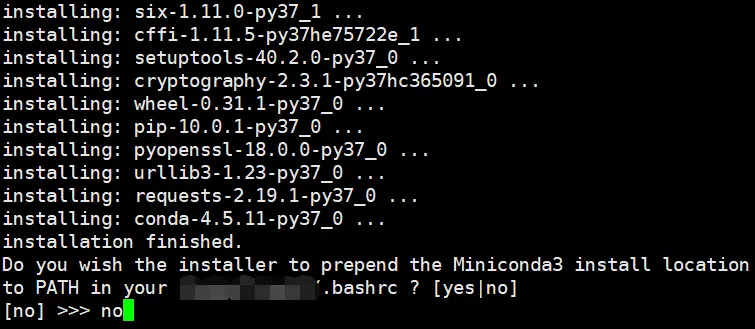
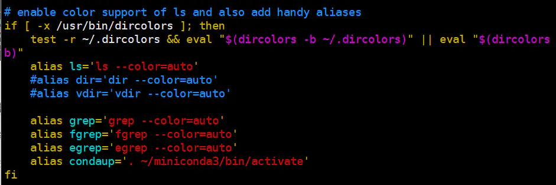

## 一、Conda简介

Conda 是一个开源的软件包管理系统和环境管理系统，用于安装多个版本的软件包及其依赖关系，并在它们之间轻松切换。 Conda 是为 Python 程序创建的，适用于 Linux，OS X 和Windows，也可以打包和分发其他软件。

conda分为anaconda和miniconda。anaconda是包含一些常用包的版本. miniconda则是精简版，需要啥装啥.

## 二、下载及安装Conda

### (1)官方网址

AnaConda下载地址:https://www.anaconda.com/distribution/

AnaConda清华镜像下载地址:https://mirrors.tuna.tsinghua.edu.cn/anaconda/archive/ 

MiniConda下载地址:https://docs.conda.io/en/latest/miniconda.html

Conda github: https://github.com/conda/conda

Conda官方文档:https://conda.io/projects/conda/en/latest/

<!--more-->

### (2)下载Conda

> 下载安装程序(AnaConda)

```bash
sudo wget https://repo.anaconda.com/archive/Anaconda3-2020.02-Linux-x86_64.sh
```

### (3)安装Conda

```bash
 #赋予执行权限
chmod 777 Anaconda3-2020.02-Linux-x86_64.sh
#运行
bash Anaconda3-2020.02-Linux-x86_64.sh
```

所有选项都输入yes,直至安装完毕

**注意**:在老版本中,安装时会询问是否修改环境变量,但新版本中好像去除了.若出现下图内容,询问是否修改环境变量.建议**选择no,不加入环境变量**.因为这样会有隐患，特别是当你的服务器之前有安装过软件的话，conda会污染你原来的环境，把你原来设置好的东西进行更改.具体的惨痛教训请参见: [Anaconda is a snake.](https://links.jianshu.com/go?to=https%3A%2F%2Fmp.weixin.qq.com%2Fs%3F__biz%3DMzAxMDkxODM1Ng%3D%3D%26mid%3D2247486380%26idx%3D1%26sn%3D9329fcd0a60ac5488607d359d6c28134%26chksm%3D9b484b17ac3fc20153d25cbdefe5017c7aa9080d13b5473a05f79808244e848b0a45d2a6a735%26scene%3D21%23wechat_redirect)



## 三、配置环境变量(安装是设置加入环境变量为no)

### (1)创建一个文件夹

```bash
#在家目录下创建.soft文件夹
mkdir ~/.soft
```

### (2)将这个文件夹添加到环境变量中

```bash
export PATH="~/.soft:$PATH"
```

### (3)软链接

```ruby
ln -s ~/anaconda3/bin ~/.soft
```

这样就可以运行啦~如果还是不行建议试试初始化一下bashrc：`. ./bashrc`

## 四、基本指令

### (1)查看conda版本

```bash
conda -V
# or
conda --version
```

### (2)启动conda(载入环境)

```bash
# 1.通过conda指令启动(必须配置了环境变量)
conda activate base

# 2.通过activate文件启动
# 加载到conda安装目录下的bin目录
cd ~/anaconda/bin
# 赋予执行权限
chmod 777 activate
# 启动conda
. ./activate
```

### (3)退出conda(退出环境)

```bash
# 1.通过conda指令启动(必须配置了环境变量)
conda deactivate

# 2.通过activate文件启动
# 加载到conda安装目录下的bin目录
cd ~/anaconda/bin
# 赋予执行权限
chmod 777 activate
# 退出环境
. ./deactivate
```

### (4)创建conda环境

```bash
#-n name 设置新的环境的名字为name
#python=3 指定新环境的python的版本
conda create -n name python=3
```

### (5)删除conda环境

```bash
# 删除名字为name的环境
conda remove -n name --all
```

### (6)重命名环境

将name1环境重命名为name2环境

```bash
# 克隆name1至name2
conda create -n name2 --clone name1
# 将name1环境删除
conda remove -n py2 --all
```

## 五、添加频道

### (1)官方channel：

官方频道国内很慢,建议使用第二种方法**添加清华Anaconda 镜像频道**

```bash
conda config --add channels bioconda
conda config --add channels conda-forge
conda config --add channels genomedk
```

### (2)清华Anaconda 镜像:

详情查看[清华大学Anaconda 镜像使用帮助](https://mirrors.tuna.tsinghua.edu.cn/help/anaconda/): https://mirrors.tuna.tsinghua.edu.cn/help/anaconda/

各系统都可以通过修改用户目录下的 `.condarc` 文件。Windows 用户无法直接创建名为 `.condarc` 的文件，可先执行 `conda config --set show_channel_urls yes` 生成该文件之后再修改。

```bash
# 备份原始频道
cp ~/.condarc ~/.condarc.bak
# 修改频道配置文件
vim ~/.condarc
```

修改.condarc文件为:

```bash
channels:
  - defaults
show_channel_urls: true
channel_alias: https://mirrors.tuna.tsinghua.edu.cn/anaconda
default_channels:
  - https://mirrors.tuna.tsinghua.edu.cn/anaconda/pkgs/main
  - https://mirrors.tuna.tsinghua.edu.cn/anaconda/pkgs/free
  - https://mirrors.tuna.tsinghua.edu.cn/anaconda/pkgs/r
  - https://mirrors.tuna.tsinghua.edu.cn/anaconda/pkgs/pro
  - https://mirrors.tuna.tsinghua.edu.cn/anaconda/pkgs/msys2
custom_channels:
  conda-forge: https://mirrors.tuna.tsinghua.edu.cn/anaconda/cloud
  msys2: https://mirrors.tuna.tsinghua.edu.cn/anaconda/cloud
  bioconda: https://mirrors.tuna.tsinghua.edu.cn/anaconda/cloud
  menpo: https://mirrors.tuna.tsinghua.edu.cn/anaconda/cloud
  pytorch: https://mirrors.tuna.tsinghua.edu.cn/anaconda/cloud
  simpleitk: https://mirrors.tuna.tsinghua.edu.cn/anaconda/cloud
```

运行 `conda clean -i` 清除索引缓存，保证用的是镜像站提供的索引。

运行 `conda create -n myenv numpy` 测试一下吧

### (3)频道相关命令

#### 1.添加频道

```bash
conda config --add channels 频道地址
```

#### 2.windows下生成.condarc文件

```bash
conda config --set show_channel_urls yes
```

#### 3.查看已经添加的channels

```bash
# 通过conda命令查看
conda config --get channels
# 查看配置文件
cat ~/.condarc
```

## 六、安装软件指令

### (1)安装命令

```bash
conda install 软件名
```

### (2)搜索需要的安装包

```bash
conda search 软件名
```

### (3)查看软件安装的位置

```bash
which 软件名
```

### (4)安装特定版本

```bash
conda install 软件名=版本号
```

### (5)查看已安装软件

```bash
conda list
```

### (6)更新指定软件

```bash
conda update gatk
```

### (7)卸载指定软件

```bash
conda remove gatk
```

## 七、自定义指令

修改`~/.bashrc`文件,使用alias语句自定义指令

```bash
alias 指令名='要执行的shell语句'
#如
alias condaup='. ~/anaconda3/bin/activate'
# 以后可以在控制台使用condaup语句来启动conda环境
```



## 参考及感谢

### 本文引用

[conda的安装与使用](https://www.jianshu.com/p/edaa744ea47d):https://www.jianshu.com/p/edaa744ea47d

[Anaconda 镜像使用帮助](https://mirrors.tuna.tsinghua.edu.cn/help/anaconda/):https://mirrors.tuna.tsinghua.edu.cn/help/anaconda/

### 参考文档

[Ubuntu18.04 安装 Anaconda3](https://blog.csdn.net/qq_15192373/article/details/81091098):https://blog.csdn.net/qq_15192373/article/details/81091098