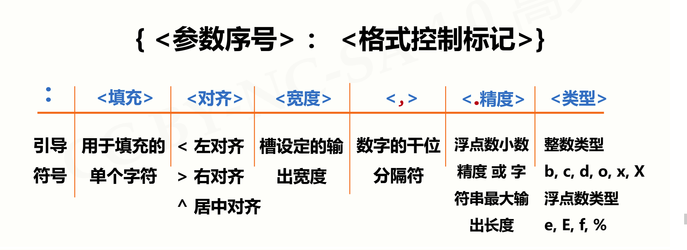

## 一、字符串的定义

Python中的字符串是**不可变的**, 字符串一旦创建便不可修改

字符串的定义分为两类: (1)定义**单行**字符串 (2)定义**多行**字符串

> 定义**单行**字符串

```python
s1 = "hello world"  # 使用双引号定义单行字符串
s2 = 'hello world'  # 使用单引号定义单行字符串
```

> 定义**多行**字符串

```python
# 使用三引号定义多行字符串
s = '''第一行
第二行
第三行
...
'''
```

**注意:**三引号在Python中表示定义字符串, 但他也可以用来注释, 注释时三引号中的内容本质上他也是一个字符串, 只不过没有语句去处理他,所以他被当做了注释

<!--more-->

## 二、字符串的格式化输出

Python格式化输出有三种方式: 

* 占位符% 
* format()方法
* f-string

### (1)占位符%

使用占位符进行格式化时, Python会使用一个带有格式符的字符串作为模板, 这个格式符用于为真实值预留位置, 并说明真实值应该呈现的格式

```python
>>> name = '李强'
>>> "你好,我叫%s" % name
"你好,我叫李强"
>>> age = 18
>>>  "你好,我叫%s, 今年%d岁" % (name,age)
"你好,我叫李强,今年18岁"
```

> 常见的占位符: 

| 符  号 | 描述                                 |
| ------ | ------------------------------------ |
| %c     | 格式化字符及其ASCII码                |
| %s     | 格式化字符串                         |
| %d     | 格式化整数                           |
| %u     | 格式化无符号整型                     |
| %o     | 格式化无符号八进制数                 |
| %x     | 格式化无符号十六进制数               |
| %X     | 格式化无符号十六进制数（大写）       |
| %f     | 格式化浮点数字，可指定小数点后的精度 |
| %e     | 用科学计数法格式化浮点数             |
| %E     | 作用同%e，用科学计数法格式化浮点数   |
| %g     | %f和%e的简写                         |
| %G     | %f 和 %E 的简写                      |
| %p     | 用十六进制数格式化变量的地址         |

### (2)format()方法

format()方法是Python字符串格式化的最主要的方法, 他的语法是:

```python
<字符串>.format(<参数列表>)
```

在format()方法中使用``{ }``为变量预留位置(槽), 例如:

```python
>>> name = '李强'
>>> age = 18
>>>  "你好,我叫{ }, 今年{ }岁".format(name,age)
"你好,我叫李强,今年18岁"
```

槽内部对格式化的配置方式:



常用的槽格式化配置:

* 保留n位小数: ``{:.nf}``,n表示保留小数的位数
* 数字补齐: ``{:m>nd}``, m表示补齐的数字, n表示补齐后数字的长度
* 显示百分比: ``{:.n%}``, n表示保留小数的位数

### (3)f-string

``f-string``是从Python3.6版本开始加入Python标准库的内容, 他的语法是:``f<字符串>``字符串中使用``{ }``为变量预留位置(槽), 在``{ }``中,直接标明要格式化的变量. 例如: 

```python
>>> name = '李强'
>>> age = 18
>>>  f"你好,我叫{name}, 今年{age}岁"
"你好,我叫李强,今年18岁"
```

