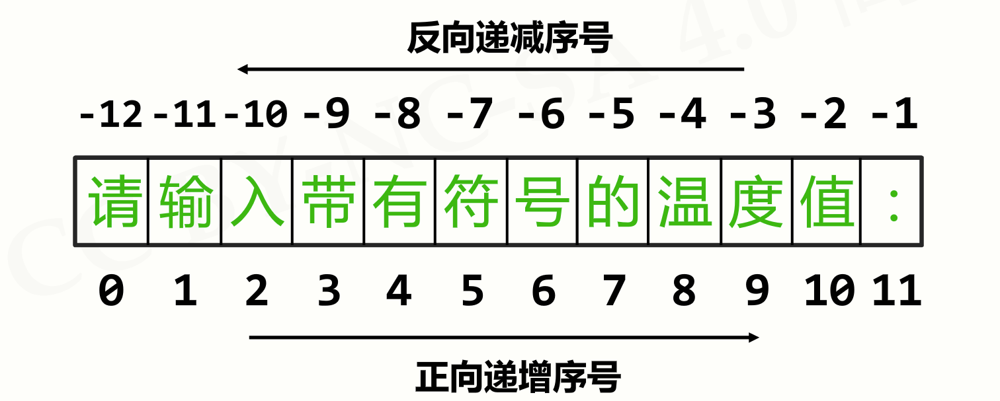

## 一、字符串索引与切片

### (1)索引

Python索引分为:**正向索引**和**反向索引**

正向索引是从字符串的第一个字符开始, 第一个索引为0, 从前向后依次递增

反向索引是从字符串的最后一个字符开始, 最后一个索引为-1, 从后向前依次递减

<!--more-->



字符串根据索引, 就可以得到字符串的单个字符:

```python
>>> s = "请输入带有符号的温度值"
>>> s[2]
'入'
```

### (2)切片

切片用于截取字符串的一部分, 他的语法为

```python
<字符串>[起始: 结束: 步长]
```

通过``<字符串>[起始: 结束: 步长]``,可以**按照步长**, 截取出**包括起始字符**, **不包括结束字符**的字符串

例如:

```python
>>> s = "请输入带有符号的温度值"
>>> s[2:6:2]
'入有'
```

> 切片的常用操作- 字符串逆序

```python
>>> "字符串"[::-1]  # 步长为-1 表示从后向前逐一取出
'串符字'
```

## 二、字符串操作符

|  操作符及使用  |              描述              |
| :------------: | :----------------------------: |
|     x + y      |         拼接字符串x和y         |
| x * n 或 n * x |         复制n次字符串x         |
|     x in s     | 判断字符串x是否为字符串s的子串 |

