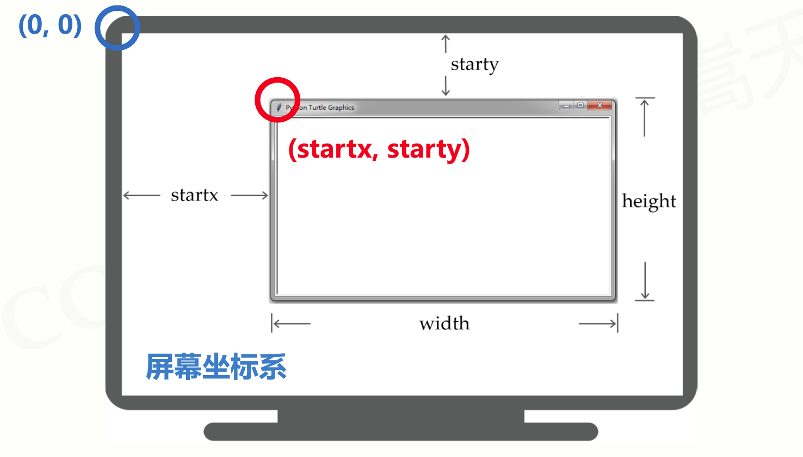
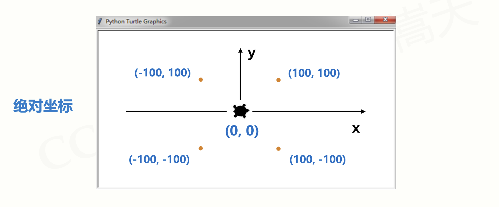
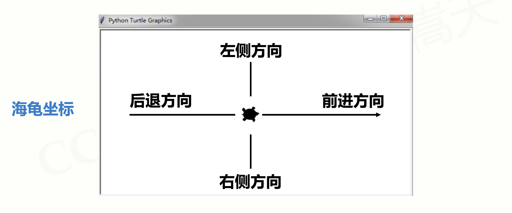
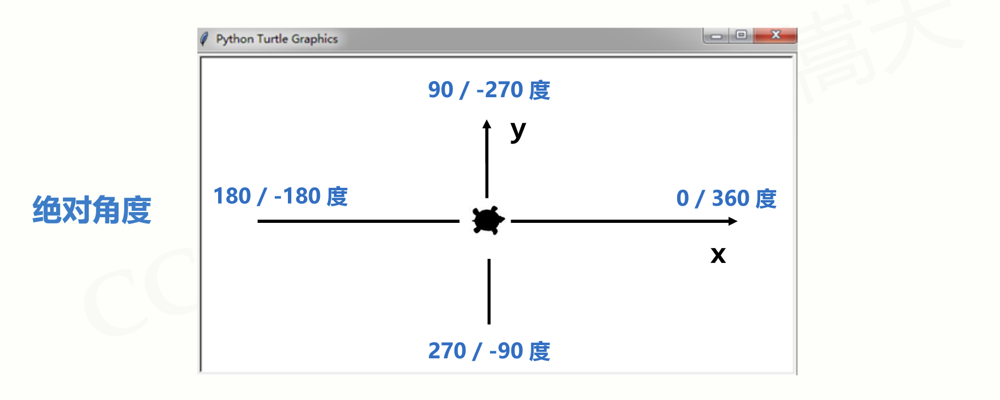
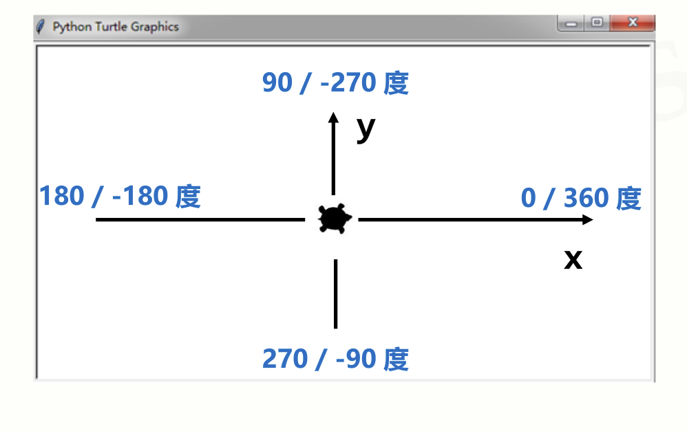

## 概述

海龟绘图体系最初来自于 Wally Feurzeig, Seymour Papert 和 Cynthia Solomon 于 1967 年所创造的 Logo 编程语言。

turtle库是Python对海龟绘图体系的实现,他是Python的标准库之一,是Python入门级的图形绘制函数库

> 原理

想象绘图区有一只机器海龟，在画布上游走, 它走过的地方会想钢笔一样,留下一条轨迹. 我们通过调用turtle库中的方法,来控制海龟的行走方向, 从而绘制出想要的图形

[海龟绘图Python官方文档](https://docs.python.org/zh-cn/3/library/turtle.html)

<!--more-->

## 一、turtle绘图窗体布局

绘制turtle图形需要一个绘图窗体, 在操作系统上表现为一个窗口, turtle所在的窗口称为turtle画布空间, **绘图窗体的最小单位是像素**

turtle绘图窗体在屏幕上的布局, 如图所示:



### 相关方法- setup()

> ``setup()``函数

* 作用

``setup()``函数用于设置绘图窗体在屏幕上的初始布局方式

* 语法

```python
turtle.setup(width, height, startx, starty)
```

* 参数说明:

  * width: 设置绘图窗口的初始宽度,  -- 如为一个整型数值，表示大小为多少像素，如为一个浮点数值，则表示屏幕的占比；默认为屏幕的 50

  * height: 设置绘图窗口的初始高度, -- 如为一个整型数值，表示高度为多少像素，如为一个浮点数值，则表示屏幕的占比；默认为屏幕的 75%

  * startx: 如为正值，表示初始位置距离屏幕左边缘多少像素，负值表示距离右边缘，None 表示窗口水平居中

  * starty: 如为正值，表示初始位置距离屏幕上边缘多少像素，负值表示距离下边缘，None 表示窗口垂直居中


## 二、turtle空间坐标体系

### (0)海龟的初始位置

海龟的初始位置为**绘图窗口的正中间**, 初始朝向是**水平朝向屏幕的右侧**



### (1)绝对坐标

turtle绝对空间坐标的原点海龟的初始位置相同, 即**相对绘图窗口的正中心**

**x轴**: 绝对空间坐标轴的x轴与海龟初始朝向相同, 即**水平向右**

**y轴**: 绝对空间坐标轴的y轴垂直与x轴向上, 即**竖直向上**

turtle绝对空间坐标轴如图所示:


#### 相关方法- goto()

> goto()方法

* 作用:

使海龟移动至某个绝对坐标

* 语法:

```python
turtle.goto(x, y)
```

* 参数说明:

  * x: x轴坐标 或 数值对/向量
  * y: y轴坐标 或 None

如果 y 为 None，x 应为一个表示坐标的数值对或 Vec2D 类对象 (例如 pos() 返回的对象)

海龟移动到一个绝对坐标。**如果画笔已落下**将会画线。**不改变海龟的朝向**。

### (2)相对坐标

相对坐标(亦称海龟坐标)是相对于海龟而言的坐标, 即**海龟的前后左右**



#### 相关方法- 向前、向后、向左

相对坐标的相关方法主要有三个:

* **向前: ``turtle.fd(distance)``**

* **向后: ``turtle.bk(distance)``**

* **向左: ``turtle.circle(radius, extent=None, steps=None)``**

#####  1.向前: turtle.fd(distance)

> turtle.fd(distance)方法

* 作用:

海龟前进 *distance* 指定的距离(前进*distance* 个像素)，方向为海龟的朝向

* 参数说明:
  * **distance**: 一个数值 (整型或浮点型), 表示海龟前进的距离 

##### 2.向后: turtle.bk(distance)

> turtle.bk(distance)方法

* 作用:

海龟后退 *distance* 指定的距离，方向与海龟的朝向相反。**不改变海龟的朝向**。

* 参数说明:
  * **distance**: 一个数值 (整型或浮点型), 表示海龟后退的距离 

##### 3.向左: turtle.circle(*radius*, *extent=None*, *steps=None*)

> turtle.circle(*radius*, *extent=None*, *steps=None*)方法

* 作用:

使海龟绕着: 以海龟左边 *radius* 个像素为圆心, *radius* 为半径的圆。行走 *extent* 个角度

当 *extent* 为 **正值**,海龟前进, 如果 *radius* 为**正值**则朝**逆时针方向**绘制圆弧，**否则朝顺时针方向**。最终海龟的**朝向会依据 *extent* 的值而改变**。

当 *extent* 为 **负值**,海龟后退, 如果 *radius* 为**正值**则朝**顺时针方向**绘制圆弧，**否则朝逆时针方向**。最终海龟的**朝向会依据 *extent* 的值而改变**。

圆实际是以其内切正多边形来近似表示的，其边的数量由 *steps* 指定。如果未指定边数则会自动确定。此方法也可用来绘制正多边形。

* 参数说明:
  * **radius** -- 一个数值
  * **extent** -- 一个数值 (或 `None`)
  * **steps** -- 一个整型数 (或 `None`)

## 三、turtle角度坐标体系

### (1)绝对坐标

绝对坐标是相对于x轴方向而言的角度



#### 相关方法- turtle.seth(*to_angle*)

> turtle.seth(*to_angle*)方法

* 作用:

使海龟朝向绝对方向(*to_angle*), seth()只改变方向但不前进

* 参数:
  * **to_angle** : 一个数值 (整型或浮点型), 需要海龟朝向的绝对方向

### (2)相对坐标

相对坐标是相对于海龟当前朝向而言的角度



#### 相关方法- 左转、右转

相对坐标的相关方法主要有两个:

* **左转: ``turtle.left(angle)``**

* **右转: ``turtle.right(angle)``**

##### 1.左转: turtle.left(angle)

> turtle.left(angle)方法

* 作用:

使海龟左转 *angle* 个角度

* 参数:
  * **angle** : 一个数值 (整型或浮点型), 表示旋转的角度

##### 2.右转: turtle.right(angle)

> turtle.right(angle)方法

使海龟右转 *angle* 个角度

* 参数:
  * **angle** : 一个数值 (整型或浮点型), 表示旋转的角度

## 四、RGB色彩体系

RGB: **Red**、**Green**、**Blue**

RGB色彩模式使用红绿蓝三个通道的颜色组合成所有视力所能感知的颜色

RGB的取值有两种模式:

* 小数模式 : 取值范围为0-1的小数
* 整数模式 : 取值范围为0-255的整数

Python的turtle库默认采用**小数模式**, 我们可以通过``turtle.colormode(mode)``方法来改变模式

### 相关方法- turtle.colormode(mode)

> turtle.colormode(mode)方法

* 作用: 改变RGB模式

* 参数: 
  * mode: 数值 1.0 或 255 其中之一, 若mode为1.0则为小数模式, 若mode为255则为整数模式

## 其他方法

### turtle.done()方法

在绘图程序执行完成之后, turtle的绘图窗体会被自动关闭, 若要使绘图完成后,窗体不自动关闭,可以使用``turtle.done()``方法

## 参考文档

[海龟绘图Python官方文档](https://docs.python.org/zh-cn/3/library/turtle.html):https://docs.python.org/zh-cn/3/library/turtle.html

