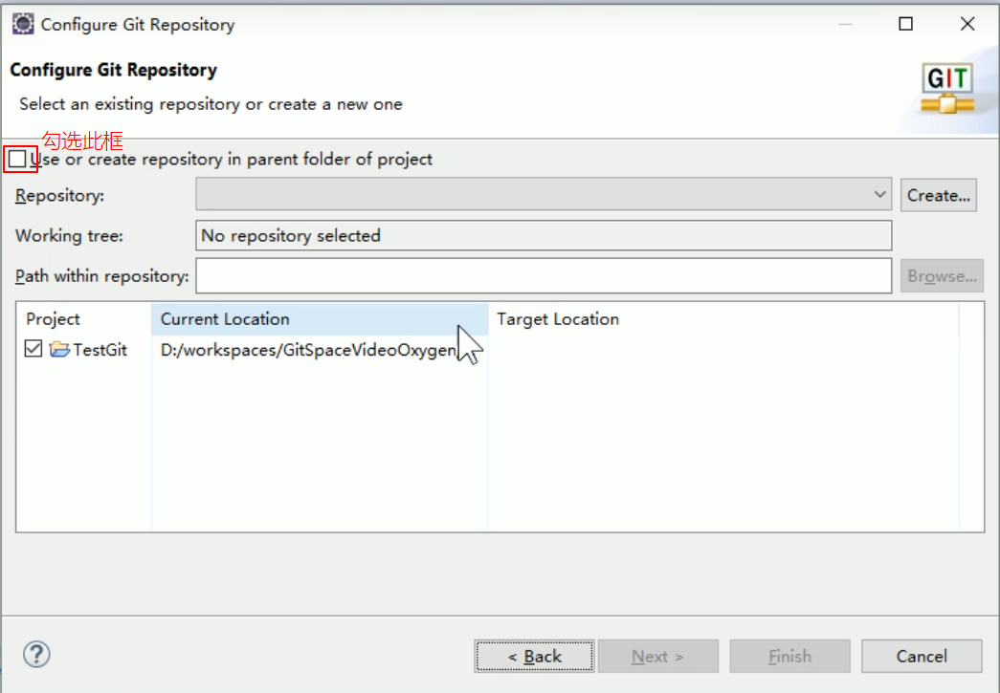

### 1. 在Eclipse中查看Git配置

* 打开 Window -> Preferences -> Git
	* 在configuration -> User Settings 中可以查看全局的签名设置
	<br>

<!--more-->


* 在 configuration -> Repository Settings 中可以查看项目的签名设置

<br>


### 2. 工程初始化为本地库

* 工程 -> 右键 -> Team -> Share Project -> Git

	<br>

	

	

	本地库初始化完成

### 3. Git常用图标


| 图标名    | 含义                   |
| --------- | ---------------------- |
| folder    | 目录下有未提交的修改   |
| tracked   | 已提交的修改           |
| untracked | 没有追踪的文件         |
| ignored   | 被忽略的文件           |
| dirty     | 文件中有未提交的修改   |
| staged    | 添加到了暂存区         |
| added     | 文件第一次添加到暂存区 |

### 4. Eclipse中忽略文件

#### 4.1 概念

​	**在将文件提交到本地库之前，需要先配置Git，去忽略掉Eclipse的特定文件。**

​	Eclipse 特定文件，是 Eclipse 为了管理我们创建的工程而维护的文件，和开发的代码没有直接关系。

​	同一个团队中很难保证大家使用相同的 IDE 工具，而 IDE 工具不同时，相关工 程特定文件就有可能不同。如果这些文件加入版本控制，那么开发时很可能需要为 了这些文件解决冲突。

​	因此，最好不要在 Git 中进行追踪，也就是**把它们忽略**。

#### 4.2 Eclipse中忽略文件的文件

* .classpath 文件
* .project 文件
* .settings

#### 4.3 GitHub 官网样例文件

* https://github.com/github/gitignore
* https://github.com/github/gitignore/blob/master/Java.gitignore

#### 4.4 配置Git忽略文件的步骤

1.在家目录下，创建本地忽略配置文件

```
#Compiledclassfile
*.class

#Logfile
*.log

#BlueJfiles
*.ctxt

#MobileToolsforJava(J2ME)
.mtj.tmp/

#PackageFiles#
*.jar
*.war
*.nar
*.ear
*.zip
*.tar.gz
*.rar

#virtualmachinecrashlogs,seehttp://www.java.com/en/download/help/error_hotspot.xml hs_err_pid*

.classpath
.project
.settings
target
```

2.在~/.gitconfig 文件中引入上述文件
* 在~/.gitconfig中添加：

```
[core]
	excludesfile=C:/Users/Lenovo/Java.gitignore
```

* 注意：这里路径中一定要**使用“/”**，不能使用“\”

### 5. 提交文件到本地库

1.工程 -> 右键 -> Team -> Commit -> Git


2.通过拖拽的方式，将文件提交

### 6. 推送到远程库

1.工程 -> 右键 -> Team -> Remote -> Push
2.输入远程库的地址


3.添加所有分支


4.编写日志


5.完成


* 注： 若推送时，本地库不是基于最新版的远程库，则会报错：


​	此时需要先pull，再推送


### 7. 克隆远程库工程

由于Eclipse版本不同，克隆操作也有所不同。因此我们分开讨论

#### 7.1 Oxygen Eclipse 克隆工程操作

1.Import...导入工程
2.选择Git -> Projects from Git


3.Clone URI


4.到远程库复制工程地址


5.粘贴远程库的地址


6.指定工程的保存位置


7.指定工程导入方式，这里只能用：Import as general project

* 第一项：导入已经存在的Eclipse工程
* 第二项：导入一个新的工程
* 第三项：作为一个普通的工程


8.转换工程类型

* 选择：工程 -> 右键 -> Configure -> Convert to Maven Project

9.最终效果


#### 7.2 Kepler Eclipse 克隆工程操作

在KeplerEclipse 克隆工程操作中，会出现一个问题：**不能保存到当前 Eclipse 工作区目录**，若保存到当前工作区目录，则在导入工程时会报错：


* 解决方法：

  保存到工作区以外的目录

  

### 8. 拉取远程库工程

* 工程 -> 右键 -> Team -> Remote -> Pull

### 9. 解决冲突

1. 冲突文件→右键→Team→MergeTool
2. 修改完成后正常执行 add/commit 操作即可

### 10. 分支实战

>实战内容


#### 工程1：创建分支，在新分支下修改文件，并上传到远程库

1.创建一个新的分支：工程 -> 右键 -> Team -> Commit -> Git
2.为分支命名


3.创建好分支后，eclipse会自动切换到新的分区。在新的分区下对文件进行修改。
4.将修改好的文件提交并上传到远程库：工程 -> 右键 -> Team -> Repository -> Pull Branch "分支名"

#### 工程2：拉取工程1上传后的远程库，

1.拉取远程库
2.切换到工程1新建的分支：工程 -> 右键 -> Team -> Switch To -> Other
3.选择远程库中的hot_fix分支


4.选择Check out as New Local Branch(在本地创建新的分支)


5.检出远程新分支，finish


6.换回分支master：工程 -> 右键 -> Team -> Switch To -> master

7.合并分支：工程 -> 右键 -> Team -> Merge

8.选择本地的要合并的分支


9.合并结果


合并成功后，把master推送到远程
