### 1.　本地库初始化

* 命令：``git init``

* 效果：在当前目录，创建一个.git文件夹

### 2. 设置签名

* 项目级别/仓库级别
  * ``git config user.name yourname``
  * ``git config user.email youremail``
  * 保存位置：./.git/config
* 系统用户级别
  * ``git config --global user.name yourname``
  * ``git config --global user.email youremail``
  * 保存位置：~/.gitconfig
* 级别优先级：
  * 项目级别/仓库级别　>  系统用户级别

<!--more-->

### 3. 基本操作

#### 3.1 查看状态

* 命令：``git status``

* 功能：``查看工作区、暂存区状态``

* 常见结果：

打印内容 | 含义 |
-|-|
 on branch master | 位于分支master(主分支)|
 no commits yet | 本地库没有任何的已提交的文件 |
 nothing to commit | 暂存区没有可提交的文件 |
 Untracked filed | 未追踪的文件 (未添加到暂存区的文件)|
 nothing added to commit but untracked files present | 暂存区没有文件，但工作区有文件 |
 Changes to be committed | 待提交的改变(暂存区中的文件)|

#### 3.2 添加
* 命令：``git add ``
* 功能：将工作区的"新建/修改添加到暂存区"

#### 3.3 删除
* 命令：``git rm --cached <file>``
* 功能：从暂存区中删除file文件

#### 3.4 提交
##### 3.4.1 提交后输入提交信息
* 命令：``git commit <file>``
* 功能：提交暂存区中的file文件
* 输入次命令后，会进入一个新的窗口，输入本次提交的相关备注

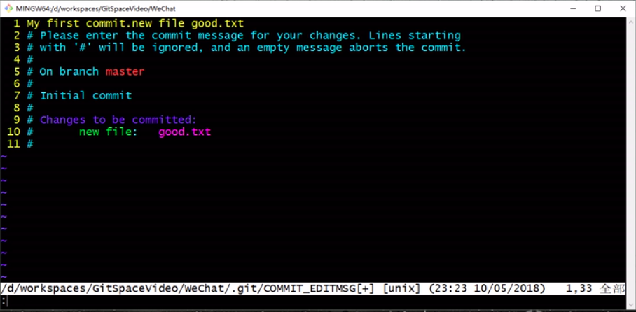

* 输入相关信息后，保存退出即可

##### 3.4.2 提交时输入提交信息
* 命令：``git commit -m "commit-message" <filename>``

#### 3.5 查看历史记录
* 命令：``git log``
  * 效果：

    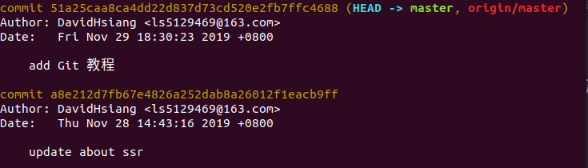

  * 多屏显示控制方式
    * 空格：向下翻页
    * b：向上翻页
    * q：退出

* 命令：``git log --pretty=oneline``
  * 效果：

    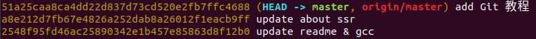

* 命令：``git log --oneline``
  * 效果：

    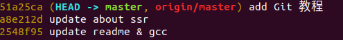

* 命令：``git reflog``
  * 效果：

    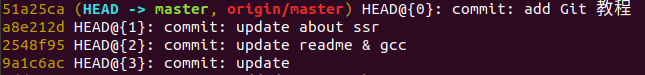

* 注：
  * (HEAD -> master)代表该版本为当前版本，HEAD是个指针，指向当前版本
  * HEAD@{移动到当前版本需要的步数}

#### 3.6 前进后退版本

##### 3.6.1 ``reset``命令定位HEAD指针的三种方式

* 基于索引值操作[推荐]
  * 命令：``get reset --<参数> <局部索引值>``
  * 例：``get reset --hard 41awq12``

* 使用^符号[只能后退]
  * 命令：``get reset --<参数> HEAD^``
  * 例：``get reset --hard HEAD^``
  * 注：一个^表示后退1步，n个表示后退n步，若n = 0则表示还原当前版本

* 使用~符号[只能后退]
  * 命令：``get reset --<参数> HEAD~n``
  * 例：``get reset --hard HEAD~1``
  * 注：n个表示后退n步

##### 3.6.2 ``reset``命令的三个参数

* ``--soft``参数
 * 仅仅在本地库移动HEAD指针
* ``--mixed``参数
 * 在本地库移动HEAD指针
 * 重置暂存区
* ``--hard``参数
 * 在本地库移动HEAD指针
 * 重置暂存区
 * 重置工作区

#### 3.7 比较文件差异

* 命令：``get deff <文件名>``
* 功能：将工作区中的文件和暂存区中的文件进行比较

* 命令：``get deff <本地库中的历史版本> <文件名>``
* 功能：将工作区中的文件与本地库的历史记录进行比较

* 注：若不带文件名，则比较所有文件

#### 3.8 ``help``指令

* 命令：``git help <git指令>``
  * 效果：查看git指令的使用文档

### 4. 分支管理

#### 4.1 创建分支

* 命令：``git branch <分支名>``

#### 4.2 查看分支

* 命令：``git branch -v``

#### 4.3 切换分支

* 命令：``git checkout <分支名>``

#### 4.4 合并分支

##### 4.4.1 基本流程

* 第一步
  * 操作：切换到要接受修改的分支
  * 命令：``git checkout <接受修改的分支名>``
* 第二步
  * 合并分支
  * 命令：``git merge <有新内容的分支名>``

##### 4.4.2 解决冲突

* 冲突的表现：

  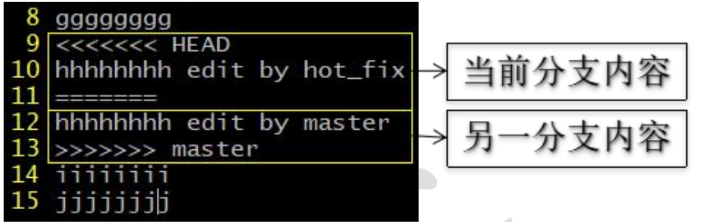

* 解决步骤：
  * 第一步：编辑文件，删除特殊符号
  * 第二步：把文件修改到满意的程度，保存退出
  * 第三步：``git add <文件名>``
  * 第四步：``git commit -m "日志信息"``
    * 注：这里的``commit``不需要加具体文件名

### 5. Github与Git

#### 5.1 创建远程库地址别名

* 命令：``git remote add <别名> <远程地址>``
* 例：``git remote add origin https://github.com/username/repositoryname.git``

#### 5.2 查看当前所有远程地址别名

* 命令：``git remote -v``

#### 5.3 推送

* 命令：``git push <别名> <分支名>``
* 功能：将本地库推送(上传)到远程库
* 注意：只有基于远程库最新版本进行的修改的本地库，才能推送到远程库

#### 5.4 克隆

* 命令：``git clone <远程地址>``
* 功能：
  * 将远程库完整的下载到本地
  * 创建origin远程地址别名
  * 初始化本地库

#### 5.5 团队成员的邀请

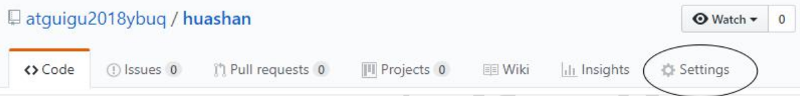

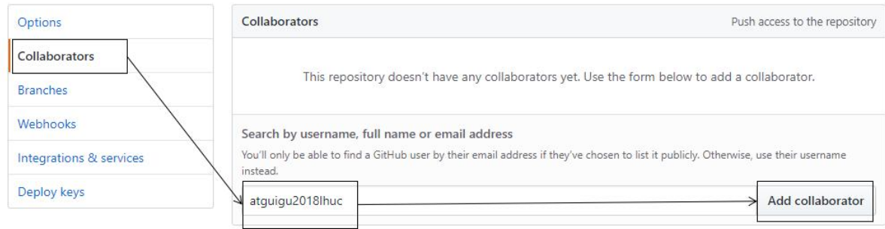

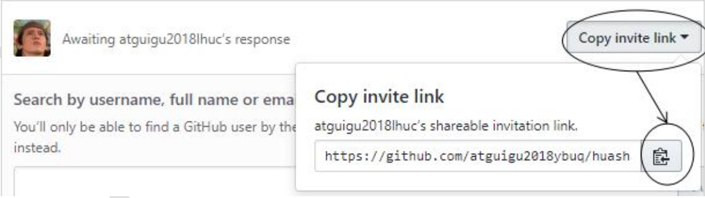

* 被邀请的成员登录Github后，访问邀请链接，确认邀请即可

#### 5.6 拉取

* pull = fetch + merge

##### 5.6.1 ``fetch + merge``

* 第一步
  * 命令：``git fetch <远程库地址别名> <远程分支名>``
  * 效果：把远程库的内容下载到本地，但不修改工作区中的文件，而是创建一个名叫``<远程库地址别名>/<远程分支名>``的分区
* 第二步
* 命令：``git merge <远程库地址别名>/<远程分支名>``
* 效果：将``<远程库地址别名>/<远程分支名>``分区合并

##### 5.6.2 ``pull``

* 命令：``git pull <远程库地址别名> <远程分支名>``
* 效果：同第一步和第二步

##### 5.6.3 解决冲突

* 1.如果不是基于Github远程库最新版所做的修改，则不能推送，必须先拉取。
* 2.拉取下来后如果进入冲突状态，则按照"分支冲突解决"操作解决即可。

### 6. Git工作流

#### 6.1 概念

  在项目开发过程中使用 Git 的方式

#### 6.2 分类

##### 6.2.1 集中式工作流

* 适用范围：个人.团队

>像 SVN 一样，集中式工作流以中央仓库作为项目所有修改的单点实体。所有 修改都提交到 Master 这个分支上。
>
>这种方式与SVN的主要区别就是开发人员有本地库。 Git很多特性并没有用到

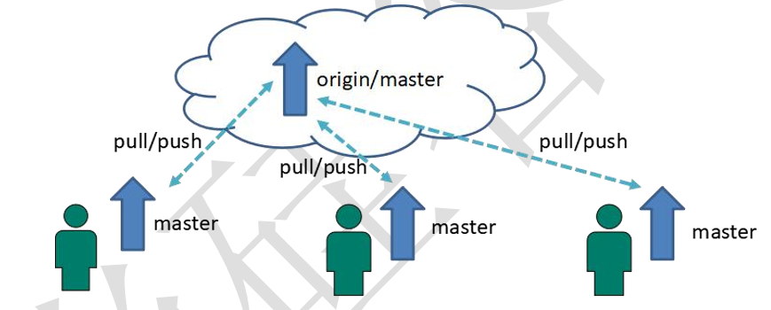

##### 6.2.2 GitFlow 工作流

* 适用范围：团队

>Gitflow 工作流通过为功能开发、发布准备和维护设立了独立的分支，让发布 迭代过程更流畅。严格的分支模型也为大型项目提供了一些非常必要的结构。

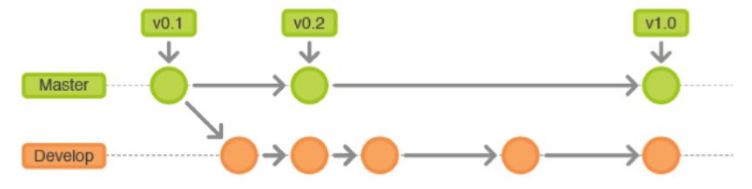

##### 6.2.3 Forking 工作流

* 适用范围：跨团队

>Forking 工作流是在 GitFlow 基础上，充分利用了 Git 的 Fork 和 pullrequest 的 功能以达到代码审核的目的。更适合安全可靠地管理大团队的开发者，而且能接受 不信任贡献者的提交。

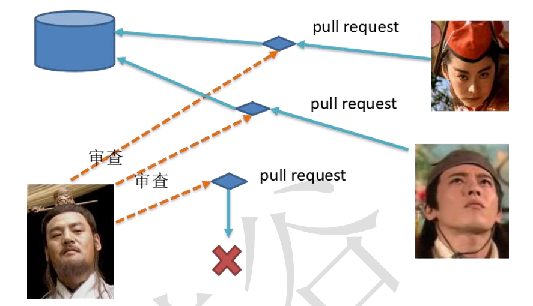

#### 6.3 GitFlow工作流详解

* 主干分支 maste
  * 主要负责管理正在运行的生产环境代码。永远保持与正在运行的生产环境完全一致。
* 开发分支 develop
  * 主要负责管理正在开发过程中的代码。一般情况下应该是最新的代码。
* bug 修理分支 hotfix
  * 主要负责管理生产环境下出现的紧急修复的代码。从主干分支分出，修 理完毕并测试上线后，并回主干分支。并回后，视情况可以删除该分支
* 准生产分支(预发布分支) release
  * 较大的版本上线前，会从开发分支中分出准生产分支，进行最后阶段的集 成测试。该版本上线后，会合并到主干分支。生产环境运行一段阶段较稳定后，可以视情况删除。
* 功能分支 feature
  * 为了不影响较短周期的开发工作，一般把中长期开发模块，会从开发分支 中独立出来。开发完成后会合并到开发分支。

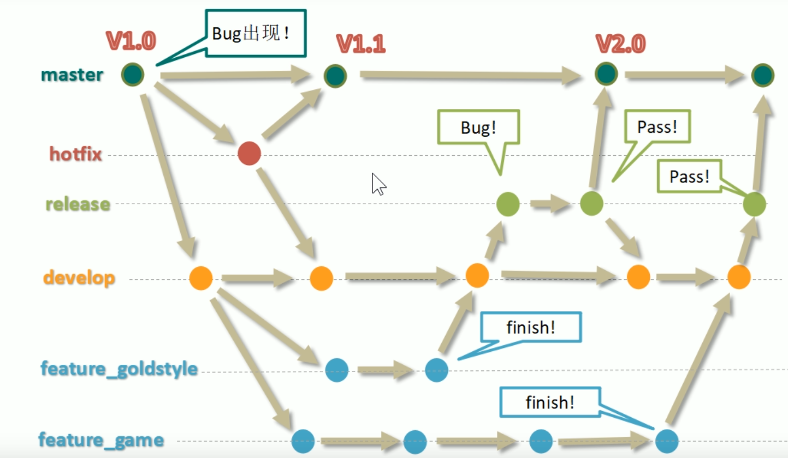

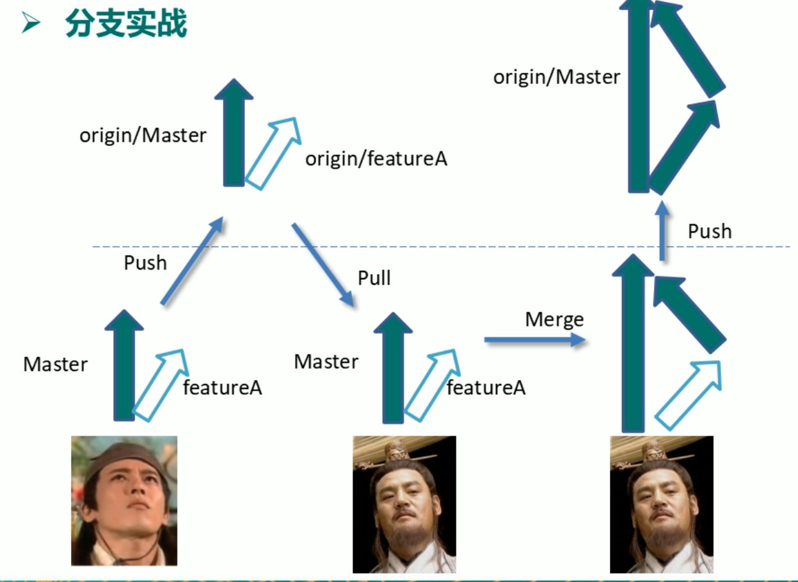
