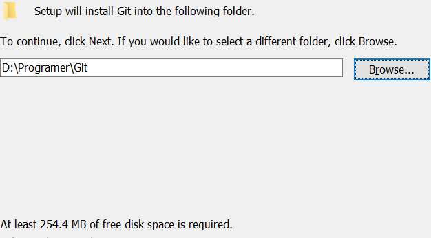
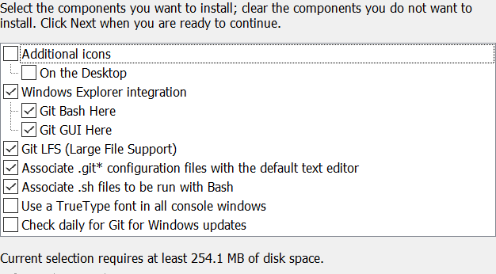
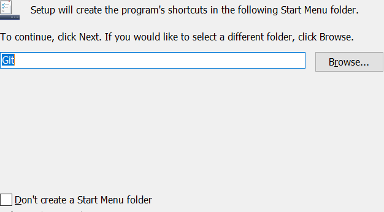
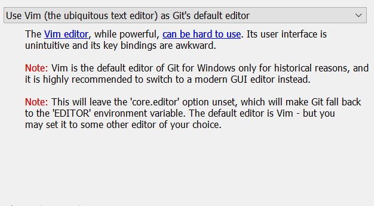
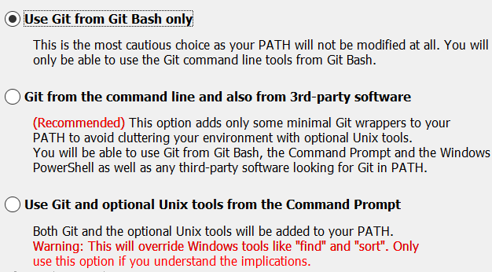
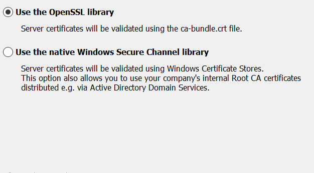
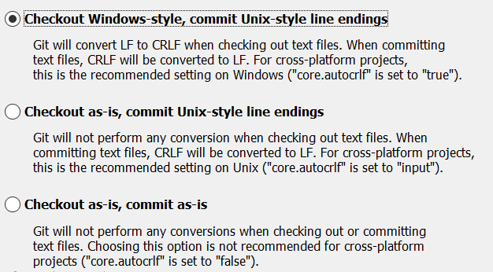
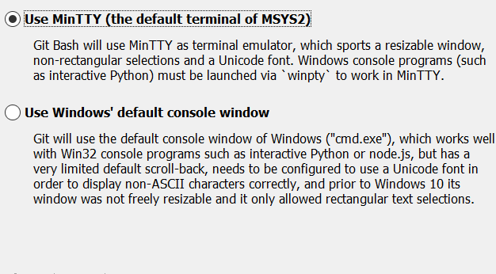
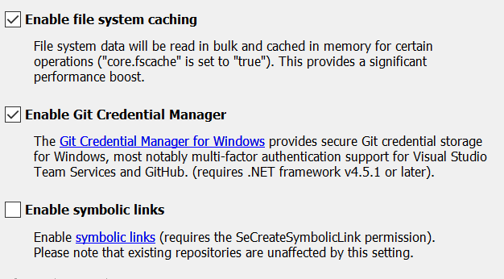
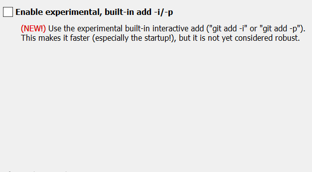

### 1. 设置安装目录

<!--more-->

### 2.安装的相关设置

* 附加图标
	* 添加快捷方式到桌面
* 添加右键快捷方式
	* 添加 Git Bash
	* 添加Git GUI
* GIT支持大文件
* 用默认文本编辑器打开.git文件
* 设置默认用git打开.sh文件
* 在所有控制台窗口中使用TrueType字体
* 用默认文本编辑器打开.git文件

### 3. 创建开始菜单目录

设置开始菜单目录名字

>Don't create a Start Menu folder
``不创建开始菜单目录``

### 4.  选择Git使用的默认编辑器

>Use the Nano editor by default
``默认使用 Nano 编辑器``

>Use Vim (The ubiquitous text editor) as Git's default editor
``使用 Vim 作为 Git 的默认编辑器``

>Use Notepad++ as Git's default editor
``使用 Notepad++ 作为 Git 的默认编辑器``

>Use Visual Studio Code as Git's default editor
``使用 Visual Studio Code 作为 Git 的默认编辑器``

### 5.配置PATH环境

>Use Git from Git Bash only
>``这是最安全的选择，因为您的PATH根本不会被修改。您只能使用 Git Bash 的 Git 命令行工具。``

>Git from the Command line and also from 3rd-party software
>``这个选项被认为是安全的，因为它只向PATH添加一些最小的 Git包，以避免使用可选的Unix工具混淆环境。 您将能够从 Git Bash 和 Windows 命令提示符中使用 Git。``

>Use Git and optional Unix tools from the Windows Command Prompt
``从Windows命令提示符使用Git和可选的Unix工具,Git和可选的Unix工具都将添加到您计算机的 PATH 中。警告：这将覆盖Windows工具，如 “ find 和 sort ”。只有在了解其含义后才使用此选项。``

### 6. 选择HTTPS传输后端

>Use the OpenSSL library
``使用 OpenSSL 库``
``服务器证书将使用ca-bundle.crt文件进行验证。``

>Use the native Windows Secure Channel library
``使用本地 Windows 安全通道库``
``服务器证书将使用Windows证书存储验证。此选项还允许您使用公司的内部根CA证书，例如， 通过Active Directory Domain Services 。``

### 7.  **配置行结束转换**

>Checkout Windows-style,commit Unix-style line endings
``在检出文本文件时，Git会将LF转换为CRLF。当提交文本文件时，CRLF将转换为LF。 对于跨平台项目，这是Windows上推荐的设置（“core.autocrlf”设置为“true”）``

>Checkout as-is , commit Unix-style line endings
``在检出文本文件时，Git不会执行任何转换。 提交文本文件时，CRLF将转换为LF。 对于跨平台项目，这是Unix上的推荐设置 （“core.autocrlf”设置为“input”）``

>Checkout as-is,commit as-is
``在检出或提交文本文件时，Git不会执行任何转换。对于跨平台项目，不推荐使用此选项（“core.autocrlf”设置为“false”）``

### 8.配置终端模拟器以与 Git Bash 一起使用

> Use MinTTY (the default terminal of MSYS2)
``Git Bash将使用MinTTY作为终端模拟器``
``该模拟器具有可调整大小的窗口，非矩形选区和Unicode字体。 Windows控制台程序（如交互式Python）必须通过'winpty'启动才能在MinTTY中运行。``

>Use Windows' default console window
``Git将使用Windows的默认控制台窗口（“cmd.exe”）``
``该窗口可以与Win32控制台程序（如交互式Python或node.js）一起使用，但默认的回滚非常有限，需要配置为使用unicode 字体以正确显示非ASCII字符，并且在Windows 10之前，其窗口不能自由调整大小，并且只允许矩形文本选择。``

### 9. 配置额外的选项

>Enable file system caching
``启用文件系统缓存``
``文件系统数据将被批量读取并缓存在内存中用于某些操作（“core.fscache”设置为“true”）。 这提供了显着的性能提升。``

>Enable Git Credential Manager
``启用Git凭证管理器``
``Windows的Git凭证管理器为Windows提供安全的Git凭证存储，最显着的是对Visual Studio Team Services和GitHub的多因素身份验证支持。 （需要.NET Framework v4.5.1或更高版本）。``

>Enable symbolic links
``启用符号链接``
``启用符号链接（需要SeCreateSymbolicLink权限）。请注意，现有存储库不受此设置的影响。``

### 10. 配置额外的选项 - 2

``启用实验性的内置外接程序-i/-p``

-----

查看文档

[Git中文详细安装教程](https://blog.csdn.net/sishen47k/article/details/80211002)
