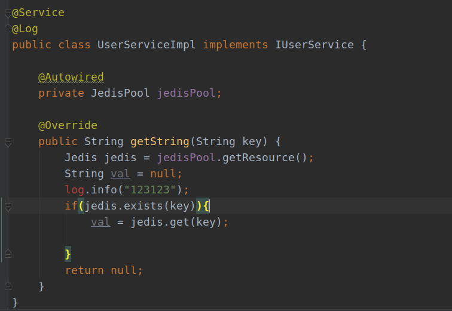
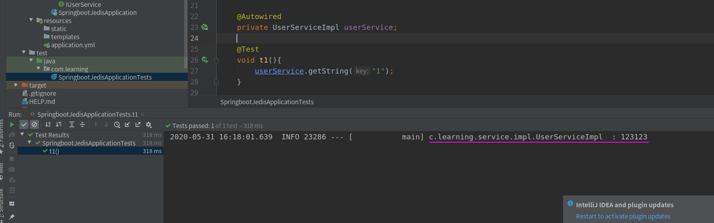
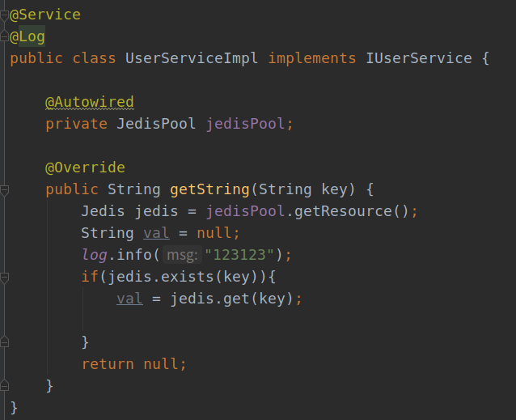

## 错误描述

在springboot项目中，使用注解@Log时，log变量不能用。

pom.xml 导入了 Lombok 依赖

```xml
<dependency>
   <groupId>org.projectlombok</groupId>
   <artifactId>lombok</artifactId>
</dependency>
```

<!--more-->

报错如下图：



虽然代码报错了，但是还是可以正常 debug



## 错误原因与解决方法

* 错误原因 : 没有安装Lombok插件

* 解决方法 : Lombok 插件即可

### 安装方法1

File > Setting > Plugins中进行搜索安装


### 安装方法2

在国内访问插件中心特别慢, 很容易搜索半天没反应, 我在安装插件时采用了这种方法(这样可以免去查询的时间):

新建一个的包含 Lombok 的 Spring Boot工程, 在他的右下角有一个下载插件的提示框


点击Enable plugins 进行安装, 弹出如下窗口


安装完成后, 重启IDEA, 重启后会提示如下信息, 点击enable启用插件即可


### 安装完成

安装完成后, 就没有报错了:



## 参考文档

[<u>在 IDEA 上 spring boot 项目使用 @Slf4j 注解， log.info()、log.debug、log.error() 会报错</u>](https://blog.csdn.net/qq_37960603/article/details/85249239#commentBox)

[<u>使用了@Slf4j log没有info的方法 .info()方法爆红或者log爆红</u>](https://www.cnblogs.com/yr1126/p/10375325.html)

