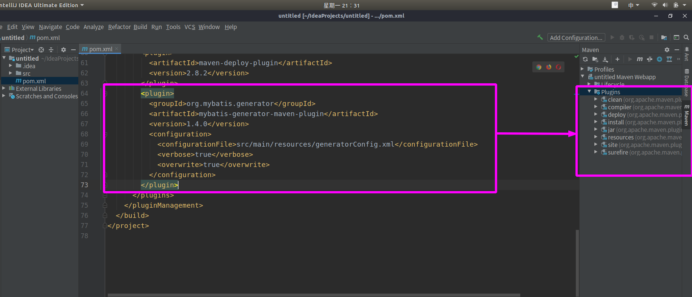
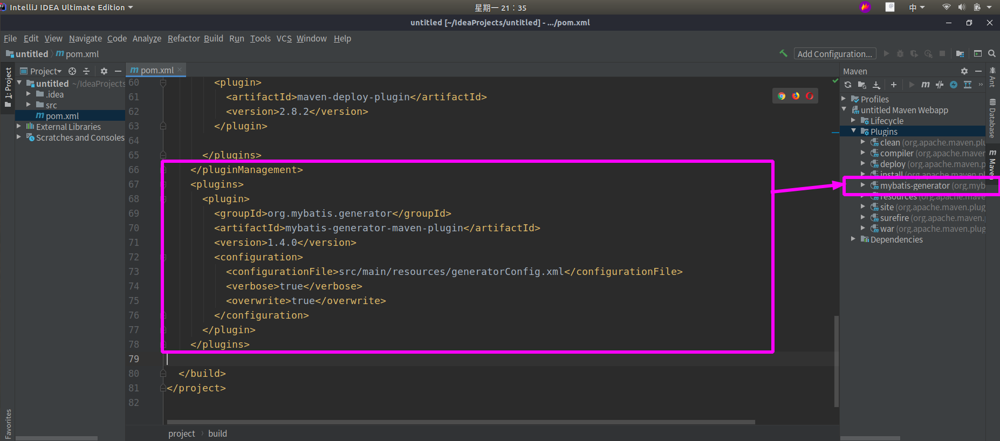

创建Maven项目时插件配置添加了mybatis-generator但是右侧maven project始终没有看到插件

<!--more-->

> 解决方法

需要放在和pluginManagement同级别，修改配置如下：

## 参考文档

[idea创建Maven项目时Maven插件内看不到mybatis-generator](https://www.cnblogs.com/itzyz/p/10978553.html) : https://www.cnblogs.com/itzyz/p/10978553.html