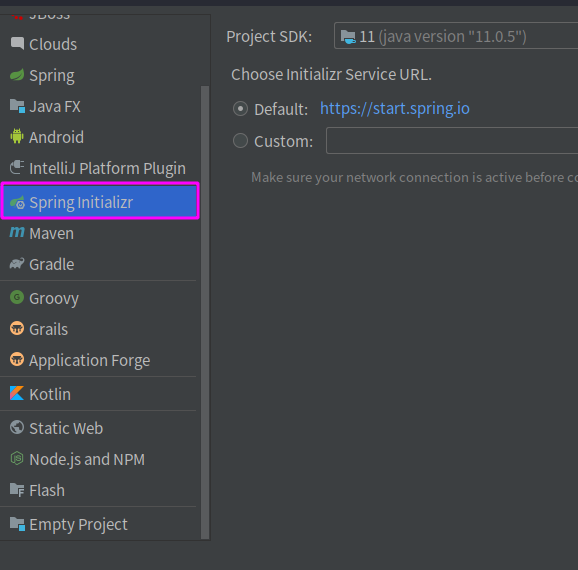
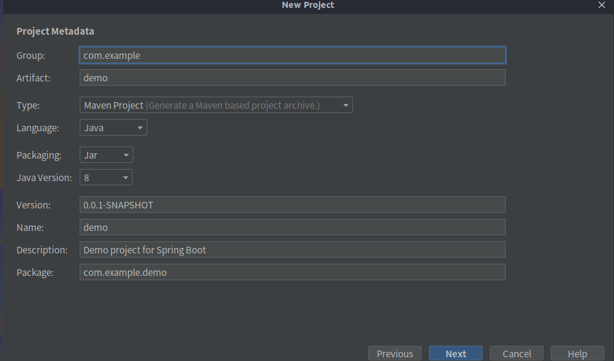
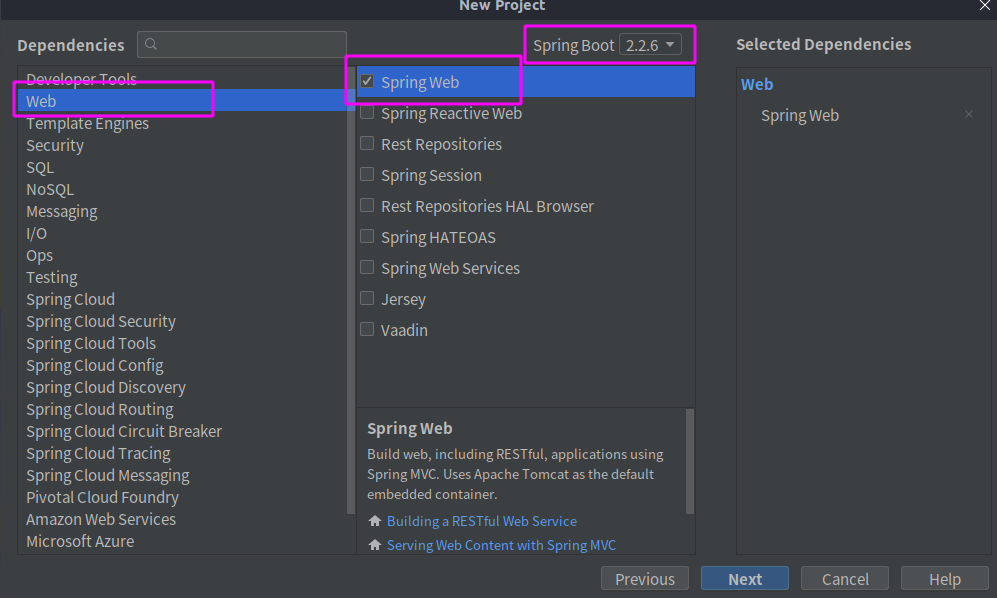
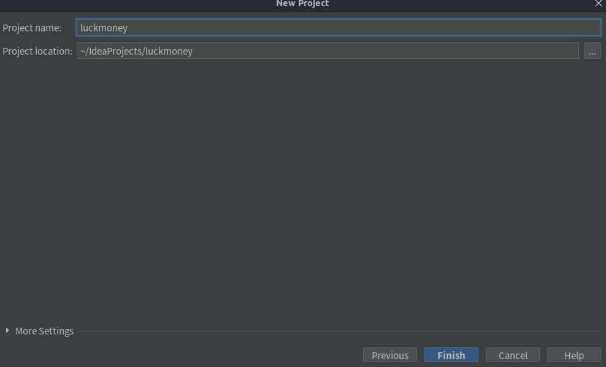

## 一、选择Spring initializr 创建Spring boot项目

Spring initializr 是Spring 官方提供的一个用来初始化一个Spring boot 项目的工具。

<!--more-->

* Project SDK : 项目SDK的版本(选择默认)
* Choose initializr Service URL : Spring initializr初始化工具的URL地址(选择默认)

## 二、编辑项目信息

* Group : 项目的组织名(通常为公司域名反写)
* Artifact : 项目名
* Type : 使用什么构建工具(默认使用Maven)
* Language : 使用的语言(默认使用Java)
* Packaging : 项目打包方式(打jar包)
* Jav Version : java版本
* Version : 项目版本 , SNAPSHOT = 快照版(不稳定版) , RELEASE = 稳定版
* Name : 项目名
* Description : 项目的描述
* Package : 项目默认创建的包

## 三、选择创建Spring Web项目

选择 Web -> Spring Web , 在Spring Boot 处选择Spring Boot的版本

## 四、选择项目路径

* Project name : 工程名
* Project location : 工程路径

创建成功后,在IDEA的右下角会有Maven projects need to be imported选择框,选择Enable Auto-Import自动导入Maven依赖

* Import Changes : 每次修改Pom文件时需要手动运行导入Maven依赖
* Enable Auto-Import : 修改Pom文件后,自动导入Maven依赖

Spring Boot项目创建完成,接下来就可以写具体的业务逻辑啦

## 参考及感谢

### 参考文档

[什么是Spring initializr](https://blog.csdn.net/wdwyf999/article/details/84996234):https://blog.csdn.net/wdwyf999/article/details/84996234

[maven snapshot和release版本的区别](https://zhidao.baidu.com/question/561174953188808884.html):https://zhidao.baidu.com/question/561174953188808884.html