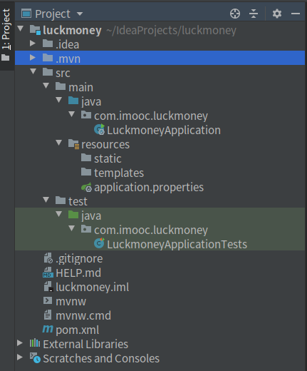

## 一、Spring Boot 工程初始目录结构

<!--more-->



## 二、主要目录结构

```bash
├── pom.xml # Maven配置文件
└── src 
    ├── main 
    │   ├── java # 主体代码
    │   │   └── com.imooc.luckmoney
    │   │               └── LuckmoneyApplication.java # Spring Boot 的入口程序
    │   └── resources 
    │       ├── application.properties # Spring　Boot 配置文件
    │       ├── static  # 放置各种静态资源文件，css、js、img等
    │       └── templates # 放置各种静态资源文件，css、js、img等
    └── test
        └── java # 测试代码
            └── com.imooc.luckmoney
                        └── LuckmoneyApplicationTests.java # 默认生成的测试文件
```

## 三、其他文件

### (1).idea : 存放项目的配置信息 

.Idea存放项目的配置信息，包括历史记录，版本控制信息等

### (2)luckmoney.iml : intellij idea的工程配置文件

iml是 intellij idea的工程配置文件，里面是当前project的一些配置信息。

如模块开发的相关信息，比如java组件，maven组件，插件组件等，还可能会存储一些模块路径信息，依赖信息以及一些别的信息。

### (3).mvn : 存放mvnw相关文件

存放maven-wrapper.properties和相关jar包以及名为MavenWrapperDownloader的java文件

### (4)mvnw : 全名是maven wrapper

它的原理是在maven-wrapper.properties文件中记录你要使用的maven版本，当用户执行mvnw clean 命令时，发现当前用户的maven版本和期望的版本不一致，那么就下载期望的版本，然后用期望的版本来执行mvn命令，比如刚才的mvn clean

### (5mvnw.cmd : 执行mvnw命令的cmd入口

注：mvnw文件适用于Linux（bash），mvnw.cmd适用于Windows 环境。

### (6).gitignore : git的配置文件，配置忽略提交的文件

### (7)HELP.md : 帮助文档

## 参考与感谢

### 文章引用

[IDEA构建maven项目生成的文件详解 （.mvn、mvnw、mvnw.cmd、.gitignore、.iml、.idea、pom.xml）](https://blog.csdn.net/vhfdff/article/details/89048334)

[IDEA中的.iml文件和.idea文件夹](https://blog.csdn.net/FlyToMyHeart/article/details/80409098)

[构建项目生成的文件（.mvn、mvnw、mvnw.cmd、.gitignore）](https://www.jianshu.com/p/2985590b08cc)

### 参考文档

[IDEA中的.iml文件和.idea文件夹作用和意义](https://blog.csdn.net/weixin_41699562/article/details/99552780)

[maven工程目录结构分析](https://www.jianshu.com/p/42451de51c4f)

[SpringBoot 目录结构](https://blog.csdn.net/little_skeleton/article/details/80922725)