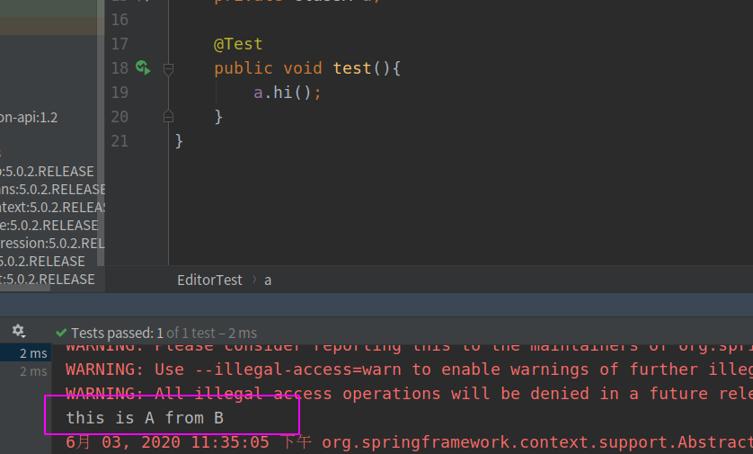

整理自:[<u>redisTemplate如何注入到ValueOperations</u>](https://www.cnblogs.com/tangyuanyuan/p/8067923.html) 、[<u>@Autowired 与@Resource的区别（详细）</u>](https://blog.csdn.net/weixin_40423597/article/details/80643990)

## 一、前言

最近在学习Redis, 在学习Redis整合Spring的时候, 遇到了一个十分神秘的语法:

```java
    @Autowired
    private RedisTemplate<String,Object> redisTemplate;

    @Resource(name = "redisTemplate")
    private ValueOperations<String, Object> vOps;
```

上面的代码将 redisTemplate 注入到 ValueOperations ，避免了 ``ValueOperations<String,  Object> valueOperations = redisTemplate.opsForValue();  ``这样来获取 ValueOperations

RedisTemplate类和ValueOperations类在继承上毫无联系 , 可却成功将 redisTemplate 注入到 ValueOperations , 他到底是如何注入的呢 ???

在找了很多的资料后, 我遇到了这篇博客: [<u>redisTemplate如何注入到ValueOperations</u>](https://www.cnblogs.com/tangyuanyuan/p/8067923.html) 终于解决了我的疑惑 , 接下来是我的一些整理和总结

<!--more-->

## 二、@Resource 注解

​		@Resource的作用相当于@Autowired，只不过@Autowired按byType自动注入，而@Resource默认按  byName自动注入罢了。@Resource有两个属性是比较重要的，分是name和type，Spring将@Resource注解的name属性解析为bean的名字，而type属性则解析为bean的类型。所以如果使用name属性，则使用byName的自动注入策略，而使用type属性时则使用byType自动注入策略。如果既不指定name也不指定type属性，这时将通过反射机制使用byName自动注入策略。

> @Resource装配顺序

　　1. 如果同时指定了name和type，则从Spring上下文中找到唯一匹配的bean进行装配，找不到则抛出异常
　　2. 如果指定了name，则从上下文中查找名称（id）匹配的bean进行装配，找不到则抛出异常
　　3. 如果指定了type，则从上下文中找到类型匹配的唯一bean进行装配，找不到或者找到多个，都会抛出异常
　　4. 如果既没有指定name，又没有指定type，则自动按照byName方式进行装配；如果没有匹配，则回退为一个原始类型进行匹配，如果匹配则自动装配；

## 三、如何注入

​		在 Spring 的``org.springframework.beans.factory.support.AbstractBeanFactory`` 这个类中 , 有一个``doGetBean()``方法。在``doGetBean()``方法中 , 有这么一段代码 :

```java
        if (requiredType != null && !requiredType.isInstance(bean)) {
            try {
                T convertedBean = this.getTypeConverter().convertIfNecessary(bean, requiredType);
                if (convertedBean == null) {
                    throw new BeanNotOfRequiredTypeException(name, requiredType, bean.getClass());
                } else {
                    return convertedBean;
                }
            } catch (TypeMismatchException var25) {
                if (this.logger.isTraceEnabled()) {
                    this.logger.trace("Failed to convert bean '" + name + "' to required type '" + ClassUtils.getQualifiedName(requiredType) + "'", var25);
                }

                throw new BeanNotOfRequiredTypeException(name, requiredType, bean.getClass());
            }
        } else {
            return bean;
        }
```

​		这段代码的含义是 : 如果你要实例化的对象和你的引用对象并不是同一种类型，也就是如``redisTemplate``和``ValueOperations``一般不是父子关系或接口实现关系，那么spring就会进行转换。

用什么转换呢？**Spring的editor**

``org.springframework.beans.BeanUtils``这个类中 , 有一个``findEditorByConvention``方法

```java
            String targetTypeName = targetType.getName();
            String editorName = targetTypeName + "Editor";

            try {
                Class<?> editorClass = cl.loadClass(editorName);
                if (!PropertyEditor.class.isAssignableFrom(editorClass)) {
                    if (logger.isInfoEnabled()) {
                        logger.info("Editor class [" + editorName + "] does not implement [java.beans.PropertyEditor] interface");
                    }

                    unknownEditorTypes.add(targetType);
                    return null;
                } else {
                    return (PropertyEditor)instantiateClass(editorClass);
                }
            } catch (ClassNotFoundException var5) {
                if (logger.isTraceEnabled()) {
                    logger.trace("No property editor [" + editorName + "] found for type " + targetTypeName + " according to 'Editor' suffix convention");
                }

                unknownEditorTypes.add(targetType);
                return null;
            }
```

​		spring会去加载 ValueOperations + Editor，即``ValueOperationsEditor``的类。且此类必须要实现``PropertyEditor``接口。而我们在``ValueOperations``的包目录下确实会找到``ValueOperationsEditor``。

```java
class ValueOperationsEditor extends PropertyEditorSupport {
    ValueOperationsEditor() {
    }

    public void setValue(Object value) {
        if (value instanceof RedisOperations) {
            super.setValue(((RedisOperations)value).opsForValue());
        } else {
            throw new IllegalArgumentException("Editor supports only conversion of type " + RedisOperations.class);
        }
    }
}
```

​		这个类非常简单，它重写了``setValue``方法，将``redisTemplate``中的``opsForValue()``返回值set进去，而``opsForValue()``返回值就是继承了``ValueOperations``的``DefaultValueOperations``。

​		这样我们用editor get value的时候就能获取到``DefaultValueOperations``了。就可以将``DefaultValueOperations``注入到``ValueOperations``中去了。

## 四、Editor类实验

### (1)导入相关依赖

```xml
<!--Spring容器-->
<dependency>
    <groupId>org.springframework</groupId>
    <artifactId>spring-context</artifactId>
    <version>5.0.2.RELEASE</version>
</dependency>

<!--@Resource依赖包-->
<dependency>
    <groupId>javax.annotation</groupId>
    <artifactId>javax.annotation-api</artifactId>
    <version>1.2</version>
</dependency>

<!--单元测试-->
<dependency>
    <groupId>junit</groupId>
    <artifactId>junit</artifactId>
    <version>4.12</version>
</dependency>

<!-- Spring整合Junit-->
<dependency>
    <groupId>org.springframework</groupId>
    <artifactId>spring-test</artifactId>
    <version>5.0.2.RELEASE</version>
</dependency>
```

### (2)编写类 ClassA 和 ClassB 

> ClassA 类 

```java
package com.learning;

public class ClassA {
    private String msg;
    public ClassA(String msg){
        this.msg=msg;
    }
    public void hi(){
        System.out.println(msg);
    }
}
```

> ClassB 类

```java
package com.learning;

import org.springframework.stereotype.Component;

@Component
public class ClassB {
    public ClassA getA(){
        return new ClassA("this is A from B");
    }
}
```

类B有个方法可以获取A类实例，我们将此注入到A对象中。

### (3)编写测试类和Spring配置类

> EditorTest 类

```java
@RunWith(SpringJUnit4ClassRunner.class)
@ContextConfiguration(classes={SpringConfig.class})
public class EditorTest {

    @Resource(name="classB")
    private ClassA a;

    @Test
    public void test(){
        a.hi();
    }
}
```

为了使用纯注解, 我们还需要创建一个SpringConfig类

> SpringConfig 类

```java
@Configuration
@ComponentScan(basePackages={"com.learning"})
public class SpringConfig {
}
```

### (4)编写类 ClassAEditor 

此时我们还需要写一个**ClassAEditor类**。如果没有editor类的话当然会注入不了 并抛出一个异常 ``Bean named 'classB' is expected to be of type 'xxx.test.ClassA' but was actually of type 'xxx.test.ClassB'``

我们完成ClassAEditor(判断略去不写):

> ClassAEditor 类

```java
public class ClassAEditor extends PropertyEditorSupport {
    public void setValue(Object value) {
        super.setValue(((ClassB)value).getA());
    }
}
```

### (5)运行结果

运行程序，得到正确结果



## 参考文档

[<u>@resource 注解的依赖</u>](https://www.jianshu.com/p/2b4c6a707343)

[<u>Spring框架整合Junit单元测试框架的纯注解方式</u>](https://blog.csdn.net/aaron_80726/article/details/78530529)