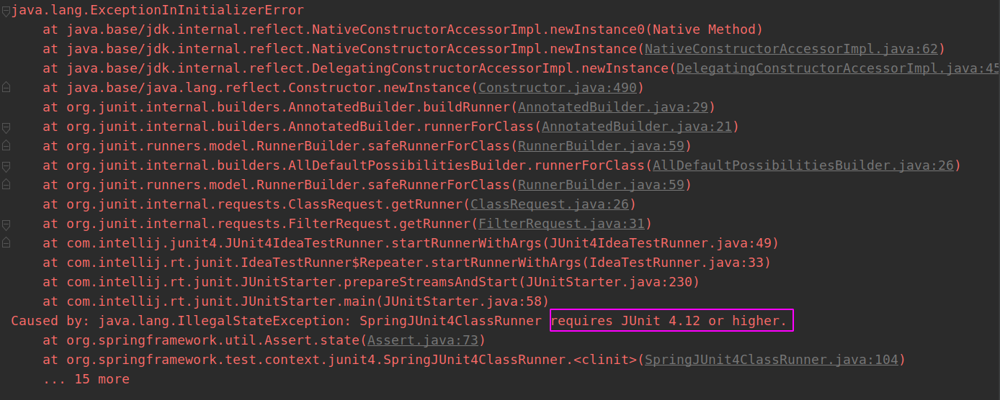

## 一. 导入相关依赖

### (1) junit依赖

```xml
    <dependency>
      <groupId>junit</groupId>
      <artifactId>junit</artifactId>
      <version>4.12</version>
      <scope>test</scope>
    </dependency>
```

注:Spring 5.x 版本整合Junit时,**Junit的版本要求必须在4.12及以上**,否则会报错

<!--more-->



### (2)spring-test

```xml
    <!--Spring-test-->
    <!-- https://mvnrepository.com/artifact/org.springframework/spring-aspects -->
    <dependency>
      <groupId>org.springframework</groupId>
      <artifactId>spring-test</artifactId>
      <version>5.0.2.RELEASE</version>
    </dependency>
```

## 二. 添加注解

在测试类添加注解:

```java
/**
	* RunWith注解:
	* 作用: 把原有的main方法替换成spring提供的main方法
	* 写法固定
	*/
@RunWith(SpringJUnit4ClassRunner.class)
/**
   * ContextConfiguration注解:
   * locations属性: 用于指定Spring配置文件的路径
   * classes属性: 用于指定注解类所在地的路径
   */
@ContextConfiguration(locations = {"classpath:applicationContext.xml"})
// 注解类写法:
//@ContextConfiguration(classes = SpringConfiguration.class)
public class MapperTest {
	//实现自动依赖注入
    @Autowired
    private DepartmentMapper departmentMapper;

    @Test
    public void testCRUD(){
        //使用依赖注入的对象
        System.out.println(departmentMapper);
    }
}
```

## 三.示例代码

```java
@RunWith(SpringJUnit4ClassRunner.class)
@ContextConfiguration(locations = {"classpath:applicationContext.xml"})
public class MapperTest {
    @Autowired
    private DepartmentMapper departmentMapper;

    @Test
    public void testCRUD(){
        System.out.println(departmentMapper);
    }
}
```

