## 一、项目概述

### (1)项目介绍

尚硅谷SSM员工管理系统,是尚硅谷雷丰阳老师的视频课程中的项目.写这个项目是因为我们学校老师把它作为课程项目来讲课.这个项目实现了对员工表,部门表实现基本的CRUD操作.

这个项目用到了下面几个知识:

* 基础框架-ssm(SpringMVC+Spring+MyBatis)
* 数据库-MySQL
* 前端框架-bootstrap快速搭建简洁美观的界面
* 项目的依赖管理-Maven
* 分页-pagehelper
* 逆向工程-MyBatis Generator

课程视频的网址:https://www.bilibili.com/video/BV1rt41127Cp 

项目github : https://github.com/DavidHSiang/atguigu-ssm-crud

<!--more-->

### (2)功能介绍

> 需求:对员工表,部门表实现基本的CRUD操作

1.分页查询员工表

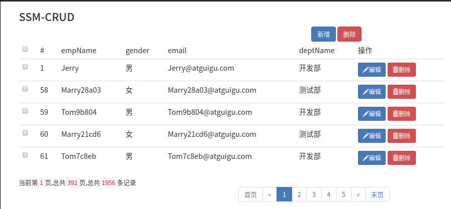

2.增加一个新的员工

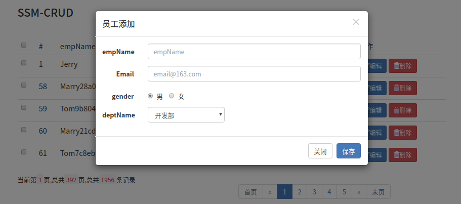

3.修改员工信息

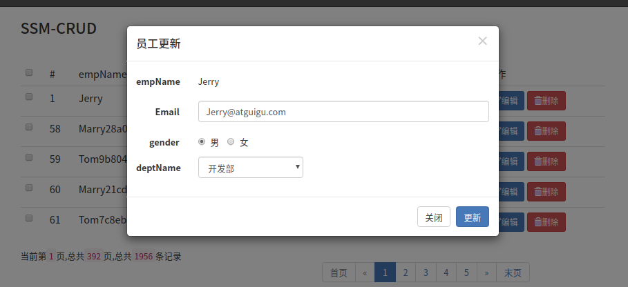

4.删除

删除包括删除单个和批量删除

* 删除单例

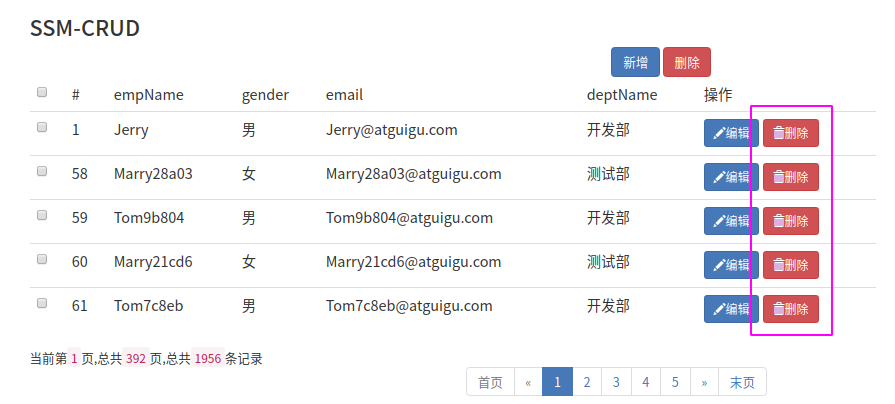

* 批量删除

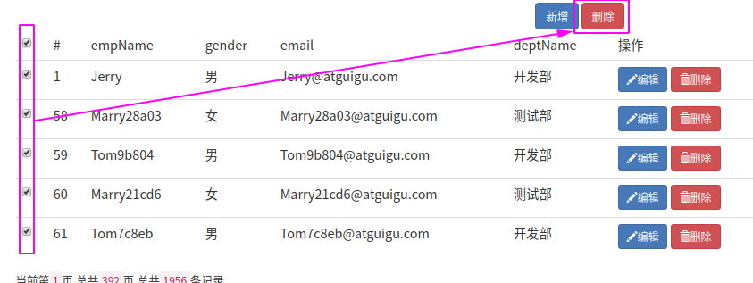

## 二、环境搭建

### (0)数据库搭建

本项目使用mysql作为后端数据库, 本项目需要用到两张表:

* 员工表:``tbl_emp``
* 部门表:``tbl_dept``

以下是这两张表的设计:

> 员工表:``tbl_emp``

| Field | Type | Null | Key  | Default | Extra |
| ----- | ---- | ---- | ---- | ------- | ----- |
| emp_id   | int(11) unsigned | NO   | PRI | NULL    | auto_increment |
| d_id     | int(11) unsigned | YES  | MUL | NULL    |                |
| emp_name | varchar(255)     | NO   |     | NULL    |                |
| gender   | char(1)          | YES  |     | NULL    |                |
| email    | varchar(255)     | YES  |     | NULL    |                |

> 部门表:``tbl_dept``

| Field     | Type             | Null | Key | Default | Extra          |
| ----- | ---- | ---- | ---- | ------- | ----- |
| dept_id   | int(11) unsigned | NO   | PRI | NULL    | auto_increment |
| dept_name | varchar(255)     | NO   |     | NULL    |                |

> 创建数据库atguigu_ssm_crud

```mysql
# 创建数据库atguigu_ssm_crud
create DATABASE atguigu_ssm_crud;
# 转到atguigu_ssm_crud数据库下
use atguigu_ssm_crud;
```

> 创建员工表与部门表

```mysql
#创建员工表
CREATE TABLE IF NOT EXISTS `tbl_emp`(
	`emp_id` INT(11) UNSIGNED NOT NULL AUTO_INCREMENT ,
	`emp_name` VARCHAR(255) NOT NULL ,
	`gender` CHAR(1),
	`email` VARCHAR(255),
	`salary` INT(5) UNSIGNED,
	PRIMARY KEY ( `emp_id` )
)ENGINE=InnoDB DEFAULT CHARSET=utf8;

#创建部门表
CREATE TABLE IF NOT EXISTS `tbl_dept`(
	`dept_id` INT(11) UNSIGNED NOT NULL AUTO_INCREMENT ,
	`dept_name` VARCHAR(255) NOT NULL ,
	PRIMARY KEY ( `dept_id` )
)ENGINE=InnoDB DEFAULT CHARSET=utf8;

#在员工表的 员工id 字段后添加一个 部门id 字段
alter  table  tbl_emp  add   d_id   INT(11) UNSIGNED  DEFAULT NULL after emp_id;

#添加外键
alter table tbl_emp add constraint `fk_emp_dept` foreign key (`d_id`) references tbl_dept(`dept_id`);

# 显示员工表的表结构
desc tbl_emp;

# 显示部门表的表结构
desc tbl_dept;
```

### (1)Maven创建Web工程

选择 maven => Create from archetype => maven-archetype-webapp , 创建一个web工程

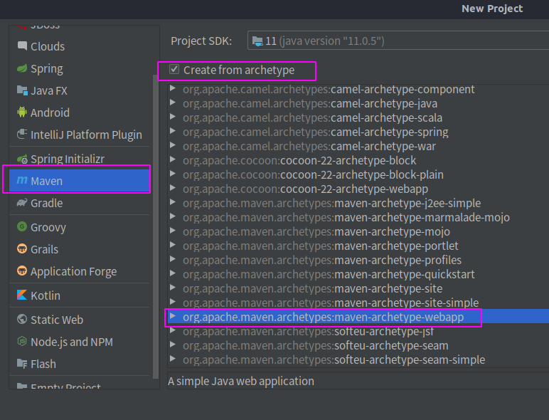

编辑工程的相应信息

* Name: 项目名
* Location: 项目路径
* GroupId: 组名 , 为公司域名的反写
* ArtifactId: 不带版本号的jar的名字 , 与项目名相同
* Version : 当前项目的版本号 , SNAPSHOT表示是快照版(不稳定版) , RELEASE 为稳定版

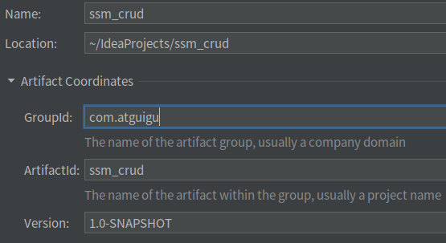

设置Maven

* Maven home directory : Maven工具的路径
* User setting file : Maven配置文件的路径
* Local repository: Maven本地仓库的路径

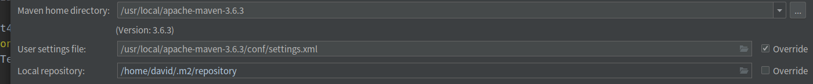

Web工程创建完成

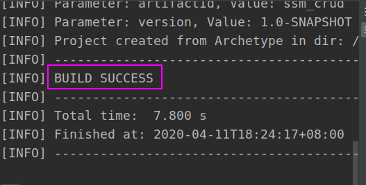

### (2)完善目录结构

Maven工程的基本目录结构:

```
projectName
├── pom.xml
└── src
    ├── main
    │   ├── java
    │   └── resources
    └── test
        ├── java
        └── resources

```

Maven创建Web工程生成的目录结构是不完善的 ,生成的需要手动补全目录结构:

* 在main下添加java目录
* 在main下添加resources目录
* 在src下添加test/java目录

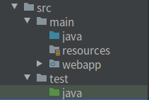

在main/java下添加工程需要的包目录

* 表现层 : com.atguigu.controller
* 业务逻辑层 : com.atguigu.service
* 持久层 : com.atguigu.dao
* bean : com.atguigu.bean

在test/java下添加测试包

* test : com.atguigu.test

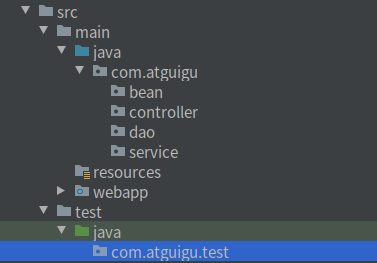

### (3)修改Maven编译版本

Maven默认编译版本为 JDK 1.7

```xml
  <properties>
    <project.build.sourceEncoding>UTF-8</project.build.sourceEncoding>
    <maven.compiler.source>1.7</maven.compiler.source>
    <maven.compiler.target>1.7</maven.compiler.target>
  </properties>
```

Maven修改编译版本至 1.8

```xml
  <properties>
    <project.build.sourceEncoding>UTF-8</project.build.sourceEncoding>
    <maven.compiler.source>1.8</maven.compiler.source>
    <maven.compiler.target>1.8</maven.compiler.target>
  </properties>
```

### (4)引入Spring

#### 1.引入依赖

Maven中央仓库地址:https://mvnrepository.com/

需要用到的依赖

* Spring以及SpringMVC - spring-webmvc
* Spring事务控制 - spring-jdbc
* Spring 面向切面 - spring-aspects
* Spring整合Junit - spring-test

本项目采用 Spring 5.0.2.RELEASE 版本

```xml
  <dependencies>
    <!-- Spring以及SpringMVC-->
    <!-- https://mvnrepository.com/artifact/org.springframework/spring-webmvc -->
    <dependency>
      <groupId>org.springframework</groupId>
      <artifactId>spring-webmvc</artifactId>
      <version>5.0.2.RELEASE</version>
    </dependency>
    <!-- Spring事务控制-->
    <!-- https://mvnrepository.com/artifact/org.springframework/spring-jdbc -->
    <dependency>
      <groupId>org.springframework</groupId>
      <artifactId>spring-jdbc</artifactId>
      <version>5.0.2.RELEASE</version>
    </dependency>
    <!--Spring 面向切面-->
    <!-- https://mvnrepository.com/artifact/org.springframework/spring-aspects -->
    <dependency>
      <groupId>org.springframework</groupId>
      <artifactId>spring-aspects</artifactId>
      <version>5.0.2.RELEASE</version>
    </dependency>
    <!--Spring整合Junit-->
    <!-- https://mvnrepository.com/artifact/org.springframework/spring-aspects -->
    <dependency>
      <groupId>org.springframework</groupId>
      <artifactId>spring-test</artifactId>
      <version>5.0.2.RELEASE</version>
    </dependency>
</dependencies>
```

#### 2.创建并编辑Spring配置文件

##### 1)在resources目录下创建spring配置文件 : applicationContext.xml

##### 2)引入Spring 约束

Spring 配置文件需要的约束

* Spring IOC (核心容器) 
* Spring 注解
* Spring事务控制
* Spring AOP (面向切面)

打开spring源码包下的官方文档 : spring-framework-5.0.2.RELEASE-dist/spring-framework-5.0.2.RELEASE/docs/spring-framework-reference/index.html

打开官方文档下的Core目录

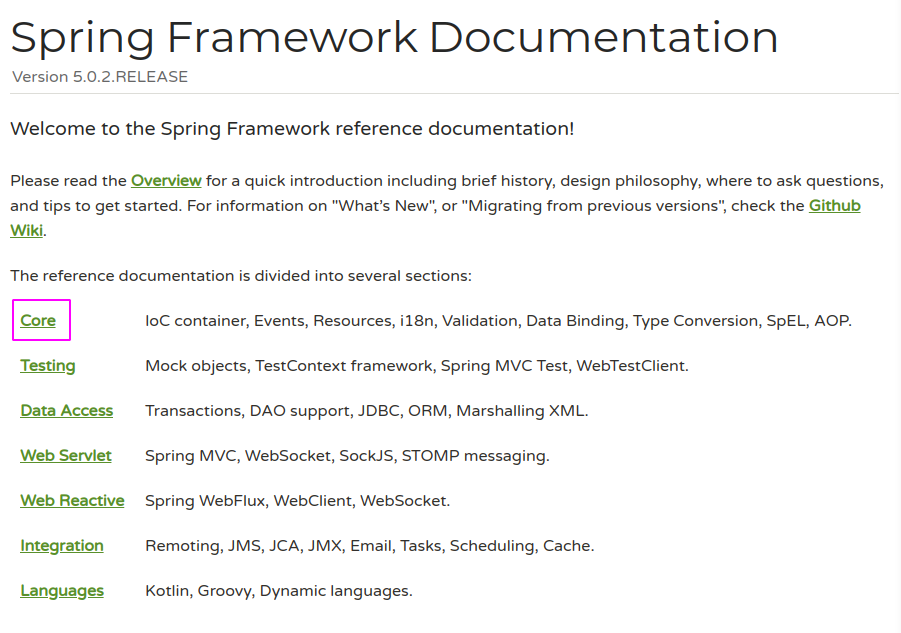

查找文档中的第一个xmlns , 这是Spring IOC (核心容器)的约束,复制这个约束到配置文件中

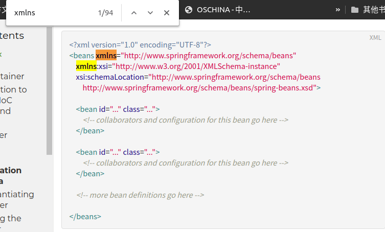

```xml
<?xml version="1.0" encoding="UTF-8"?>
<beans xmlns="http://www.springframework.org/schema/beans"
    xmlns:xsi="http://www.w3.org/2001/XMLSchema-instance"
    xsi:schemaLocation="http://www.springframework.org/schema/beans
        http://www.springframework.org/schema/beans/spring-beans.xsd">
</beans>
```

下面,只需要将``xmlns="http://www.springframework.org/schema/beans"``和xsi:schemaLocation中的内容复制粘贴 , 将``beans``替换为其他约束``相应的名称``, 并在``xmlns``后添加``:[相应名称]``

```xml
xmlns:[相应名称]="http://www.springframework.org/schema/[相应名称]"
```

```xml
xsi:schemaLocation="http://www.springframework.org/schema/beans
        http://www.springframework.org/schema/beans/spring-beans.xsd
        http://www.springframework.org/schema/[相应名称]
        http://www.springframework.org/schema/[相应名称]/spring-[相应名称].xsd
		....">
```

其他约束的对应名称:

* Spring 注解 - xmlns:context
* Spring事务控制 - xmlns:tx
* Spring AOP (面向切面) -  - xmlns:aop

最终的约束:

```xml
<?xml version="1.0" encoding="UTF-8"?>
<beans xmlns="http://www.springframework.org/schema/beans"
    xmlns:xsi="http://www.w3.org/2001/XMLSchema-instance"
    xmlns:context="http://www.springframework.org/schema/context"
    xmlns:tx="http://www.springframework.org/schema/tx"
    xmlns:aop="http://www.springframework.org/schema/aop"
    xsi:schemaLocation="http://www.springframework.org/schema/beans
        http://www.springframework.org/schema/beans/spring-beans.xsd
        http://www.springframework.org/schema/context
        http://www.springframework.org/schema/context/spring-context.xsd
       http://www.springframework.org/schema/tx
        http://www.springframework.org/schema/tx/spring-tx.xsd
       http://www.springframework.org/schema/aop
        http://www.springframework.org/schema/aop/spring-aop.xsd">
</beans>
```

##### 3)添加注解自动扫描

```xml
<!-- 自动扫描除Controller之外的所有注解 -->
<context:component-scan base-package="com.atguigu">
        <context:exclude-filter type="annotation" expression="org.springframework.stereotype.Controller"/>
    </context:component-scan>
```

##### 4)Spring整合Mybatis与Spring事务管理在之后进行配置

##### 5)最终的Spring配置文件 : applicationContext.xml

```xml
<?xml version="1.0" encoding="UTF-8"?>
<beans xmlns="http://www.springframework.org/schema/beans"
       xmlns:xsi="http://www.w3.org/2001/XMLSchema-instance"
       xmlns:aop="http://www.springframework.org/schema/aop"
       xmlns:context="http://www.springframework.org/schema/context"
       xmlns:tx="http://www.springframework.org/schema/tx"
       xsi:schemaLocation="http://www.springframework.org/schema/beans
        http://www.springframework.org/schema/beans/spring-beans.xsd
        http://www.springframework.org/schema/aop
        http://www.springframework.org/schema/aop/spring-aop.xsd
        http://www.springframework.org/schema/context
        http://www.springframework.org/schema/context/spring-context.xsd
        http://www.springframework.org/schema/tx
        http://www.springframework.org/schema/tx/spring-tx.xsd">
    <!-- 自动扫描除Controller之外的所有注解 -->
    <context:component-scan base-package="com.atguigu">
        <context:exclude-filter type="annotation" expression="org.springframework.stereotype.Controller"/>
    </context:component-scan>
</beans>
```

#### 3.添加Spring监听器

到此为止,我们添加了Spring的依赖,编辑了Spring的配置文件, 但是要想在服务器启动时启动Spring,需要在``web.xml``文件中添加**Spring监听器**

```xml
  <!--启动Spring容器-->
  <context-param>
    <param-name>contextConfigLocation</param-name>
    <param-value>classpath:applicationContext.xml</param-value>
  </context-param>
  <listener>
    <listener-class>org.springframework.web.context.ContextLoaderListener</listener-class>
  </listener>
```

### (4)引入Mybatis

#### 1.引入依赖

Maven中央仓库地址:https://mvnrepository.com/

需要用到的依赖

* Mybatis基本依赖 - mybatis
* mybatis整合spring - mybatis-spring
* 数据库驱动 - c3p0
* 连接池 - mysql-connector-java

```xml
  <dependencies>
    <!-- mybatis-->
    <!-- https://mvnrepository.com/artifact/org.mybatis/mybatis -->
    <dependency>
      <groupId>org.mybatis</groupId>
      <artifactId>mybatis</artifactId>
      <version>3.4.5</version>
    </dependency>
    <!--mybatis整合spring的适配包-->
    <!-- https://mvnrepository.com/artifact/org.mybatis/mybatis-spring -->
    <dependency>
      <groupId>org.mybatis</groupId>
      <artifactId>mybatis-spring</artifactId>
      <version>1.3.1</version>
    </dependency>
    <!--数据库连接池-->
    <!-- https://mvnrepository.com/artifact/c3p0/c3p0 -->
    <dependency>
      <groupId>c3p0</groupId>
      <artifactId>c3p0</artifactId>
      <version>0.9.1.2</version>
    </dependency>
     <!--数据库驱动-->
    <!-- https://mvnrepository.com/artifact/mysql/mysql-connector-java -->
    <dependency>
      <groupId>mysql</groupId>
      <artifactId>mysql-connector-java</artifactId>
      <version>5.1.41</version>
    </dependency>
</dependencies>
```

#### 2.创建并编辑Mybatis配置文件

##### 1)在resources目录下创建spring配置文件 : mybatis-config.xml

##### 2)引入Mybatis 约束

Mybatis官方文档: https://mybatis.org/mybatis-3/ , 复制Mybatis官方文档>入门中的xml 约束

```xml
<?xml version="1.0" encoding="UTF-8" ?>
<!DOCTYPE configuration
  PUBLIC "-//mybatis.org//DTD Config 3.0//EN"
  "http://mybatis.org/dtd/mybatis-3-config.dtd">
<configuration>
</configuration>
```

##### 3)在configuration中 , 添加设置 , 使用驼峰命名法

```xml
    <settings>
        <setting name="mapUnderscoreToCamelCase" value="true"/>
    </settings
```

##### 4)在configuration中 , 配置bean的类型别名

```xml
    <typeAliases>
        <package name="com.atguigu.bean"/>
    </typeAliases>
```

##### 5)关于数据库连接的信息、反向工程、分页插件PageHelper 在之后进行配置

##### 6)最终的mybatis配置文件 : mybatis-config.xml

```xml
<?xml version="1.0" encoding="UTF-8" ?>
<!DOCTYPE configuration
        PUBLIC "-//mybatis.org//DTD Config 3.0//EN"
        "http://mybatis.org/dtd/mybatis-3-config.dtd">
<configuration>
    <settings>
        <setting name="mapUnderscoreToCamelCase" value="true"/>
    </settings>
    <typeAliases>
        <package name="com.atguigu.bean"/>
    </typeAliases>
</configuration>
```

### (6)引入SpringMVC

#### 1.引入依赖

Maven中央仓库地址:https://mvnrepository.com/

需要用到的依赖

* Spring以及SpringMVC - spring-webmvc
* SpringMVC解析JSON - jackson-databind

本项目采用 Spring 5.0.2.RELEASE 版本

其中, ``spring-webmvc``这个依赖在引入Spring的时候就一起引入了,jackson-databind在使用到注解``@ResponseBody``时一定要导入

```xml
  <dependencies>
    <!-- Spring以及SpringMVC-->
    <!-- https://mvnrepository.com/artifact/org.springframework/spring-webmvc -->
    <dependency>
      <groupId>org.springframework</groupId>
      <artifactId>spring-webmvc</artifactId>
      <version>5.0.2.RELEASE</version>
    </dependency>
    <!--SpringMVC解析JSON-->
    <!-- https://mvnrepository.com/artifact/com.fasterxml.jackson.core/jackson-databind -->
    <dependency>
      <groupId>com.fasterxml.jackson.core</groupId>
      <artifactId>jackson-databind</artifactId>
      <version>2.10.0</version>
    </dependency>
</dependencies>
```

#### 2.配置SpringMVC前端控制器

若想使用SpringMVC, 必须在web.xml中配置SpringMVC的前端控制器。SpringMVC的前端控制器是一个servlet。我们可以通过在web.xml中配置, 来指定SpringMVC配置文件的路径,也可以不指定。若不指定, 需要将SpringMVC的配置文件放在与web.xml同级的目录下, 并把文件名设置成: ``<servlet名>-servlet.xml``, 即``dispatcherServlet-servlet.xml``

```xml
  <!--SpringMVC的前端控制器,拦截所有请求-->
  <servlet>
    <servlet-name>dispatcherServlet</servlet-name>
    <servlet-class>org.springframework.web.servlet.DispatcherServlet</servlet-class>
    <load-on-startup>1</load-on-startup>
  </servlet>
  <servlet-mapping>
    <servlet-name>dispatcherServlet</servlet-name>
    <url-pattern>/</url-pattern>
  </servlet-mapping>
```

#### 3.创建并编辑SpringMVC配置文件

##### 1)在webapp => WEB-INF 目录下, 创建文件``dispatcherServlet-servlet.xml``

##### 2)引入SpringMVC约束

引入SpringMVC配置文件的约束的方式, 与引入Spring配置文件约束相似, 只不过需要引入的约束有所不同

Spring 配置文件需要的约束:

* Spring 注解 - xmlns:context
* SpringMVC - mvc

最终的约束:

```xml
<?xml version="1.0" encoding="UTF-8"?>
<beans xmlns="http://www.springframework.org/schema/beans"
       xmlns:mvc="http://www.springframework.org/schema/mvc"
       xmlns:context="http://www.springframework.org/schema/context"
       xmlns:xsi="http://www.w3.org/2001/XMLSchema-instance"
       xsi:schemaLocation="
        http://www.springframework.org/schema/beans
        http://www.springframework.org/schema/beans/spring-beans.xsd
        http://www.springframework.org/schema/mvc
        http://www.springframework.org/schema/mvc/spring-mvc.xsd
        http://www.springframework.org/schema/context
        http://www.springframework.org/schema/context/spring-context.xsd">
</beans>
```

##### 3)添加注解自动扫描

```xml
    <!--
        配置注解扫描
        只扫描controller的注解,别的不扫描
        -->
    <context:component-scan base-package="com.atguigu.controller" use-default-filters="false">
        <context:include-filter type="annotation" expression="org.springframework.stereotype.Controller"/>
    </context:component-scan>
```

需要注意的是: 这里**只扫描controller的注解**, 为此**需要关闭使用默认的过滤器**:``use-default-filters="false"``

##### 4)配置视图解析器

若前后端分离(一般都是前后端分离)的话,可以不用配置

```xml
    <!--
        配置视图解析器
        prefix表示前缀, 指定文件路径
        suffix表示后缀, 指定文件格式
        -->
    <bean id="viewResolver" class="org.springframework.web.servlet.view.InternalResourceViewResolver">
        <property name="prefix" value="/WEB-INF/views/"></property>
        <property name="suffix" value=".jsp"></property>
    </bean>
```

##### 5)两个基本配置

```xml
    <!-- 将SpringMVC不能处理的请求交给Tomcat-->
    <mvc:default-servlet-handler/>
    <!-- 能支持SpringMVC更高级的一些功能-->
    <mvc:annotation-driven/>
```

#### 4.SpringMVC关于静态资源绝对路径与相对路径的一些说明

SpringMVC中网页访问静态资源会存在一些问题。例如,我们在web工程中, 把静态资源文件统一放到webapp/static目录下,把jsp网页全部放入webapp/Web-INF/views目录下

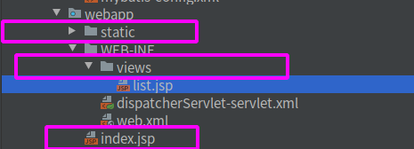

index.jsp转发至list.jsp, 而views下的list.jsp文件要引用static文件夹下的xxx.js文件:

```js
<script src="static/xxx.js"></script>
```

一般情况下,static/xxx.js,表示相对于当前文件所在目录的路径,即./static/xxx.js

/static/xxx.js 表示相对于服务器的路径,即http://localhost:8080/static/xxx.js

但在SSM中,SpringMVC的前端控制器,拦截了所有请求, 因此static/xxx.js或/static/xxx.js都需要经过前端控制器进行解析,而xxx.js是静态资源,不可能通过Controller来配置, 若不进行相关的配置,static/xxx.js相对路径会报错 /static/xxx.js 绝对路径也无法访问, 因为SpringMVC的前端控制器把所有请求都拦截了,但不知道把它定向到哪。可以在SpringMVC配置文件中加入配置:``<mvc:default-servlet-handler/>``(将SpringMVC不能处理的请求交给Tomcat)

此时的相对路径需要注意:访问list.jsp页面是通过index.jsp转发而来的,浏览器上显示的是index.jsp的路径,
此时的相对路径并非相对于list.jsp的相对路径,而是相对于index.jsp的相对路径
即static/xxx.js访问的是
http://localhost:8080/atguigu_ssm_crud_war/static/xxx.js
而对于/static/xxx.js,为绝对路径,即http://localhost:8080/static/xxx.js

> 总结:

从index.jsp转发至list.jsp,相对路径 相对于: http://localhost:8080/atguigu_ssm_crud_war/index.jsp , 
    

| list.jsp``<script src="..."></script>``src中的内容 | 无SpringMVC拦截                                              | 有SpringMVC拦截,<br/>无``<mvc:default-servlet-handler/>`` | 有SpringMVC拦截<br/>有``<mvc:default-servlet-handler/>``     |
| -------------------------------------------------- | ------------------------------------------------------------ | --------------------------------------------------------- | ------------------------------------------------------------ |
| static/xxx.js                                      | http://localhost:8080/atguigu_ssm_crud_war/static/xxx.js <br/>访问成功 | 被拦截,找不到对应的请求映射,报错                          | http://localhost:8080/atguigu_ssm_crud_war/static/xxx.js<br/>访问成功 |
| /static/xxx.js                                     | http://localhost:8080/static/xxx.js <br/>找不到文件,报错     | 被拦截,找不到对应的请求映射,报错                          | http://localhost:8080/static/xxx.js<br/>找不到文件,报错      |
| /atguigu_ssm_crud_war/static/xxx.js                | http://localhost:8080/atguigu_ssm_crud_war/static/xxx.js <br/>访问成功 | 被拦截,找不到对应的请求映射,报错                          | http://localhost:8080/atguigu_ssm_crud_war/static/xxx.js<br/>访问成功 |

### (7)Mybatis整合Spring

#### 1)用于存储数据库连接信息的配置文件``dbconfig.properties``

1.在resources目录下创建一个用于存储数据库连接信息的配置文件:``dbconfig.properties``

2.在``dbconfig.properties``配置文件中添加数据连接信息

```properties
jdbc.jdbcUrl=jdbc:mysql://localhost:3306/atguigu_ssm_crud?characterEncoding=utf-8
jdbc.driverClass=com.mysql.jdbc.Driver
jdbc.user=root
jdbc.password=123456
```

3.在Spring配置文件中引入配置文件``dbconfig.properties``

```xml
<context:property-placeholder location="classpath:dbconfig.properties"/>
```

#### 2)配置数据源

在Spring配置文件中, 配置数据源

```xml
    <!-- 配置数据源 -->
    <bean id="datasource" class="com.mchange.v2.c3p0.ComboPooledDataSource">
        <property name="jdbcUrl" value="${jdbc.jdbcUrl}"></property>
        <property name="driverClass" value="${jdbc.driverClass}"></property>
        <property name="user" value="${jdbc.user}"></property>
        <property name="password" value="${jdbc.password}"></property>
    </bean>
```

#### 3)配置Spring和MyBatis的整合

1.配置SqlSessionFactory工厂(在Spring配置文件中)

```xml
    <!--配置SqlSessionFactory工厂-->
    <bean id="sqlSessionFactory" class="org.mybatis.spring.SqlSessionFactoryBean">
        <!-- 指定mybatis全局配置文件的位置 -->
        <property name="configLocation" value="classpath:mybatis-config.xml"></property>
        <!-- 指定数据源 -->
        <property name="dataSource" ref="datasource"></property>
        <!-- 指定映射文件的位置 -->
        <property name="mapperLocations" value="classpath:mapper/*.xml"></property>
    </bean>
```

2.配置扫描器,将dao接口的代理对象添加到容器(在Spring配置文件中)

```xml
    <!-- 配置扫描器,将dao接口的代理对象添加到容器 -->
    <bean id="mapperScanner" class="org.mybatis.spring.mapper.MapperScannerConfigurer">
        <property name="basePackage" value="com.atguigu.dao"></property>
    </bean>
```

3.配置可以执行批量的sqlSession (注释:批量操作时效率更高,若没有业务需求可以不配)(在Spring配置文件中)

```xml
    <!-- 配置可以执行批量的sqlSession -->
    <bean id="sqlSession" class="org.mybatis.spring.SqlSessionTemplate">
        <constructor-arg name="sqlSessionFactory" ref="sqlSessionFactory"></constructor-arg>
        <constructor-arg name="executorType" value="BATCH"></constructor-arg>
    </bean>
```

### (8)添加Spring事务操作

以下配置均在Spring配置文件中

#### 1)配置事务管理器

```xml
    <!--配置事务管理器-->
    <bean id="transactionManager" class="org.springframework.jdbc.datasource.DataSourceTransactionManager">
        <property name="dataSource" ref="datasource"></property>
    </bean>
```

#### 2)配置事务通知

```xml
    <!--配置事务通知-->
    <tx:advice id="txAdvice" transaction-manager="transactionManager">
        <tx:attributes>
            <tx:method name="*" read-only="false"/>
            <tx:method name="get*" read-only="true"/>
        </tx:attributes>
    </tx:advice>
```

#### 3)配置AOP增强

```xml
    <!--配置AOP增强-->
    <aop:config>
        <aop:pointcut id="txPoint" expression="execution(* com.atguigu.service..*(..))"/>
        <aop:advisor advice-ref="txAdvice" pointcut-ref="txPoint"></aop:advisor>
    </aop:config>
```

### (9)Mybatis分页插件-PageHelper

#### 1)PageHelper简介

PageHelper是Mybatis的一个分页插件

PageHelper的官网:https://pagehelper.github.io/

PageHelper的github: https://github.com/pagehelper/Mybatis-PageHelper

PageHelper的中文文档: https://github.com/pagehelper/Mybatis-PageHelper/blob/master/README_zh.md

#### 2)添加相关依赖

```xml
    <!--Mybatis分页插件-->
    <dependency>
      <groupId>com.github.pagehelper</groupId>
      <artifactId>pagehelper</artifactId>
      <version>5.1.11</version>
    </dependency>
```

#### 3)在Mybatis配置文件中注册PageHelper分页插件

```xml
    <plugins>
        <!-- com.github.pagehelper为PageHelper类所在包名 -->
        <plugin interceptor="com.github.pagehelper.PageInterceptor">
            <!--参数合理化 当pageNum<=0 时会查询第一页 -->
            <property name="reasonable" value="true"/>
        </plugin>
    </plugins>
```

#### 4)PageHelper的基本使用

需要使用PageHelper分页插件,只需要在要执行的查询方法前面添加``PageHelper.startPage();``函数即可

例如:

```java
PageHelper.startPage(1, 5);
List<Employee> employees = employeeService.getAll();
for (Employee e :
        employees) {
    System.out.println(e);
}
```

在上面的代码中,``employeeService.getAll()``是一个查询所有员工类的方法, 参数``1``表示分页是第几页,参数``5``表示每页有多少个元素

可以在查询方法后使用PageInfo类来对分页结果进行封装, 例如:

```java
PageHelper.startPage(pn, 5);
List<Employee> employees = employeeService.getAll();
PageInfo pageInfo = new PageInfo(employees,5);
List<Employee> employeesResult = pageInfo.getList();
for (Employee e :
        employeesResult) {
    System.out.println(e);
}
```

其中PageInfo构造器的参数``5``表示分页条显示的页数

### (10)配置web.xml,添加相关约束、字符编码过滤器与SpringMVCRest风格的过滤器

#### 0)添加相关约束

将原先的``<web-app></web-app>``修改为

```xml
<web-app xmlns="http://xmlns.jcp.org/xml/ns/javaee"
         xmlns:xsi="http://www.w3.org/2001/XMLSchema-instance"
         xsi:schemaLocation="http://xmlns.jcp.org/xml/ns/javaee http://xmlns.jcp.org/xml/ns/javaee/web-app_4_0.xsd"
         version="4.0">
</web-app>
```

#### 1)添加字符编码过滤器

为了防止程序中的中文乱码,需要添加字符编码过滤器。需要注意的是, 字符编码过滤器**一定要放在所有过滤器之前**,因为其他过滤器有可能会对网络请求中的内容进行一些操作,若先对内容进行操作而后设置字符编码, 可能会导致某些地方出现乱码

```xml
  <!--3.字符编码过滤器,一定要放在所有过滤器之前-->
  <filter>
    <filter-name>characterEncodingFilter</filter-name>
    <filter-class>org.springframework.web.filter.CharacterEncodingFilter</filter-class>
    <init-param>
      <param-name>encoding</param-name>
      <param-value>UTF-8</param-value>
    </init-param>
    <init-param>
      <param-name>forceRequestEncoding</param-name>
      <param-value>true</param-value>
    </init-param>
    <init-param>
      <param-name>forceResponseEncoding</param-name>
      <param-value>true</param-value>
    </init-param>
  </filter>
  <filter-mapping>
    <filter-name>characterEncodingFilter</filter-name>
    <url-pattern>/*</url-pattern>
  </filter-mapping>
```

#### 2)添加SpringMVC对Rest风格的URI的支持

SpringMVC默认的只会处理Get和Post请求,若要处理delete和put请求,需要在web.xml中配置使用Rest风格的URI,将页面普通的post请求转换为指定的delete或者put请求

```xml
<!--4.使用Rest风格的URI,将页面普通的post请求转换为指定的delete或者put请求-->
<filter>
  <filter-name>hiddenHttpMethodFilter</filter-name>
  <filter-class>org.springframework.web.filter.HiddenHttpMethodFilter</filter-class>
</filter>
<filter-mapping>
  <filter-name>hiddenHttpMethodFilter</filter-name>
  <url-pattern>/*</url-pattern>
</filter-mapping>
<filter>
  <filter-name>HttpPutFormContentFilter</filter-name>
  <filter-class>org.springframework.web.filter.HttpPutFormContentFilter</filter-class>
</filter>
<filter-mapping>
  <filter-name>HttpPutFormContentFilter</filter-name>
  <url-pattern>/*</url-pattern>
</filter-mapping>
```

### (11)导入Web开发必备包

Web开发必备的依赖有:

* jstl
* servlet-api
* junit

#### 1)jstl

```xml
<!--jstl-->
<!-- https://mvnrepository.com/artifact/jstl/jstl -->
<dependency>
  <groupId>jstl</groupId>
  <artifactId>jstl</artifactId>
  <version>1.2</version>
</dependency>
```

#### 2)servlet-api

**注意:**Tomcat自带了servlet-api的相关jar包, 为了防止与Tomcat上的jar包产生冲突,需要将这个包的范围设置成只在开发时使用,即:``<scope>provided</scope>``

```xml
<!--servlet-api-->
<!-- https://mvnrepository.com/artifact/javax.servlet/javax.servlet-api -->
<dependency>
  <groupId>javax.servlet</groupId>
  <artifactId>javax.servlet-api</artifactId>
  <version>3.1.0</version>
  <scope>provided</scope>
</dependency>
```

#### 3)junit

**注意:**Spring整合Junit时,**Junit的版本必须在4.12即以上**

```xml
<!--junit-->
<dependency>
  <groupId>junit</groupId>
  <artifactId>junit</artifactId>
  <version>4.12</version>
  <scope>test</scope>
</dependency>
```

### (12)使用MyBatis代码生成器,逆向工程生成持久层相关代码

#### 1)导入MyBatis代码生成器的依赖

```xml
<!--MyBatis代码生成器 逆向工程-->
<!-- https://mvnrepository.com/artifact/org.mybatis.generator/mybatis-generator-core -->
<dependency>
  <groupId>org.mybatis.generator</groupId>
  <artifactId>mybatis-generator-core</artifactId>
  <version>1.3.5</version>
</dependency>
```

#### 2)创建并编写mybatis-generator的配置文件

mybatis-generator的github:https://github.com/mybatis/generator

mybatis-generator的官方文档: http://www.mybatis.org/generator/

在官方文档中, 有一个示例配置文件, 这里直接使用官网的示例配置文件作为模板,在模板的基础上进行修改:

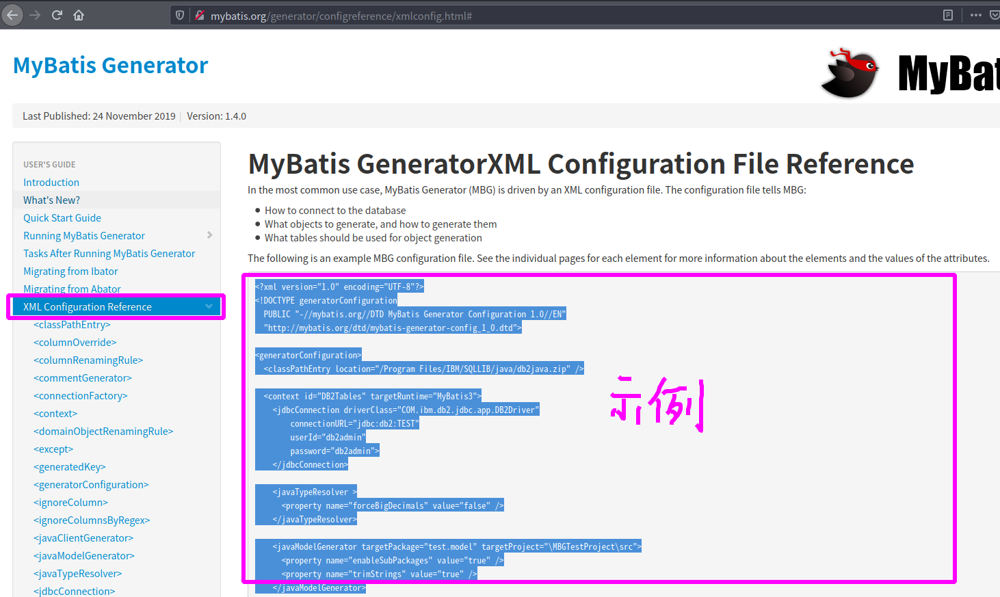

> 配置文件模板与解释

```xml
<?xml version="1.0" encoding="UTF-8"?>
<!DOCTYPE generatorConfiguration
  PUBLIC "-//mybatis.org//DTD MyBatis Generator Configuration 1.0//EN"
  "http://mybatis.org/dtd/mybatis-generator-config_1_0.dtd">

<generatorConfiguration>
  <!-- 需要导入的类,不需要的话直接删除 -->
  <classPathEntry location="/Program Files/IBM/SQLLIB/java/db2java.zip" />

  <context id="DB2Tables" targetRuntime="MyBatis3">
    
     <!-- 数据库连接信息 -->
    <jdbcConnection driverClass="COM.ibm.db2.jdbc.app.DB2Driver"
        connectionURL="jdbc:db2:TEST"
        userId="db2admin"
        password="db2admin">
    </jdbcConnection>
      
    <!-- Java类型解析 -->
    <javaTypeResolver >
      <property name="forceBigDecimals" value="false" />
    </javaTypeResolver>

     <!-- 指定JavaBean生成的位置 -->
    <javaModelGenerator targetPackage="test.model" targetProject="\MBGTestProject\src">
      <property name="enableSubPackages" value="true" />
      <property name="trimStrings" value="true" />
    </javaModelGenerator>
    
    <!-- 指定sql映射文件生成的位置 -->
    <sqlMapGenerator targetPackage="test.xml"  targetProject="\MBGTestProject\src">
      <property name="enableSubPackages" value="true" />
    </sqlMapGenerator>

      <!-- 指定dao接口生成的位置 -->
    <javaClientGenerator type="XMLMAPPER" targetPackage="test.dao"  targetProject="\MBGTestProject\src">
      <property name="enableSubPackages" value="true" />
    </javaClientGenerator>
      
    <!-- table指定每个表的生成策略 -->
    <table schema="DB2ADMIN" tableName="ALLTYPES" domainObjectName="Customer" >
      <property name="useActualColumnNames" value="true"/>
      <generatedKey column="ID" sqlStatement="DB2" identity="true" />
      <columnOverride column="DATE_FIELD" property="startDate" />
      <ignoreColumn column="FRED" />
      <columnOverride column="LONG_VARCHAR_FIELD" jdbcType="VARCHAR" />
    </table>

  </context>
</generatorConfiguration>
```

##### 1.创建mbg.xml配置文件

在工程目录下(与pom.xml同级目录下)创建mbg.xml配置文件,并将配置文件模板复制到其中

##### 2.删除classPathEntry标签

将一下内容删除

```xml
  <!-- 需要导入的类,不需要的话直接删除 -->
  <classPathEntry location="/Program Files/IBM/SQLLIB/java/db2java.zip" />
```

##### 3.修改数据库连接信息

* driverClass : 数据库驱动类
* connectionURL : 数据库连接的URL地址
* userId : 用户名
* password : 密码

```xml
<!-- 数据库连接信息 -->
<jdbcConnection driverClass="com.mysql.jdbc.Driver"
                connectionURL="jdbc:mysql://localhost:3306/atguigu_ssm_crud"
                userId="root"
                password="123456">
</jdbcConnection>
```

##### 4.指定JavaBean生成的位置

* targetPackage : JavaBean所在的包
* targetProject : 存放生成的内容的目录，如果目录不存在，MBG不会自动建目录
* enableSubPackages 属性 :  在targetPackage的基础上，根据数据库的schema再生成一层package，最终生成的类放在这个package下，默认为false 
* trimStrings 属性 : 设置是否在getter方法中，对String类型字段调用trim()方法

```xml
<!-- 指定JavaBean生成的位置 -->
<javaModelGenerator
        targetPackage="com.atguigu.bean"
        targetProject="./src/main/java">
    <property name="enableSubPackages" value="true"/>
    <property name="trimStrings" value="true"/>
</javaModelGenerator>
```

##### 5.指定sql映射文件生成的位置

* targetPackage : sql映射文件所在的包
* targetProject : 存放生成的内容的目录，如果目录不存在，MBG不会自动建目录
* enableSubPackages 属性 :  在targetPackage的基础上，根据数据库的schema再生成一层package，最终生成的类放在这个package下，默认为false 

```xml
<!-- 指定sql映射文件生成的位置 -->
<sqlMapGenerator
        targetPackage="mapper"
        targetProject="./src/main/resources">
    <property name="enableSubPackages" value="true"/>
</sqlMapGenerator>
```

##### 6.指定dao接口生成的位置

* type : 指定生成的类型
* targetPackage : dao接口所在的包
* targetProject : 存放生成的内容的目录，如果目录不存在，MBG不会自动建目录
* enableSubPackages 属性 :  在targetPackage的基础上，根据数据库的schema再生成一层package，最终生成的类放在这个package下，默认为false 

```xml
<!-- 指定dao接口生成的位置 -->
<javaClientGenerator type="XMLMAPPER"
                     targetPackage="com.atguigu.dao"
                     targetProject="./src/main/java">
    <property name="enableSubPackages" value="true"/>
</javaClientGenerator>
```

##### 7.指定每个表的生成策略

* tableName : 在数据库中, 表的名字
* domainObjectName : 生成的实体类名

```xml
<!-- table指定每个表的生成策略 -->
<table tableName="tbl_emp" domainObjectName="Employee"></table>
<table tableName="tbl_dept" domainObjectName="Department"></table>
```

##### 8.配置不生成注释

```xml
<!-- 配置不生成注释 -->
<commentGenerator>
    <property name="suppressAllComments" value="true" />
</commentGenerator>
```

##### 9.最终的mbg.xml配置文件

```xml
<?xml version="1.0" encoding="UTF-8"?>
<!DOCTYPE generatorConfiguration
        PUBLIC "-//mybatis.org//DTD MyBatis Generator Configuration 1.0//EN"
        "http://mybatis.org/dtd/mybatis-generator-config_1_0.dtd">

<generatorConfiguration>


    <context id="DB2Tables" targetRuntime="MyBatis3">
        <!-- 配置不生成注释 -->
        <commentGenerator>
            <property name="suppressAllComments" value="true" />
        </commentGenerator>
        <!-- 数据库连接信息 -->
        <jdbcConnection driverClass="com.mysql.jdbc.Driver"
                        connectionURL="jdbc:mysql://localhost:3306/atguigu_ssm_crud"
                        userId="root"
                        password="990524">
        </jdbcConnection>
        <!-- Java类型解析 -->
        <javaTypeResolver>
            <property name="forceBigDecimals" value="false"/>
        </javaTypeResolver>
        <!-- 指定JavaBean生成的位置 -->
        <javaModelGenerator
                targetPackage="com.atguigu.bean"
                targetProject="./src/main/java">
            <property name="enableSubPackages" value="true"/>
            <property name="trimStrings" value="true"/>
        </javaModelGenerator>
        <!-- 指定sql映射文件生成的位置 -->
        <sqlMapGenerator
                targetPackage="mapper"
                targetProject="./src/main/resources">
            <property name="enableSubPackages" value="true"/>
        </sqlMapGenerator>
        <!-- 指定dao接口生成的位置 -->
        <javaClientGenerator type="XMLMAPPER"
                             targetPackage="com.atguigu.dao"
                             targetProject="./src/main/java">
            <property name="enableSubPackages" value="true"/>
        </javaClientGenerator>
        <!-- table指定每个表的生成策略 -->
        <table tableName="tbl_emp" domainObjectName="Employee"></table>
        <table tableName="tbl_dept" domainObjectName="Department"></table>

    </context>
</generatorConfiguration>
```

#### 3)运行反向工程,生成文件

mybatis-generator反向工程的方法有很多种, 可以在官方文档的Running MyBatis Generator章节(http://mybatis.org/generator/running/running.html)中查看更多的运行方式。在这里,我们使用运行Java代码的方式来运行反向工程: 

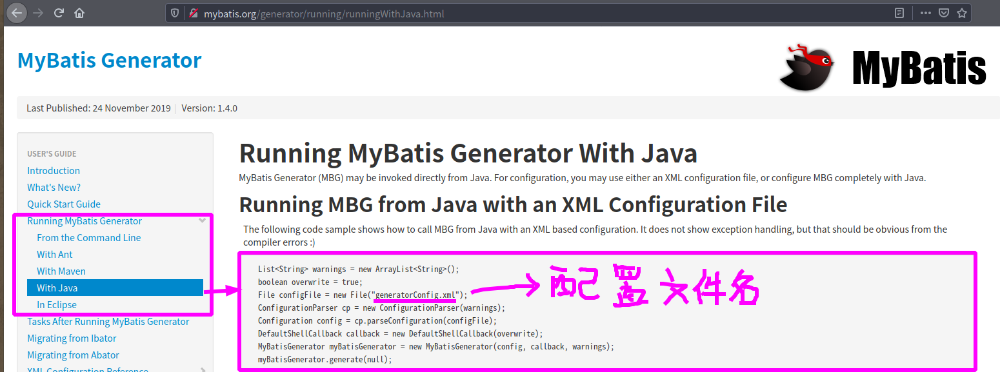

##### 1.在test/java下创建单元测试类:com.atguigu.test.MBGTest

##### 2.编写测试方法,复制官网上的Java代码,并修改配置文件名

```java
public class MBGTest {
    @Test
    public void MBGTest() throws Exception {
        List<String> warnings = new ArrayList<String>();
        boolean overwrite = true;
        File configFile = new File("mbg.xml");
        ConfigurationParser cp = new ConfigurationParser(warnings);
        Configuration config = cp.parseConfiguration(configFile);
        DefaultShellCallback callback = new DefaultShellCallback(overwrite);
        MyBatisGenerator myBatisGenerator = new MyBatisGenerator(config, callback, warnings);
        myBatisGenerator.generate(null);
    }
}
```

##### 3.在MBGTest方法上右键, 点击运行MBGTest方法

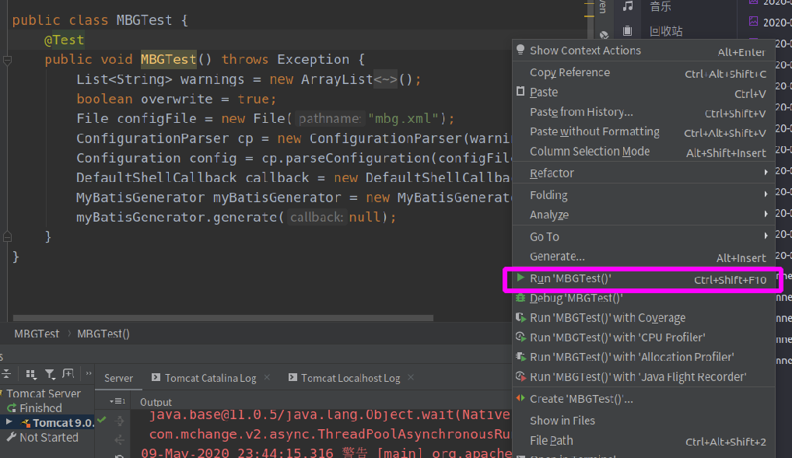

### (13)使用JSR303校验

#### 1)引入依赖

```xml
<!--支持JSR303校验
		Tomcat7以下的服务器,el表达式的版本较为落后,需要额外给服务器的lib包中替换新的标准的el -->
<!-- https://mvnrepository.com/artifact/org.hibernate.validator/hibernate-validator -->
<dependency>
  <groupId>org.hibernate.validator</groupId>
  <artifactId>hibernate-validator</artifactId>
  <version>6.1.2.Final</version>
</dependency>
```

#### 2)JSR303校验的基本使用

1.在JavaBean需要校验的字段上添加上注解, 例如:

```java
public class Employee {

    @Pattern(regexp = "(^[a-zA-Z0-9_-]{3,16}$)|(^[\\u2E80-\\u9FFF]{2,5}$)")
    private String empName;

    @Pattern(regexp = "^([a-z0-9_\\.-]+)@([\\da-z\\.-]+)\\.([a-z\\.]{2,6})$")
    private String email;
    
    .......
}
```

@Pattern注解中有两个重要的参数:

* regexp : 指定正则表达式
* message : 指定发生错误时的提示信息

2.在控制器的需要校验的方法中,为方法要校验的参数添加``@Valid``注解, 并添加``BindingResult result``参数, 例如:

```java
    @ResponseBody
    @RequestMapping(value = "/emp/{empId}",method = RequestMethod.PUT)
    public Msg updateEmp( @Valid Employee employee, BindingResult result){
        .....
        if(result.hasErrors()){
            //校验失败,不符合规范
            System.out.println("hasErrors");
            List<FieldError> errors = result.getFieldErrors();
            for (FieldError error :
                    errors) {
                System.out.println(error.getField());
                ......
            }
            .......
        }else {
          	........
                }
            }
        }
    }
```

* result.hasErrors() : 判断数据校验是否通过
* result.getFieldErrors() : 得到错误的集合
* error.getField() : 得到错误的字段名

### (14)添加前端框架

本工程需要用到的前端框架:

* bootstrap : 官网 https://www.bootcss.com/
* jQuery  : 官网https://jquery.com/

将官网下载的bootstrap和jQuery添加到webapp/static目录下:

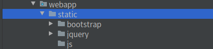

**注意:**官网下载的bootstrap文件夹名默认为``bootstrap-x.x.x-dist``,要将``bootstrap-x.x.x-dist``文件夹重命名为bootstrap, 不然有可能会编译不成功

## 三、环境搭建总结

至此, 工程的基础环境已经搭建完成, 到目前为止总共添加了一下文件:

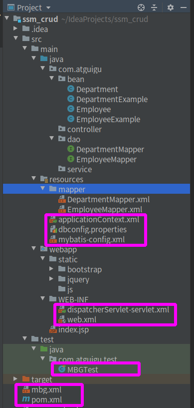

其中,框出的是自己编辑过的,而bean、dao、mapper中的文件是反向工程生成的

下面是自己编辑过的文件的最终效果: 

> Spring配置文件: applicationContext.xml

```xml
<?xml version="1.0" encoding="UTF-8"?>
<beans xmlns="http://www.springframework.org/schema/beans"
       xmlns:xsi="http://www.w3.org/2001/XMLSchema-instance"
       xmlns:context="http://www.springframework.org/schema/context"
       xmlns:tx="http://www.springframework.org/schema/tx"
       xmlns:aop="http://www.springframework.org/schema/aop"
       xsi:schemaLocation="http://www.springframework.org/schema/beans
        http://www.springframework.org/schema/beans/spring-beans.xsd
        http://www.springframework.org/schema/context
        http://www.springframework.org/schema/context/spring-context.xsd
       http://www.springframework.org/schema/tx
        http://www.springframework.org/schema/tx/spring-tx.xsd
       http://www.springframework.org/schema/aop
        http://www.springframework.org/schema/aop/spring-aop.xsd">
    <!-- 自动扫描除Controller之外的所有注解 -->
    <context:component-scan base-package="com.atguigu">
        <context:exclude-filter type="annotation" expression="org.springframework.stereotype.Controller"/>
    </context:component-scan>
    
    <!-- 引入配置文件dbconfig.properties -->
    <context:property-placeholder location="classpath:dbconfig.properties"/>

    <!-- 配置数据源 -->
    <bean id="datasource" class="com.mchange.v2.c3p0.ComboPooledDataSource">
        <property name="jdbcUrl" value="${jdbc.jdbcUrl}"></property>
        <property name="driverClass" value="${jdbc.driverClass}"></property>
        <property name="user" value="${jdbc.user}"></property>
        <property name="password" value="${jdbc.password}"></property>
    </bean>

    <!--配置SqlSessionFactory工厂-->
    <bean id="sqlSessionFactory" class="org.mybatis.spring.SqlSessionFactoryBean">
        <!-- 指定mybatis全局配置文件的位置 -->
        <property name="configLocation" value="classpath:mybatis-config.xml"></property>
        <!-- 指定数据源 -->
        <property name="dataSource" ref="datasource"></property>
        <!-- 指定映射文件的位置 -->
        <property name="mapperLocations" value="classpath:mapper/*.xml"></property>
    </bean>

    <!-- 配置扫描器,将dao接口的代理对象添加到容器 -->
    <bean id="mapperScanner" class="org.mybatis.spring.mapper.MapperScannerConfigurer">
        <property name="basePackage" value="com.atguigu.dao"></property>
    </bean>

    <!-- 配置可以执行批量的sqlSession -->
    <bean id="sqlSession" class="org.mybatis.spring.SqlSessionTemplate">
        <constructor-arg name="sqlSessionFactory" ref="sqlSessionFactory"></constructor-arg>
        <constructor-arg name="executorType" value="BATCH"></constructor-arg>
    </bean>

    <!--配置事务管理器-->
    <bean id="transactionManager" class="org.springframework.jdbc.datasource.DataSourceTransactionManager">
        <property name="dataSource" ref="datasource"></property>
    </bean>

    <!--配置事务通知-->
    <tx:advice id="txAdvice" transaction-manager="transactionManager">
        <tx:attributes>
            <tx:method name="*" read-only="false"/>
            <tx:method name="get*" read-only="true"/>
        </tx:attributes>
    </tx:advice>

    <!--配置AOP增强-->
    <aop:config>
        <aop:pointcut id="txPoint" expression="execution(* com.atguigu.service..*(..))"/>
        <aop:advisor advice-ref="txAdvice" pointcut-ref="txPoint"></aop:advisor>
    </aop:config>
</beans>
```

> SpringMVC配置文件 : dispatcherServlet-servlet.xml

```xml
<?xml version="1.0" encoding="UTF-8"?>
<beans xmlns="http://www.springframework.org/schema/beans"
       xmlns:mvc="http://www.springframework.org/schema/mvc"
       xmlns:context="http://www.springframework.org/schema/context"
       xmlns:xsi="http://www.w3.org/2001/XMLSchema-instance"
       xsi:schemaLocation="
        http://www.springframework.org/schema/beans
        http://www.springframework.org/schema/beans/spring-beans.xsd
        http://www.springframework.org/schema/mvc
        http://www.springframework.org/schema/mvc/spring-mvc.xsd
        http://www.springframework.org/schema/context
        http://www.springframework.org/schema/context/spring-context.xsd">
    <!--
        配置注解扫描
        只扫描controller的注解,别的不扫描
        -->
    <context:component-scan base-package="com.atguigu.controller" use-default-filters="false">
        <context:include-filter type="annotation" expression="org.springframework.stereotype.Controller"/>
    </context:component-scan>

    <!--
        配置视图解析器
        prefix表示前缀, 指定文件路径
        suffix表示后缀, 指定文件格式
        -->
    <bean id="viewResolver" class="org.springframework.web.servlet.view.InternalResourceViewResolver">
        <property name="prefix" value="/WEB-INF/views/"></property>
        <property name="suffix" value=".jsp"></property>
    </bean>

    <!-- 将SpringMVC不能处理的请求交给Tomcat-->
    <mvc:default-servlet-handler/>
    <!-- 能支持SpringMVC更高级的一些功能-->
    <mvc:annotation-driven/>
</beans>
```

> Mybatis配置文件 : mybatis-config.xml

```xml
<?xml version="1.0" encoding="UTF-8" ?>
<!DOCTYPE configuration
        PUBLIC "-//mybatis.org//DTD Config 3.0//EN"
        "http://mybatis.org/dtd/mybatis-3-config.dtd">
<configuration>
    <settings>
        <setting name="mapUnderscoreToCamelCase" value="true"/>
    </settings>

    <typeAliases>
        <package name="com.atguigu.bean"/>
    </typeAliases>

    <plugins>
        <!-- com.github.pagehelper为PageHelper类所在包名 -->
        <plugin interceptor="com.github.pagehelper.PageInterceptor">
            <!--参数合理化 当pageNum<=0 时会查询第一页 -->
            <property name="reasonable" value="true"/>
        </plugin>
    </plugins>
</configuration>
```

> 数据库连接信息配置文件 : dbconfig.properties

```properties
jdbc.jdbcUrl=jdbc:mysql://localhost:3306/atguigu_ssm_crud?characterEncoding=utf-8
jdbc.driverClass=com.mysql.jdbc.Driver
jdbc.user=root
jdbc.password=123456
```

> Mybatis反向工程配置文件 : mbg.xml

```xml
<?xml version="1.0" encoding="UTF-8"?>
<!DOCTYPE generatorConfiguration
        PUBLIC "-//mybatis.org//DTD MyBatis Generator Configuration 1.0//EN"
        "http://mybatis.org/dtd/mybatis-generator-config_1_0.dtd">

<generatorConfiguration>

    <context id="DB2Tables" targetRuntime="MyBatis3">

        <!-- 配置不生成注释 -->
        <commentGenerator>
            <property name="suppressAllComments" value="true" />
        </commentGenerator>

        <!-- 数据库连接信息 -->
        <jdbcConnection driverClass="com.mysql.jdbc.Driver"
                        connectionURL="jdbc:mysql://localhost:3306/atguigu_ssm_crud"
                        userId="root"
                        password="123456">
        </jdbcConnection>

        <!-- Java类型解析 -->
        <javaTypeResolver >
            <property name="forceBigDecimals" value="false" />
        </javaTypeResolver>

        <!-- 指定JavaBean生成的位置 -->
        <javaModelGenerator
                targetPackage="com.atguigu.bean"
                targetProject="./src/main/java">
            <property name="enableSubPackages" value="true"/>
            <property name="trimStrings" value="true"/>
        </javaModelGenerator>

        <!-- 指定sql映射文件生成的位置 -->
        <sqlMapGenerator
                targetPackage="mapper"
                targetProject="./src/main/resources">
            <property name="enableSubPackages" value="true"/>
        </sqlMapGenerator>

        <!-- 指定dao接口生成的位置 -->
        <javaClientGenerator type="XMLMAPPER"
                             targetPackage="com.atguigu.dao"
                             targetProject="./src/main/java">
            <property name="enableSubPackages" value="true"/>
        </javaClientGenerator>

        <!-- table指定每个表的生成策略 -->
        <table tableName="tbl_emp" domainObjectName="Employee"></table>
        <table tableName="tbl_dept" domainObjectName="Department"></table>

    </context>
</generatorConfiguration>
```

> Mybatis反向工程的单元测试 : com/atguigu/test/MBGTest.java

```java
package com.atguigu.test;

import org.junit.Test;
import org.mybatis.generator.api.MyBatisGenerator;
import org.mybatis.generator.config.Configuration;
import org.mybatis.generator.config.xml.ConfigurationParser;
import org.mybatis.generator.internal.DefaultShellCallback;

import java.io.File;
import java.util.ArrayList;
import java.util.List;

public class MBGTest {
    @Test
    public void MBGTest() throws Exception {
        List<String> warnings = new ArrayList<String>();
        boolean overwrite = true;
        File configFile = new File("mbg.xml");
        ConfigurationParser cp = new ConfigurationParser(warnings);
        Configuration config = cp.parseConfiguration(configFile);
        DefaultShellCallback callback = new DefaultShellCallback(overwrite);
        MyBatisGenerator myBatisGenerator = new MyBatisGenerator(config, callback, warnings);
        myBatisGenerator.generate(null);
    }
}
```

> web.xml配置文件 : web.xml

```xml
<!DOCTYPE web-app PUBLIC
 "-//Sun Microsystems, Inc.//DTD Web Application 2.3//EN"
 "http://java.sun.com/dtd/web-app_2_3.dtd" >

<web-app xmlns="http://xmlns.jcp.org/xml/ns/javaee"
         xmlns:xsi="http://www.w3.org/2001/XMLSchema-instance"
         xsi:schemaLocation="http://xmlns.jcp.org/xml/ns/javaee http://xmlns.jcp.org/xml/ns/javaee/web-app_4_0.xsd"
         version="4.0">
  <display-name>Archetype Created Web Application</display-name>
  <!--启动Spring容器-->
  <context-param>
    <param-name>contextConfigLocation</param-name>
    <param-value>classpath:applicationContext.xml</param-value>
  </context-param>
  <listener>
    <listener-class>org.springframework.web.context.ContextLoaderListener</listener-class>
  </listener>

  <!--SpringMVC的前端控制器,拦截所有请求-->
  <servlet>
    <servlet-name>dispatcherServlet</servlet-name>
    <servlet-class>org.springframework.web.servlet.DispatcherServlet</servlet-class>
    <load-on-startup>1</load-on-startup>
  </servlet>
  <servlet-mapping>
    <servlet-name>dispatcherServlet</servlet-name>
    <url-pattern>/</url-pattern>
  </servlet-mapping>

  <!--3.字符编码过滤器,一定要放在所有过滤器之前-->
  <filter>
    <filter-name>characterEncodingFilter</filter-name>
    <filter-class>org.springframework.web.filter.CharacterEncodingFilter</filter-class>
    <init-param>
      <param-name>encoding</param-name>
      <param-value>UTF-8</param-value>
    </init-param>
    <init-param>
      <param-name>forceRequestEncoding</param-name>
      <param-value>true</param-value>
    </init-param>
    <init-param>
      <param-name>forceResponseEncoding</param-name>
      <param-value>true</param-value>
    </init-param>
  </filter>
  <filter-mapping>
    <filter-name>characterEncodingFilter</filter-name>
    <url-pattern>/*</url-pattern>
  </filter-mapping>

  <!--4.使用Rest风格的URI,将页面普通的post请求转换为指定的delete或者put请求-->
  <filter>
    <filter-name>hiddenHttpMethodFilter</filter-name>
    <filter-class>org.springframework.web.filter.HiddenHttpMethodFilter</filter-class>
  </filter>
  <filter-mapping>
    <filter-name>hiddenHttpMethodFilter</filter-name>
    <url-pattern>/*</url-pattern>
  </filter-mapping>
  <filter>
    <filter-name>HttpPutFormContentFilter</filter-name>
    <filter-class>org.springframework.web.filter.HttpPutFormContentFilter</filter-class>
  </filter>
  <filter-mapping>
    <filter-name>HttpPutFormContentFilter</filter-name>
    <url-pattern>/*</url-pattern>
  </filter-mapping>
</web-app>
```

> pom.xml配置文件 : pom.xml

```xml
<?xml version="1.0" encoding="UTF-8"?>

<project xmlns="http://maven.apache.org/POM/4.0.0" xmlns:xsi="http://www.w3.org/2001/XMLSchema-instance"
  xsi:schemaLocation="http://maven.apache.org/POM/4.0.0 http://maven.apache.org/xsd/maven-4.0.0.xsd">
  <modelVersion>4.0.0</modelVersion>

  <groupId>com.atguigu</groupId>
  <artifactId>ssm_crud</artifactId>
  <version>1.0-SNAPSHOT</version>
  <packaging>war</packaging>

  <name>ssm_crud Maven Webapp</name>
  <!-- FIXME change it to the project's website -->
  <url>http://www.example.com</url>

  <properties>
    <project.build.sourceEncoding>UTF-8</project.build.sourceEncoding>
    <maven.compiler.source>1.8</maven.compiler.source>
    <maven.compiler.target>1.8</maven.compiler.target>
  </properties>

  <dependencies>
    <!-- Spring以及SpringMVC-->
    <!-- https://mvnrepository.com/artifact/org.springframework/spring-webmvc -->
    <dependency>
      <groupId>org.springframework</groupId>
      <artifactId>spring-webmvc</artifactId>
      <version>5.0.2.RELEASE</version>
    </dependency>
    <!-- Spring事务控制-->
    <!-- https://mvnrepository.com/artifact/org.springframework/spring-jdbc -->
    <dependency>
      <groupId>org.springframework</groupId>
      <artifactId>spring-jdbc</artifactId>
      <version>5.0.2.RELEASE</version>
    </dependency>
    <!--Spring 面向切面-->
    <!-- https://mvnrepository.com/artifact/org.springframework/spring-aspects -->
    <dependency>
      <groupId>org.springframework</groupId>
      <artifactId>spring-aspects</artifactId>
      <version>5.0.2.RELEASE</version>
    </dependency>
    <!--Spring整合Junit-->
    <!-- https://mvnrepository.com/artifact/org.springframework/spring-aspects -->
    <dependency>
      <groupId>org.springframework</groupId>
      <artifactId>spring-test</artifactId>
      <version>5.0.2.RELEASE</version>
    </dependency>
    <!-- mybatis-->
    <!-- https://mvnrepository.com/artifact/org.mybatis/mybatis -->
    <dependency>
      <groupId>org.mybatis</groupId>
      <artifactId>mybatis</artifactId>
      <version>3.4.5</version>
    </dependency>
    <!--mybatis整合spring的适配包-->
    <!-- https://mvnrepository.com/artifact/org.mybatis/mybatis-spring -->
    <dependency>
      <groupId>org.mybatis</groupId>
      <artifactId>mybatis-spring</artifactId>
      <version>1.3.1</version>
    </dependency>
    <!--数据库连接池-->
    <!-- https://mvnrepository.com/artifact/mysql/mysql-connector-java -->
    <dependency>
      <groupId>c3p0</groupId>
      <artifactId>c3p0</artifactId>
      <version>0.9.1.2</version>
    </dependency>
    <!--数据库驱动-->
    <!-- https://mvnrepository.com/artifact/c3p0/c3p0 -->
    <dependency>
      <groupId>mysql</groupId>
      <artifactId>mysql-connector-java</artifactId>
      <version>5.1.41</version>
    </dependency>
    <!--SpringMVC解析JSON-->
    <!-- https://mvnrepository.com/artifact/com.fasterxml.jackson.core/jackson-databind -->
    <dependency>
      <groupId>com.fasterxml.jackson.core</groupId>
      <artifactId>jackson-databind</artifactId>
      <version>2.10.0</version>
    </dependency>
    <!--Mybatis分页插件-->
    <dependency>
      <groupId>com.github.pagehelper</groupId>
      <artifactId>pagehelper</artifactId>
      <version>5.1.11</version>
    </dependency>
    <!--jstl-->
    <!-- https://mvnrepository.com/artifact/jstl/jstl -->
    <dependency>
      <groupId>jstl</groupId>
      <artifactId>jstl</artifactId>
      <version>1.2</version>
    </dependency>
    <!--servlet-api-->
    <!-- https://mvnrepository.com/artifact/javax.servlet/javax.servlet-api -->
    <dependency>
      <groupId>javax.servlet</groupId>
      <artifactId>javax.servlet-api</artifactId>
      <version>3.1.0</version>
      <scope>provided</scope>
    </dependency>
    <!--junit-->
    <dependency>
      <groupId>junit</groupId>
      <artifactId>junit</artifactId>
      <version>4.12</version>
      <scope>test</scope>
    </dependency>
    <!--MyBatis代码生成器 逆向工程-->
    <!-- https://mvnrepository.com/artifact/org.mybatis.generator/mybatis-generator-core -->
    <dependency>
      <groupId>org.mybatis.generator</groupId>
      <artifactId>mybatis-generator-core</artifactId>
      <version>1.3.5</version>
    </dependency>
    <!--支持JSR303校验
		Tomcat7以下的服务器,el表达式的版本较为落后,需要额外给服务器的lib包中替换新的标准的el -->
    <!-- https://mvnrepository.com/artifact/org.hibernate.validator/hibernate-validator -->
    <dependency>
      <groupId>org.hibernate.validator</groupId>
      <artifactId>hibernate-validator</artifactId>
      <version>6.1.2.Final</version>
    </dependency>
  </dependencies>

  <build>
    <finalName>ssm_crud</finalName>
    <pluginManagement><!-- lock down plugins versions to avoid using Maven defaults (may be moved to parent pom) -->
      <plugins>
        <plugin>
          <artifactId>maven-clean-plugin</artifactId>
          <version>3.1.0</version>
        </plugin>
        <!-- see http://maven.apache.org/ref/current/maven-core/default-bindings.html#Plugin_bindings_for_war_packaging -->
        <plugin>
          <artifactId>maven-resources-plugin</artifactId>
          <version>3.0.2</version>
        </plugin>
        <plugin>
          <artifactId>maven-compiler-plugin</artifactId>
          <version>3.8.0</version>
        </plugin>
        <plugin>
          <artifactId>maven-surefire-plugin</artifactId>
          <version>2.22.1</version>
        </plugin>
        <plugin>
          <artifactId>maven-war-plugin</artifactId>
          <version>3.2.2</version>
        </plugin>
        <plugin>
          <artifactId>maven-install-plugin</artifactId>
          <version>2.5.2</version>
        </plugin>
        <plugin>
          <artifactId>maven-deploy-plugin</artifactId>
          <version>2.8.2</version>
        </plugin>
      </plugins>
    </pluginManagement>
  </build>
</project>
```


