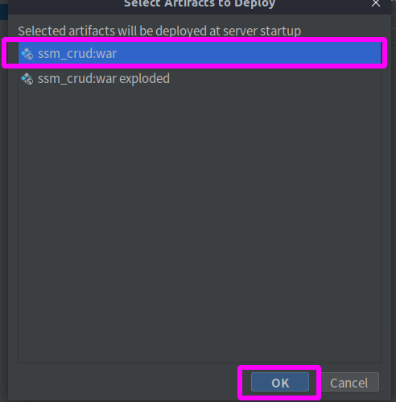

---

title: 尚硅谷SSM员工管理系统开发笔记(二)
date: 2020-05-10 23:29:36
reward: true
declare: true
tags: 
	- 尚硅谷SSM员工管理系统
categories: 
	- [开发笔记,尚硅谷SSM员工管理系统]
---

## 前文回顾

在[尚硅谷SSM员工管理系统开发笔记(一)](https://davidhsiang.github.io/assets/mdrepository/%E5%B0%9A%E7%A1%85%E8%B0%B7SSM%E5%91%98%E5%B7%A5%E7%AE%A1%E7%90%86%E7%B3%BB%E7%BB%9F%E5%BC%80%E5%8F%91%E7%AC%94%E8%AE%B0(%E4%B8%80)/)中, 介绍了本项目的内容以及基础的环境搭建, 其中包括SSM依赖导入、SSM配置文件编写、Mybatis反向工程等。在本文中主要介绍实现联合查询与测试SSM环境是否搭建成功

## 一、修改JavaBean与Mapper,实现联合查询

在这个项目中我们用到了两张表: *员工表* 和 *部门表*。*部门表* 和 *员工表* 属于一对多的关系, 一个部门有多个员工, 多个员工对应一个部门。而反向工程生成的JavaBean与Mapper并没有为我们实现联合查询。因此我们需要修改默认生成的JavaBean与Mapper。对于这个工程来说, 要实现的功能是对员工的CRUD操作, 而并没有对于部门的CRUD操作。因此只需要修改Employee的Bean和Mapper即可。

<!--more-->

### (1)修改Employee类的字段

员工对于部门是多对一的关系。在Mybatis中, 多对一的关系可以看成是一对一的关系, 而要实现一对一的关系, 只需在员工类中添加一个部门类的字段即可, 即:

```java
private Department department;
```

与此同时, 还要加上Get 和Set方法, 即:

```java
public Department getDepartment() {
    return department;
}

public void setDepartment(Department department) {
    this.department = department;
}
```

### (2)为实体类添加构造函数与toString方法

除了添加字段外,为了更好的初始化对象, 以及调试时打印实例。我们应该为每个实体类添加构造函数和toString方法

> Employee类

```java
/**
    * Employee类的构造函数
    */
public Employee() {
    super();
}

public Employee(Integer empId, Integer dId, String empName, String gender, String email) {
    this.empId = empId;
    this.dId = dId;
    this.empName = empName;
    this.gender = gender;
    this.email = email;
}
/**
    * Employee类的toString方法
 */
@Override
public String toString() {
    return "Employee{" +
            "empId=" + empId +
            ", dId=" + dId +
            ", empName='" + empName + '\'' +
            ", gender='" + gender + '\'' +
            ", email='" + email + '\'' +
            ", department=" + department +
            '}';
}
```

> Department类

```java
/**
    * Department类的构造函数
    */
public Department() {
    super();
}

public Department(Integer deptId, String deptName) {
    this.deptId = deptId;
    this.deptName = deptName;
}

/**
    * Department类的toString方法
 */
@Override
public String toString() {
    return "Department{" +
        "deptId=" + deptId +
        ", deptName='" + deptName + '\'' +
        '}';
}
```

### (3)修改EmployeeMapper.xml映射配置

1.添加带有Department类型字段的结果映射

```xml
<resultMap id="WithDeptResultMap" type="com.atguigu.bean.Employee">
  <id column="emp_id" jdbcType="INTEGER" property="empId" />
  <result column="d_id" jdbcType="INTEGER" property="dId" />
  <result column="emp_name" jdbcType="VARCHAR" property="empName" />
  <result column="gender" jdbcType="CHAR" property="gender" />
  <result column="email" jdbcType="VARCHAR" property="email" />
  <association property="department" javaType="com.atguigu.bean.Department">
    <id column="dept_id" jdbcType="INTEGER" property="deptId" />
    <result column="dept_name" jdbcType="VARCHAR" property="deptName" />
  </association>
</resultMap>
```

2.添加带部门表字段的返回值列表

```xml
<sql id="WithDept_Column_List">
  e.emp_id, e.d_id, e.emp_name, e.gender, e.email, d.dept_id, d.dept_name
</sql>
```

3.添加带部门信息的员工查询

```xml
<!-- 查询员工带部门信息 -->
<select id="selectByExampleWithDept" parameterType="com.atguigu.bean.EmployeeExample" resultMap="WithDeptResultMap">
  select
  <if test="distinct">
    distinct
  </if>
  <include refid="WithDept_Column_List" />
  from tbl_emp e
  left join tbl_dept d on e.d_id = d.dept_id
  <if test="_parameter != null">
    <include refid="Example_Where_Clause" />
  </if>
  <if test="orderByClause != null">
    order by ${orderByClause}
  </if>
  <if test="orderByClause == null">
    order by e.emp_id
  </if>
</select>


<select id="selectByPrimaryKeyWithDept" parameterType="java.lang.Integer" resultMap="WithDeptResultMap">
  select
  <include refid="WithDept_Column_List" />
  from tbl_emp e
  left join tbl_dept d on e.d_id = d.dept_id
  where emp_id = #{empId,jdbcType=INTEGER}
</select>
```

### (4)修改EmployeeMapper接口

修改EmployeeMapper接口, 添加以下两个方法:

```java
List<Employee> selectByExampleWithDept(EmployeeExample example);

Employee selectByPrimaryKeyWithDept(Integer empId);
```

## 二、测试SSM环境	

### (1)Spring整合Junit

#### 1)导入依赖

在上一篇开发笔记中已经导入过了, 不过要注意: **Junit版本一定要在4.12及以上**

```xml
<dependency>
  <groupId>junit</groupId>
  <artifactId>junit</artifactId>
  <version>4.12</version>
  <scope>test</scope>
</dependency>
```

#### 2)在测试类的声明之前, 添加上两个注解

```java
@RunWith(SpringJUnit4ClassRunner.class)
@ContextConfiguration(locations = {"classpath:applicationContext.xml"})
```

* ``@RunWith(...)`` : 设置使用Spring整合JUnit的类来运行这个单元测试
* ``@ContextConfiguration(...)``设置Spring配置文件的路径

#### 3)使用Spring的依赖注入

配置完这两项后, 就可以使用``@Autowired``注解来进行依赖注入

### (2)测试Mybatis与数据库的连接

#### 1)新建测试类com.atguigu.test.MapperTest

新建测试类``com.atguigu.test.MapperTest``

#### 2)整合Spring, 注入对象

```java
@RunWith(SpringJUnit4ClassRunner.class)
@ContextConfiguration(locations = {"classpath:applicationContext.xml"})
public class MapperTest {

    @Autowired
    private DepartmentMapper departmentMapper;
    @Autowired
    private EmployeeMapper employeeMapper;
    @Autowired
    SqlSession sqlSession;
  
}
```

#### 3)向数据库添加并查询测试数据, 测试数据库连接

1.测试添加部门数据

```java
    @Test
    public void testInsertDepartments(){

        departmentMapper.insertSelective(new Department(null,"开发部"));

        departmentMapper.insertSelective(new Department(null,"测试部"));

    }
```

2.测试添加单个员工

    @Test
    public void testInsertAEmployee(){
    
            employeeMapper.insertSelective(new Employee(null,2,"Marry","F","Marry@atguigu.com"));
    
    }
3.测试批量添加员工

```java
    @Test
    public void testInsertEmployees(){

        EmployeeMapper mapper = sqlSession.getMapper(EmployeeMapper.class);
        for (int i = 1 ; i < 1000 ; i ++){
            String uid = (i%2==0?"Tom":"Marry")+UUID.randomUUID().toString().substring(0,5);
            mapper.insertSelective(new Employee(null,1,uid,i%2==0?"M":"F",uid+"@atguigu.com"));
        }

    }
```

这里使用的sqlSession对象是一个可以执行批量的sqlSession, 这是在Spring配置文件中单独配置的, 他的配置方式是:

```xml
<bean id="sqlSession" class="org.mybatis.spring.SqlSessionTemplate">
    <constructor-arg name="sqlSessionFactory" ref="sqlSessionFactory"></constructor-arg>
    <constructor-arg name="executorType" value="BATCH"></constructor-arg>
</bean>
```

4.测试查询所有员工

```java
@Test
public void testFind(){
    List<Employee> employees = employeeMapper.selectByExampleWithDept(null);
    for (Employee e :
            employees) {
        System.out.println(e);
    }
}
```

5.运行单元测试测试数据库连接

由于在此之前,我已经搭过一遍这个工程, 数据库的测试数据也是早已添加, 所以这里我只测试了查询所有的方法, 可以看到, 数据库连接是成功的, 而MapperTest中使用了Spring的依赖注入, 这说明Spring整合Mybatis也是成功的


### (3)添加Tomcat服务器并部署War包

1.添加本地Tomcat服务器


2.部署war包


3.选择ssm_crud:war



4.确认Tomcat设置


### (4)测试SpringMVC响应请求

1.添加Employee的业务逻辑类(Service): com.atguigu.service.EmployeeService

2.使用@Service将EmployeeService类添加到Spring容器

```java
@Service
public class EmployeeService {
}
```

3.在EmployeeService中,注入EmployeeMapper,并添加一个查询所有的方法

```java
@Autowired
private EmployeeMapper employeeMapper;

public List<Employee> getAll(){
    return employeeMapper.selectByExampleWithDept(null);
}
```

4.添加一个视图控制器类(Controller): com.atguigu.controller.EmployeeController

5.使用@Controller将EmployeeController类添加到Spring容器

```java
@Controller
public class EmployeeController {
}
```

6.在EmployeeController中,注入EmployeeService, 并添加一个查询所有的方法

```java
    @Autowired
    private EmployeeService employeeService;
    @ResponseBody
    @RequestMapping("/emps")
    public List<Employee> getEmpsWithJson(){
        List<Employee> employees = employeeService.getAll();
        return employees;
    }
```

* RequestMapping : 请求映射 , 当访问项目路径/emps时执行getEmpsWithJson()方法
* ResponseBody : 设置返回JSON信息

7.运行服务器测试SpringMVC是否有响应

访问 : http://localhost:8080/ssm_crud_war/emps 可以看到:


说明SpringMVC配置没有问题。同时,在EmployeeController中注入了EmployeeService类,并调用了查询所有的方法。这说明Spring和Mybatis的配置也没有问题

## 三、总结

在笔记二中主要编辑了以下几个文件:


> Department类添加的内容

```java
    /**
     * Department类的构造函数
     */
    public Department() {
        super();
    }

    public Department(Integer deptId, String deptName) {
        this.deptId = deptId;
        this.deptName = deptName;
    }

    /**
     * Department类的toString方法
     */
    @Override
    public String toString() {
        return "Department{" +
                "deptId=" + deptId +
                ", deptName='" + deptName + '\'' +
                '}';
    }
```

> Employee类添加的内容

```java
    private Department department;

    public Department getDepartment() {
        return department;
    }

    public void setDepartment(Department department) {
        this.department = department;
    }

    /**
     * Employee类的构造函数
     */
    public Employee() {
        super();
    }

    public Employee(Integer empId, Integer dId, String empName, String gender, String email) {
        this.empId = empId;
        this.dId = dId;
        this.empName = empName;
        this.gender = gender;
        this.email = email;
    }
    /**
     * Employee类的toString方法
     */
    @Override
    public String toString() {
        return "Employee{" +
                "empId=" + empId +
                ", dId=" + dId +
                ", empName='" + empName + '\'' +
                ", gender='" + gender + '\'' +
                ", email='" + email + '\'' +
                ", department=" + department +
                '}';
    }
```

> EmployeeController类

```java
@Controller
public class EmployeeController {

    @Autowired
    private EmployeeService employeeService;
    @ResponseBody
    @RequestMapping("/emps")
    public List<Employee> getEmpsWithJson(){
        List<Employee> employees = employeeService.getAll();
        return employees;
    }
}
```

> EmployeeMapper接口添加的内容

```java
    List<Employee> selectByExampleWithDept(EmployeeExample example);

    Employee selectByPrimaryKeyWithDept(Integer empId);
```

> EmployeeService类

```java
@Service
public class EmployeeService {

    @Autowired
    private EmployeeMapper employeeMapper;

    public List<Employee> getAll(){
        return employeeMapper.selectByExampleWithDept(null);
    }

}
```

> EmployeeMapper.xml配置添加的内容

```xml
  <resultMap id="WithDeptResultMap" type="com.atguigu.bean.Employee">
    <id column="emp_id" jdbcType="INTEGER" property="empId" />
    <result column="d_id" jdbcType="INTEGER" property="dId" />
    <result column="emp_name" jdbcType="VARCHAR" property="empName" />
    <result column="gender" jdbcType="CHAR" property="gender" />
    <result column="email" jdbcType="VARCHAR" property="email" />
    <association property="department" javaType="com.atguigu.bean.Department">
      <id column="dept_id" jdbcType="INTEGER" property="deptId" />
      <result column="dept_name" jdbcType="VARCHAR" property="deptName" />
    </association>
  </resultMap>

  <sql id="WithDept_Column_List">
  e.emp_id, e.d_id, e.emp_name, e.gender, e.email, d.dept_id, d.dept_name
  </sql>

  <!-- 查询员工带部门信息 -->
  <select id="selectByExampleWithDept" parameterType="com.atguigu.bean.EmployeeExample" resultMap="WithDeptResultMap">
    select
    <if test="distinct">
      distinct
    </if>
    <include refid="WithDept_Column_List" />
    from tbl_emp e
    left join tbl_dept d on e.d_id = d.dept_id
    <if test="_parameter != null">
      <include refid="Example_Where_Clause" />
    </if>
    <if test="orderByClause != null">
      order by ${orderByClause}
    </if>
    <if test="orderByClause == null">
      order by e.emp_id
    </if>
  </select>


  <select id="selectByPrimaryKeyWithDept" parameterType="java.lang.Integer" resultMap="WithDeptResultMap">
    select
    <include refid="WithDept_Column_List" />
    from tbl_emp e
    left join tbl_dept d on e.d_id = d.dept_id
    where emp_id = #{empId,jdbcType=INTEGER}
  </select>
```

> MapperTest测试类

```java
@RunWith(SpringJUnit4ClassRunner.class)
@ContextConfiguration(locations = {"classpath:applicationContext.xml"})
public class MapperTest {

    @Autowired
    private DepartmentMapper departmentMapper;
    @Autowired
    private EmployeeMapper employeeMapper;
    @Autowired
    SqlSession sqlSession;

    @Test
    public void testInsertDepartments(){

        departmentMapper.insertSelective(new Department(null,"开发部"));

        departmentMapper.insertSelective(new Department(null,"测试部"));

    }

    @Test
    public void testInsertAEmployee(){

        employeeMapper.insertSelective(new Employee(null,2,"Marry","F","Marry@atguigu.com"));

    }

    @Test
    public void testInsertEmployees(){

        EmployeeMapper mapper = sqlSession.getMapper(EmployeeMapper.class);
        for (int i = 1 ; i < 1000 ; i ++){
            String uid = (i%2==0?"Tom":"Marry")+ UUID.randomUUID().toString().substring(0,5);
            mapper.insertSelective(new Employee(null,1,uid,i%2==0?"M":"F",uid+"@atguigu.com"));
        }

    }

    @Test
    public void testFind(){
        List<Employee> employees = employeeMapper.selectByExampleWithDept(null);
        for (Employee e :
                employees) {
            System.out.println(e);
        }
    }
}
```

## 相关连接

[尚硅谷SSM员工管理系统开发笔记(一)](https://davidhsiang.github.io/assets/mdrepository/%E5%B0%9A%E7%A1%85%E8%B0%B7SSM%E5%91%98%E5%B7%A5%E7%AE%A1%E7%90%86%E7%B3%BB%E7%BB%9F%E5%BC%80%E5%8F%91%E7%AC%94%E8%AE%B0(%E4%B8%80)/)