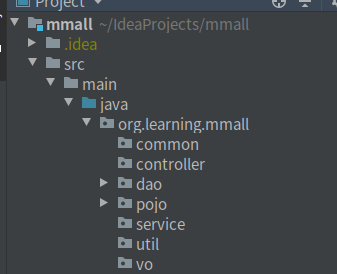

## 一、前文回顾

在笔记(一)中, 主要实现了: 数据表的设计与创建、创建Web工程、git初始化

在笔记(二)中, 主要实现了: pom文件的基本配置

本文主要实现了: 项目包结构初始化、Spring的配置、SpringMVC的配置、web.xml的配置<!--?-->

## 二、项目包结构初始化

需要创建的包:

* common : 存放全局常量
* controller : 表现层
* dao : 持久层
* pojo : JavaBean
* service : 业务逻辑层
* util : 工具类
* vo : view object ,封装 pojo

<!--more-->



## 三、Spring配置

### (1)编辑Spring主配置文件

在``resources``目录下创建``applicationContext.xml``配置文件, 此文件为Spring的主配置文件

#### 1.导入xml约束

```xml
<?xml version="1.0" encoding="UTF-8"?>
<beans xmlns="http://www.springframework.org/schema/beans"
       xmlns:xsi="http://www.w3.org/2001/XMLSchema-instance" xmlns:aop="http://www.springframework.org/schema/aop"
       xmlns:tx="http://www.springframework.org/schema/tx" xmlns:jdbc="http://www.springframework.org/schema/jdbc"
       xmlns:context="http://www.springframework.org/schema/context"
       xsi:schemaLocation="
     http://www.springframework.org/schema/context http://www.springframework.org/schema/context/spring-context.xsd
     http://www.springframework.org/schema/beans http://www.springframework.org/schema/beans/spring-beans.xsd
     http://www.springframework.org/schema/tx http://www.springframework.org/schema/tx/spring-tx.xsd
     http://www.springframework.org/schema/aop http://www.springframework.org/schema/aop/spring-aop.xsd">
</beans>
```

#### 2.自动扫描除Controller之外的所有注解

```xml
<!-- 自动扫描除Controller之外的所有注解 -->
<context:component-scan base-package="org.learning.mmall">
    <context:exclude-filter type="annotation" expression="org.springframework.stereotype.Controller"/>
</context:component-scan>
```

#### 3.配置注解AOP<!--?-->

```xml
<aop:aspectj-autoproxy/>
```

#### 4.导入Spring数据库相关的配置文件

``applicationContext-datasource.xml``这个文件将在下面进行讲解

```xml
<import resource="applicationContext-datasource.xml"/>
```

### (2)编辑Spring数据库相关的配置文件

在``resources``目录下创建``applicationContext-datasource.xml``配置文件, 此文件专门配置Spring与数据库相关的配置

#### 1.导入xml约束

```xml
<?xml version="1.0" encoding="UTF-8"?>
<beans xmlns="http://www.springframework.org/schema/beans"
       xmlns:xsi="http://www.w3.org/2001/XMLSchema-instance" xmlns:aop="http://www.springframework.org/schema/aop"
       xmlns:tx="http://www.springframework.org/schema/tx" xmlns:jdbc="http://www.springframework.org/schema/jdbc"
       xmlns:context="http://www.springframework.org/schema/context"
       xsi:schemaLocation="
     http://www.springframework.org/schema/context http://www.springframework.org/schema/context/spring-context.xsd
     http://www.springframework.org/schema/beans http://www.springframework.org/schema/beans/spring-beans.xsd
     http://www.springframework.org/schema/tx http://www.springframework.org/schema/tx/spring-tx.xsd
     http://www.springframework.org/schema/aop http://www.springframework.org/schema/aop/spring-aop.xsd">
 </beans>
```

#### 2.引入datasource.properties配置文件

``datasource.properties``配置文件将在之后进行讲解

```xml
<!-- 引入配置文件datasource.properties -->
<context:property-placeholder location="classpath:datasource.properties"/>
```

#### 3.配置数据源

```xml
    <bean id="dataSource" class="org.apache.commons.dbcp.BasicDataSource" destroy-method="close">
        <property name="driverClassName" value="${db.driverClassName}"/>
        <property name="url" value="${db.url}"/>
        <property name="username" value="${db.username}"/>
        <property name="password" value="${db.password}"/>
        <!-- 连接池启动时的初始值 -->
        <property name="initialSize" value="${db.initialSize}"/>
        <!-- 连接池的最大值 -->
        <property name="maxActive" value="${db.maxActive}"/>
        <!-- 最大空闲值.当经过一个高峰时间后，连接池可以慢慢将已经用不到的连接慢慢释放一部分，一直减少到maxIdle为止 -->
        <property name="maxIdle" value="${db.maxIdle}"/>
        <!-- 最小空闲值.当空闲的连接数少于阀值时，连接池就会预申请去一些连接，以免洪峰来时来不及申请 -->
        <property name="minIdle" value="${db.minIdle}"/>
        <!-- 最大建立连接等待时间。如果超过此时间将接到异常。设为－1表示无限制 -->
        <property name="maxWait" value="${db.maxWait}"/>
        <!--#给出一条简单的sql语句进行验证 -->
         <!--<property name="validationQuery" value="select getdate()" />-->
        <property name="defaultAutoCommit" value="${db.defaultAutoCommit}"/>
        <!-- 回收被遗弃的（一般是忘了释放的）数据库连接到连接池中 -->
         <!--<property name="removeAbandoned" value="true" />-->
        <!-- 数据库连接过多长时间不用将被视为被遗弃而收回连接池中 -->
         <!--<property name="removeAbandonedTimeout" value="120" />-->
        <!-- #连接的超时时间，默认为半小时。 -->
        <property name="minEvictableIdleTimeMillis" value="${db.minEvictableIdleTimeMillis}"/>

        <!--# 失效检查线程运行时间间隔，要小于MySQL默认-->
        <property name="timeBetweenEvictionRunsMillis" value="40000"/>
        <!--# 检查连接是否有效-->
        <property name="testWhileIdle" value="true"/>
        <!--# 检查连接有效性的SQL语句-->
        <property name="validationQuery" value="SELECT 1 FROM dual"/>
    </bean>
```

#### 4.配置Mybatis整合

4.1配置SessionFactory

```xml
<bean id="sqlSessionFactory" class="org.mybatis.spring.SqlSessionFactoryBean">
    <property name="dataSource" ref="dataSource"/>
    <property name="mapperLocations" value="classpath*:mappers/*Mapper.xml"></property>

    <!-- 注意其他配置 -->
    <property name="plugins">
        <array>
            <bean class="com.github.pagehelper.PageInterceptor">
                <property name="properties">
                    <!--使用下面的方式配置参数，一行配置一个 -->
                    <value>
                        dialect=mysql
                    </value>
                </property>
            </bean>
        </array>
    </property>

</bean>
```

4.2配置扫描器,将dao接口的代理对象添加到容器 

```xml
<!-- 配置扫描器,将dao接口的代理对象添加到容器 -->
<bean name="mapperScannerConfigurer" class="org.mybatis.spring.mapper.MapperScannerConfigurer">
    <property name="basePackage" value="org.learning.mmall.dao"/>
</bean>
```

#### 5.配置注解式声明事务

5.1配置事务管理器

```xml
<!-- 事务管理 -->
<bean id="transactionManager" class="org.springframework.jdbc.datasource.DataSourceTransactionManager">
    <property name="dataSource" ref="dataSource"/>
    <!--提交失败的时候是否回滚-->
    <property name="rollbackOnCommitFailure" value="true"/>
</bean>
```

5.2配置事务注解扫描

```xml
<!-- 使用@Transactional进行声明式事务管理需要声明下面这行 -->
<tx:annotation-driven transaction-manager="transactionManager" proxy-target-class="true" />
```

### (3)配置datasource.properties数据库连接信息

在``resources``目录下, 创建``datasource.properties``

编辑``datasource.properties``:

```properties
# 数据库驱动位置, 反向工程中使用
db.driverLocation=/home/david/.m2/repository/mysql/mysql-connector-java/5.1.6/mysql-connector-java-5.1.6.jar
# 数据库驱动
db.driverClassName=com.mysql.jdbc.Driver

#数据库地址
db.url=jdbc:mysql://localhost:3306/mmall_learning?characterEncoding=utf-8
# 数据库用户名
db.username=root
# 数据库密码
db.password=123456

# 连接池启动时的初始值
db.initialSize = 20
# 连接池的最大值
db.maxActive = 50
# 最大空闲值
db.maxIdle = 20
# 最小空闲值
db.minIdle = 10
# 最大建立连接等待时间
db.maxWait = 10

# 默认自动提交
db.defaultAutoCommit = true
# 连接的超时时间
db.minEvictableIdleTimeMillis = 3600000
```

### (4)配置Spring监听器<!--?-->

在web.xml配置文件中, 配置Spring监听器:

```xml
<!--Web容器启动和关闭的监听器-->
<listener>
    <listener-class>org.springframework.web.context.request.RequestContextListener</listener-class>
</listener>
  <!--启动Spring容器-->
<listener>
    <listener-class>org.springframework.web.context.ContextLoaderListener</listener-class>
</listener>
<context-param>
    <param-name>contextConfigLocation</param-name>
    <param-value>
        classpath:applicationContext.xml
    </param-value>
</context-param>
```

### (5)最终的配置文件

#### 1.applicationContext.xml

```xml
<?xml version="1.0" encoding="UTF-8"?>
<beans xmlns="http://www.springframework.org/schema/beans"
       xmlns:xsi="http://www.w3.org/2001/XMLSchema-instance" xmlns:aop="http://www.springframework.org/schema/aop"
       xmlns:tx="http://www.springframework.org/schema/tx" xmlns:jdbc="http://www.springframework.org/schema/jdbc"
       xmlns:context="http://www.springframework.org/schema/context"
       xsi:schemaLocation="
     http://www.springframework.org/schema/context http://www.springframework.org/schema/context/spring-context.xsd
     http://www.springframework.org/schema/beans http://www.springframework.org/schema/beans/spring-beans.xsd
     http://www.springframework.org/schema/tx http://www.springframework.org/schema/tx/spring-tx.xsd
     http://www.springframework.org/schema/aop http://www.springframework.org/schema/aop/spring-aop.xsd">

    <!-- 自动扫描除Controller之外的所有注解 -->
    <context:component-scan base-package="org.learning.mmall">
        <context:exclude-filter type="annotation" expression="org.springframework.stereotype.Controller"/>
    </context:component-scan>

    <!--<context:annotation-config/>-->
    <aop:aspectj-autoproxy/>

    <import resource="applicationContext-datasource.xml"/>

</beans>
```

#### 2.applicationContext-datasource.xml

```xml
<?xml version="1.0" encoding="UTF-8"?>
<beans xmlns="http://www.springframework.org/schema/beans"
       xmlns:xsi="http://www.w3.org/2001/XMLSchema-instance" xmlns:aop="http://www.springframework.org/schema/aop"
       xmlns:tx="http://www.springframework.org/schema/tx" xmlns:jdbc="http://www.springframework.org/schema/jdbc"
       xmlns:context="http://www.springframework.org/schema/context"
       xsi:schemaLocation="
     http://www.springframework.org/schema/context http://www.springframework.org/schema/context/spring-context.xsd
     http://www.springframework.org/schema/beans http://www.springframework.org/schema/beans/spring-beans.xsd
     http://www.springframework.org/schema/tx http://www.springframework.org/schema/tx/spring-tx.xsd
     http://www.springframework.org/schema/aop http://www.springframework.org/schema/aop/spring-aop.xsd">

    <!-- 引入配置文件datasource.properties -->
    <context:property-placeholder location="classpath:datasource.properties"/>

    <bean id="dataSource" class="org.apache.commons.dbcp.BasicDataSource" destroy-method="close">
        <property name="driverClassName" value="${db.driverClassName}"/>
        <property name="url" value="${db.url}"/>
        <property name="username" value="${db.username}"/>
        <property name="password" value="${db.password}"/>
        <!-- 连接池启动时的初始值 -->
        <property name="initialSize" value="${db.initialSize}"/>
        <!-- 连接池的最大值 -->
        <property name="maxActive" value="${db.maxActive}"/>
        <!-- 最大空闲值.当经过一个高峰时间后，连接池可以慢慢将已经用不到的连接慢慢释放一部分，一直减少到maxIdle为止 -->
        <property name="maxIdle" value="${db.maxIdle}"/>
        <!-- 最小空闲值.当空闲的连接数少于阀值时，连接池就会预申请去一些连接，以免洪峰来时来不及申请 -->
        <property name="minIdle" value="${db.minIdle}"/>
        <!-- 最大建立连接等待时间。如果超过此时间将接到异常。设为－1表示无限制 -->
        <property name="maxWait" value="${db.maxWait}"/>
        <!--#给出一条简单的sql语句进行验证 -->
         <!--<property name="validationQuery" value="select getdate()" />-->
        <property name="defaultAutoCommit" value="${db.defaultAutoCommit}"/>
        <!-- 回收被遗弃的（一般是忘了释放的）数据库连接到连接池中 -->
         <!--<property name="removeAbandoned" value="true" />-->
        <!-- 数据库连接过多长时间不用将被视为被遗弃而收回连接池中 -->
         <!--<property name="removeAbandonedTimeout" value="120" />-->
        <!-- #连接的超时时间，默认为半小时。 -->
        <property name="minEvictableIdleTimeMillis" value="${db.minEvictableIdleTimeMillis}"/>

        <!--# 失效检查线程运行时间间隔，要小于MySQL默认-->
        <property name="timeBetweenEvictionRunsMillis" value="40000"/>
        <!--# 检查连接是否有效-->
        <property name="testWhileIdle" value="true"/>
        <!--# 检查连接有效性的SQL语句-->
        <property name="validationQuery" value="SELECT 1 FROM dual"/>
    </bean>

    <bean id="sqlSessionFactory" class="org.mybatis.spring.SqlSessionFactoryBean">
        <property name="dataSource" ref="dataSource"/>
        <property name="mapperLocations" value="classpath*:mappers/*Mapper.xml"></property>

        <!-- 注意其他配置 -->
        <property name="plugins">
            <array>
                <bean class="com.github.pagehelper.PageInterceptor">
                    <property name="properties">
                        <!--使用下面的方式配置参数，一行配置一个 -->
                        <value>
                            dialect=mysql
                        </value>
                    </property>
                </bean>
            </array>
        </property>

    </bean>

    <bean name="mapperScannerConfigurer" class="org.mybatis.spring.mapper.MapperScannerConfigurer">
        <property name="basePackage" value="org.learning.mmall.dao"/>
    </bean>

    <!-- 使用@Transactional进行声明式事务管理需要声明下面这行 -->
    <tx:annotation-driven transaction-manager="transactionManager" proxy-target-class="true" />
    <!-- 事务管理 -->
    <bean id="transactionManager" class="org.springframework.jdbc.datasource.DataSourceTransactionManager">
        <property name="dataSource" ref="dataSource"/>
        <!--提交失败的时候是否回滚-->
        <property name="rollbackOnCommitFailure" value="true"/>
    </bean>

</beans>
```

#### 3.datasource.properties

```properties
db.driverLocation=/home/david/.m2/repository/mysql/mysql-connector-java/5.1.6/mysql-connector-java-5.1.6.jar
db.driverClassName=com.mysql.jdbc.Driver

db.url=jdbc:mysql://localhost:3306/mmall_learning?characterEncoding=utf-8
db.username=root
db.password=990524

db.initialSize = 20
db.maxActive = 50
db.maxIdle = 20
db.minIdle = 10
db.maxWait = 10
db.defaultAutoCommit = true
db.minEvictableIdleTimeMillis = 3600000
```

#### 4.web.xml

```xml
<?xml version="1.0" encoding="UTF-8"?>
<web-app xmlns:xsi="http://www.w3.org/2001/XMLSchema-instance"
         xmlns="http://java.sun.com/xml/ns/javaee"
         xsi:schemaLocation="http://java.sun.com/xml/ns/javaee http://java.sun.com/xml/ns/javaee/web-app_2_5.xsd"
         id="WebApp_ID" version="2.5">

    <display-name>Archetype Created Web Application</display-name>

    <!--Web容器启动和关闭的监听器-->
    <listener>
        <listener-class>org.springframework.web.context.request.RequestContextListener</listener-class>
    </listener>

    <listener>
        <listener-class>org.springframework.web.context.ContextLoaderListener</listener-class>
    </listener>
    <context-param>
        <param-name>contextConfigLocation</param-name>
        <param-value>
            classpath:applicationContext.xml
        </param-value>
    </context-param>

</web-app>
```

## 四、SpringMVC配置

### (1)配置SpringMVC的前端控制器

在web.xml中, 配置SpringMVC的前端控制器

```xml
<servlet>
    <servlet-name>dispatcher</servlet-name>
    <servlet-class>org.springframework.web.servlet.DispatcherServlet</servlet-class>
    <!--当>0时, 在容器启动时初始化这个servlet-->
    <!--当<0时, 只有在这个servlet被使用时才被加载-->
    <!--1代表优先级-->
    <load-on-startup>1</load-on-startup>
</servlet>
<servlet-mapping>
    <servlet-name>dispatcher</servlet-name>
    <!--所有*.do的请求都会被SpringMVC进行拦截-->
    <url-pattern>*.do</url-pattern>
</servlet-mapping>
```

### (2)编辑SpringMVC配置文件

在web.xml同级目录下, 创建SpringMVC配置文件``dispatcher-servlet.xml``

注意:SpringMVC配置文件名默认为``<web.xml中SpringMVC的前端控制器名>-servlet.xml``, 并且在web.xml同级目录下。你也可以自己在web.xml中配置文件的名称和路径

#### 1.导入xml约束

```xml
<?xml version="1.0" encoding="UTF-8"?>
<beans xmlns="http://www.springframework.org/schema/beans"
       xmlns:xsi="http://www.w3.org/2001/XMLSchema-instance" xmlns:p="http://www.springframework.org/schema/p"
       xmlns:context="http://www.springframework.org/schema/context"
       xmlns:mvc="http://www.springframework.org/schema/mvc" xmlns:aop="http://www.springframework.org/schema/aop"
       xsi:schemaLocation="http://www.springframework.org/schema/beans http://www.springframework.org/schema/beans/spring-beans.xsd
   http://www.springframework.org/schema/context http://www.springframework.org/schema/context/spring-context.xsd
   http://www.springframework.org/schema/mvc
   http://www.springframework.org/schema/mvc/spring-mvc.xsd">
</beans>
```

#### 2.配置注解扫描

```xml
<!--
    配置注解扫描
    扫描controller的注解,别的不扫描
    -->
<context:component-scan base-package="org.learning.mmall" use-default-filters="false">
    <context:include-filter type="annotation" expression="org.springframework.stereotype.Controller"/>
</context:component-scan>
```

#### 3.配置字符集

```xml
<mvc:annotation-driven>
    <mvc:message-converters>
        <bean class="org.springframework.http.converter.StringHttpMessageConverter">
            <property name="supportedMediaTypes">
                <list>
                    <value>text/plain;charset=UTF-8</value>
                    <value>text/html;charset=UTF-8</value>
                </list>
            </property>
        </bean>
        <bean class="org.springframework.http.converter.json.MappingJackson2HttpMessageConverter">
            <property name="supportedMediaTypes">
                <list>
                    <value>application/json;charset=UTF-8</value>
                </list>
            </property>
        </bean>
    </mvc:message-converters>
</mvc:annotation-driven>
```

#### 4.配置文件上传对象

```xml
<!-- 文件上传 -->
<bean id="multipartResolver" class="org.springframework.web.multipart.commons.CommonsMultipartResolver">
    <property name="maxUploadSize" value="10485760"/> <!-- 10m -->
    <property name="maxInMemorySize" value="4096" />
    <property name="defaultEncoding" value="UTF-8"></property>
</bean>
```

### (3)最终的配置文件

#### 1.dispatcher-servlet.xml

```xml
<?xml version="1.0" encoding="UTF-8"?>
<beans xmlns="http://www.springframework.org/schema/beans"
       xmlns:xsi="http://www.w3.org/2001/XMLSchema-instance" xmlns:p="http://www.springframework.org/schema/p"
       xmlns:context="http://www.springframework.org/schema/context"
       xmlns:mvc="http://www.springframework.org/schema/mvc" xmlns:aop="http://www.springframework.org/schema/aop"
       xsi:schemaLocation="http://www.springframework.org/schema/beans http://www.springframework.org/schema/beans/spring-beans.xsd
   http://www.springframework.org/schema/context http://www.springframework.org/schema/context/spring-context.xsd
   http://www.springframework.org/schema/mvc
   http://www.springframework.org/schema/mvc/spring-mvc.xsd">

    <!--
        配置注解扫描
        扫描controller的注解,别的不扫描
        -->
    <context:component-scan base-package="org.learning.mmall" use-default-filters="false">
        <context:include-filter type="annotation" expression="org.springframework.stereotype.Controller"/>
    </context:component-scan>

    <mvc:annotation-driven>
        <mvc:message-converters>
            <bean class="org.springframework.http.converter.StringHttpMessageConverter">
                <property name="supportedMediaTypes">
                    <list>
                        <value>text/plain;charset=UTF-8</value>
                        <value>text/html;charset=UTF-8</value>
                    </list>
                </property>
            </bean>
            <bean class="org.springframework.http.converter.json.MappingJackson2HttpMessageConverter">
                <property name="supportedMediaTypes">
                    <list>
                        <value>application/json;charset=UTF-8</value>
                    </list>
                </property>
            </bean>
        </mvc:message-converters>
    </mvc:annotation-driven>

    <!-- 文件上传 -->
    <bean id="multipartResolver" class="org.springframework.web.multipart.commons.CommonsMultipartResolver">
        <property name="maxUploadSize" value="10485760"/> <!-- 10m -->
        <property name="maxInMemorySize" value="4096" />
        <property name="defaultEncoding" value="UTF-8"></property>
    </bean>

</beans>
```

#### 2.web.xml

```xml
<?xml version="1.0" encoding="UTF-8"?>
<web-app xmlns:xsi="http://www.w3.org/2001/XMLSchema-instance"
         xmlns="http://java.sun.com/xml/ns/javaee"
         xsi:schemaLocation="http://java.sun.com/xml/ns/javaee http://java.sun.com/xml/ns/javaee/web-app_2_5.xsd"
         id="WebApp_ID" version="2.5">

    <display-name>Archetype Created Web Application</display-name>

    <!--Web容器启动和关闭的监听器-->
    <listener>
        <listener-class>org.springframework.web.context.request.RequestContextListener</listener-class>
    </listener>

    <listener>
        <listener-class>org.springframework.web.context.ContextLoaderListener</listener-class>
    </listener>
    <context-param>
        <param-name>contextConfigLocation</param-name>
        <param-value>
            classpath:applicationContext.xml
        </param-value>
    </context-param>

    <servlet>
        <servlet-name>dispatcher</servlet-name>
        <servlet-class>org.springframework.web.servlet.DispatcherServlet</servlet-class>
        <!--当>0时, 在容器启动时初始化这个servlet-->
        <!--当<0时, 只有在这个servlet被使用时才被加载-->
        <!--1代表优先级-->
        <load-on-startup>1</load-on-startup>
    </servlet>
    <servlet-mapping>
        <servlet-name>dispatcher</servlet-name>
        <!--所有*.do的请求都会被SpringMVC进行拦截-->
        <url-pattern>*.do</url-pattern>
    </servlet-mapping>

</web-app>
```

## 五、web.xml配置

### (1)配置字符编码过滤器

 注意: 这个过滤器一定要放在其他过滤器之前, 因为其他过滤器有可能会对请求中的内容进行操作。必须要先转码再操作

```xml
<filter>
    <filter-name>characterEncodingFilter</filter-name>
    <filter-class>org.springframework.web.filter.CharacterEncodingFilter</filter-class>
    <init-param>
        <param-name>encoding</param-name>
        <param-value>UTF-8</param-value>
    </init-param>
    <init-param>
        <param-name>forceEncoding</param-name>
        <param-value>true</param-value>
    </init-param>
</filter>
<filter-mapping>
    <filter-name>characterEncodingFilter</filter-name>
    <url-pattern>/*</url-pattern>
</filter-mapping>
```

### (2)配置Spring监听器

之前已经配过了, 这里再写一遍

```xml
<!--Web容器启动和关闭的监听器-->
<listener>
    <listener-class>org.springframework.web.context.request.RequestContextListener</listener-class>
</listener>

<listener>
    <listener-class>org.springframework.web.context.ContextLoaderListener</listener-class>
</listener>
<context-param>
    <param-name>contextConfigLocation</param-name>
    <param-value>
        classpath:applicationContext.xml
    </param-value>
</context-param>
```

### (3)配置SpringMVC前端控制器

之前已经配过了, 这里再写一遍

```xml
<servlet>
    <servlet-name>dispatcher</servlet-name>
    <servlet-class>org.springframework.web.servlet.DispatcherServlet</servlet-class>
    <!--当>0时, 在容器启动时初始化这个servlet-->
    <!--当<0时, 只有在这个servlet被使用时才被加载-->
    <!--1代表优先级-->
    <load-on-startup>1</load-on-startup>
</servlet>
<servlet-mapping>
    <servlet-name>dispatcher</servlet-name>
    <!--所有*.do的请求都会被SpringMVC进行拦截-->
    <url-pattern>*.do</url-pattern>
</servlet-mapping>
```

### (4)最终的配置文件

```xml
<?xml version="1.0" encoding="UTF-8"?>
<web-app xmlns:xsi="http://www.w3.org/2001/XMLSchema-instance"
         xmlns="http://java.sun.com/xml/ns/javaee"
         xsi:schemaLocation="http://java.sun.com/xml/ns/javaee http://java.sun.com/xml/ns/javaee/web-app_2_5.xsd"
         id="WebApp_ID" version="2.5">

    <display-name>Archetype Created Web Application</display-name>

    <filter>
        <filter-name>characterEncodingFilter</filter-name>
        <filter-class>org.springframework.web.filter.CharacterEncodingFilter</filter-class>
        <init-param>
            <param-name>encoding</param-name>
            <param-value>UTF-8</param-value>
        </init-param>
        <init-param>
            <param-name>forceEncoding</param-name>
            <param-value>true</param-value>
        </init-param>
    </filter>
    <filter-mapping>
        <filter-name>characterEncodingFilter</filter-name>
        <url-pattern>/*</url-pattern>
    </filter-mapping>

    <!--Web容器启动和关闭的监听器-->
    <listener>
        <listener-class>org.springframework.web.context.request.RequestContextListener</listener-class>
    </listener>

    <listener>
        <listener-class>org.springframework.web.context.ContextLoaderListener</listener-class>
    </listener>
    <context-param>
        <param-name>contextConfigLocation</param-name>
        <param-value>
            classpath:applicationContext.xml
        </param-value>
    </context-param>

    <servlet>
        <servlet-name>dispatcher</servlet-name>
        <servlet-class>org.springframework.web.servlet.DispatcherServlet</servlet-class>
        <!--当>0时, 在容器启动时初始化这个servlet-->
        <!--当<0时, 只有在这个servlet被使用时才被加载-->
        <!--1代表优先级-->
        <load-on-startup>1</load-on-startup>
    </servlet>
    <servlet-mapping>
        <servlet-name>dispatcher</servlet-name>
        <!--所有*.do的请求都会被SpringMVC进行拦截-->
        <url-pattern>*.do</url-pattern>
    </servlet-mapping>

</web-app>
```