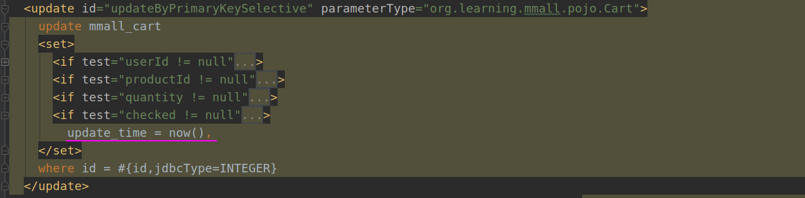

## 一、前文回顾

在笔记(一)中, 主要实现了: 数据表的设计与创建、创建Web工程、git初始化

在笔记(二)中, 主要实现了: pom文件的基本配置

在笔记(三)中, 主要实现了: 项目包结构初始化、Spring的配置、SpringMVC的配置、web.xml的配置

本文主要实现了: Mybatis三剑客([Free MyBatis plugin](https://plugins.jetbrains.com/plugin/8321-free-mybatis-plugin)、[PageHelper](https://pagehelper.github.io/)、[MyBatis Generator ](http://mybatis.org/generator/index.html))的使用

<!--more-->

## 二、[Free MyBatis plugin](https://plugins.jetbrains.com/plugin/8321-free-mybatis-plugin)

### (1)Free MyBatis plugin介绍

[Free MyBatis plugin](https://plugins.jetbrains.com/plugin/8321-free-mybatis-plugin)是IDEA的一个Mybatis插件, 它的主要功能如下:


在Mapper映射文件的左侧, 会有一些向左的箭头, 点击它即可跳转到dao接口对应的方法:


相对应的, 在dao接口的左侧, 会有一排向右的箭头, 点击它会跳转到Mapper映射文件对应的配置

除此之外, 它还可以检测dao接口的方法是否有相对应的Mapper配置或Mapper配置是否有相对应的方法, 如果没有会报错

### (2)Free MyBatis plugin 安装

安装IDEA插件有两种方法:

* 在IDEA内搜索安装
* 从IDEA插件官网下载压缩包安装

#### 1.在IDEA内搜索安装

打开IDEA的 File > Setting , 选择 Plugins > Marketplance , 在搜索框中搜索``Free MyBatis plugin ``进行安装, 安装完后重启


使用IDEA搜索安装有时会特别慢, 网络特别卡, 这时候就需要使用第二中方式: 从IDEA插件官网下载压缩包安装

#### 2.从IDEA插件官网下载压缩包安装

IDEA插件官网 : https://plugins.jetbrains.com/

Free MyBatis plugin 下载页 : https://plugins.jetbrains.com/plugin/8321-free-mybatis-plugin

下载完成后, 选择``Install Plugin from Disk`` 从本地添加IDEA插件, **要注意!!!直接选择压缩包, 不需要将压缩包解压**。之后都是些傻瓜操作, 点击安装、勾选插件、重启IDEA, 根据IDEA的提示操作即可


## 三、[PageHelper](https://pagehelper.github.io/)

### (1)PageHelper简介

PageHelper是Mybatis的一个分页插件

PageHelper的官网:https://pagehelper.github.io/

PageHelper的github: https://github.com/pagehelper/Mybatis-PageHelper

PageHelper的中文文档: https://github.com/pagehelper/Mybatis-PageHelper/blob/master/README_zh.md

### (2)导入相关依赖<!--?-->

```xml
<!--?Mybatis分页插件-->
<dependency>
  <groupId>com.github.pagehelper</groupId>
  <artifactId>pagehelper</artifactId>
  <version>5.1.11</version>
</dependency>

<!-- https://mvnrepository.com/artifact/com.github.miemiedev/mybatis-paginator -->
<dependency>
  <groupId>com.github.miemiedev</groupId>
  <artifactId>mybatis-paginator</artifactId>
  <version>1.2.17</version>
</dependency>

<!-- https://mvnrepository.com/artifact/com.github.jsqlparser/jsqlparser -->
<dependency>
  <groupId>com.github.jsqlparser</groupId>
  <artifactId>jsqlparser</artifactId>
  <version>3.1</version>
</dependency>
```

### (3)在Spring中配置PageHelper

在Mybatis的sqlSessionFactory中添加如下配置

```xml
<!-- 注意其他配置 -->
<property name="plugins">
    <array>
        <bean class="com.github.pagehelper.PageInterceptor">
            <property name="properties">
                <!--使用下面的方式配置参数，一行配置一个 -->
                <value>
                    dialect=mysql
                </value>
            </property>
        </bean>
    </array>
</property>
```

最终的Mybatis的sqlSessionFactory的配置:

```xml
<bean id="sqlSessionFactory" class="org.mybatis.spring.SqlSessionFactoryBean">
    <property name="dataSource" ref="dataSource"/>
    <property name="mapperLocations" value="classpath*:mappers/*Mapper.xml"></property>

    <!-- 注意其他配置 -->
    <property name="plugins">
        <array>
            <bean class="com.github.pagehelper.PageInterceptor">
                <property name="properties">
                    <!--使用下面的方式配置参数，一行配置一个 -->
                    <value>
                        dialect=mysql
                    </value>
                </property>
            </bean>
        </array>
    </property>

</bean>
```

### (4)基本使用方法

PageHelper的分页十分简单, 只需在需要进行分页的查询方法上方, 添加上`PageHelper.startPage();`函数即可

## 四、Mybatis反向工程

### (1)[MyBatis Generator ](http://mybatis.org/generator/index.html)简介

[MyBatis Generator ](http://mybatis.org/generator/index.html)是Mybatis的反向工程插件。他的作用是根据数据表的结构, 自动生成Mybatis映射文件、dao接口和JavaBean

[MyBatis Generator ](http://mybatis.org/generator/index.html)的官网文档: http://mybatis.org/generator/

### (2)引入Mybatis generator 插件

在pom.xml文件的``<plugins>``标签中, 添加Mybatis generator 插件

```xml
<plugin>
  <groupId>org.mybatis.generator</groupId>
  <artifactId>mybatis-generator-maven-plugin</artifactId>
  <version>1.4.0</version>
  <configuration>
    <configurationFile>src/main/resources/generatorConfig.xml</configurationFile>
    <verbose>true</verbose>
    <overwrite>true</overwrite>
  </configuration>
</plugin>
```

> **注意:** mybatis-generator所在的`plugins`不能在pluginManagement标签内。要和pluginManagement标签同级别(若存在pluginManagement标签)

此时, 在右侧的Maven栏, Maven > mmall Maven Webapp > Plugins 中, 多了一个``mybatis-generator``插件, 如图所示:


### (3)编写反向工程配置文件

在``resources``文件夹下, 新建反向工程配置文件 : ``generatorConfig.xml``

​		**注释:** 在使用Maven进行``mybatis-generator``反向工程时, 反向工程配置文件的名称和位置是在``pom.xml``引入``mybatis-generator``时定义的: ``<configurationFile>src/main/resources/generatorConfig.xml</configurationFile>``

> ``generatorConfig.xml``文件内容及解释:

```xml
<?xml version="1.0" encoding="UTF-8"?>
<!DOCTYPE generatorConfiguration
        PUBLIC "-//mybatis.org//DTD MyBatis Generator Configuration 1.0//EN"
        "http://mybatis.org/dtd/mybatis-generator-config_1_0.dtd">

<generatorConfiguration>
    <!--导入属性配置-->
    <!--datasource.properties文件在笔记三中进行了配置, 下一节将对它的部分配置进行再次说明-->
    <properties resource="datasource.properties"></properties>

    <!--指定特定数据库的jdbc驱动jar包的位置-->
    <classPathEntry location="${db.driverLocation}" />

    <context id="default" targetRuntime="MyBatis3">

        <!-- optional，旨在创建class时，对注释进行控制(不生成注释) -->
        <commentGenerator>
            <property name="suppressDate" value="true"/>
            <property name="suppressAllComments" value="true"/>
        </commentGenerator>

        <!--jdbc的数据库连接 -->
        <jdbcConnection
                driverClass="${db.driverClassName}"
                connectionURL="${db.url}"
                userId="${db.username}"
                password="${db.password}">
        </jdbcConnection>

        <!-- 非必需，类型处理器，在数据库类型和java类型之间的转换控制-->
        <javaTypeResolver>
            <property name="forceBigDecimals" value="false"/>
        </javaTypeResolver>

        <!-- Model模型生成器,用来生成含有主键key的类，记录类 以及查询Example类
            targetPackage     指定生成的model生成所在的包名
            targetProject     指定在该项目下所在的路径
        -->
        <!--<javaModelGenerator targetPackage="com.mmall.pojo" targetProject=".\src\main\java">-->
        <javaModelGenerator targetPackage="org.learning.mmall.pojo" targetProject="./src/main/java">
            <!-- 是否允许子包，即targetPackage.schemaName.tableName -->
            <property name="enableSubPackages" value="false"/>
            <!-- 是否对model添加 构造函数 -->
            <property name="constructorBased" value="true"/>
            <!-- 是否对类CHAR类型的列的数据进行trim操作(把前后的空格字符删除) -->
            <property name="trimStrings" value="true"/>
            <!-- 建立的Model对象是否 不可改变  即生成的Model对象不会有 setter方法，只有构造方法 -->
            <property name="immutable" value="false"/>
        </javaModelGenerator>

        <!--mapper映射文件生成所在的目录 为每一个数据库的表生成对应的SqlMap文件 -->
        <!--<sqlMapGenerator targetPackage="mappers" targetProject=".\src\main\resources">-->
        <sqlMapGenerator targetPackage="mappers" targetProject="./src/main/resources">
            <property name="enableSubPackages" value="false"/>
        </sqlMapGenerator>

        <!-- 客户端代码，生成易于使用的针对Model对象和XML配置文件 的代码
            type="ANNOTATEDMAPPER",生成Java Model 和基于注解的Mapper对象
            type="MIXEDMAPPER",生成基于注解的Java Model 和相应的Mapper对象
            type="XMLMAPPER",生成SQLMap XML文件和独立的Mapper接口
        -->

        <!-- targetPackage：mapper接口dao生成的位置 -->
        <!--<javaClientGenerator type="XMLMAPPER" targetPackage="com.mmall.dao" targetProject=".\src\main\java">-->
        <javaClientGenerator type="XMLMAPPER" targetPackage="org.learning.mmall.dao" targetProject="./src/main/java">
            <!-- enableSubPackages:是否让schema作为包的后缀 -->
            <property name="enableSubPackages" value="false" />
        </javaClientGenerator>

		<!-- table指定每个表的生成策略 -->
        <table tableName="mmall_shipping" 
               domainObjectName="Shipping" 
               enableCountByExample="false" 
               enableUpdateByExample="false" 
               enableDeleteByExample="false" 
               enableSelectByExample="false" 
               selectByExampleQueryId="false">
        </table>
        <table tableName="mmall_cart" 
               domainObjectName="Cart" 
               enableCountByExample="false" 
               enableUpdateByExample="false" 
               enableDeleteByExample="false" 
               enableSelectByExample="false" 
               selectByExampleQueryId="false">
        </table>
        <table tableName="mmall_category" 
               domainObjectName="Category" 
               enableCountByExample="false" 
               enableUpdateByExample="false" 
               enableDeleteByExample="false" 
               enableSelectByExample="false" 
               selectByExampleQueryId="false">
        </table>
        <table tableName="mmall_order" 
               domainObjectName="Order" 
               enableCountByExample="false" 
               enableUpdateByExample="false" 
               enableDeleteByExample="false" 
               enableSelectByExample="false" 
               selectByExampleQueryId="false">
        </table>
        <table tableName="mmall_order_item" 
               domainObjectName="OrderItem" 
               enableCountByExample="false" 
               enableUpdateByExample="false" 
               enableDeleteByExample="false" 
               enableSelectByExample="false" 
               selectByExampleQueryId="false">
        </table>
        <table tableName="mmall_pay_info" 
               domainObjectName="PayInfo" 
               enableCountByExample="false" 
               enableUpdateByExample="false" 
               enableDeleteByExample="false" 
               enableSelectByExample="false" 
               selectByExampleQueryId="false">
        </table>
        <table tableName="mmall_product" 
               domainObjectName="Product" 
               enableCountByExample="false" 
               enableUpdateByExample="false" 
               enableDeleteByExample="false" 
               enableSelectByExample="false" 
               selectByExampleQueryId="false">
            <columnOverride column="detail" jdbcType="VARCHAR" />
            <columnOverride column="sub_images" jdbcType="VARCHAR" />
        </table>
        <table tableName="mmall_user" 
               domainObjectName="User" 
               enableCountByExample="false" 
               enableUpdateByExample="false" 
               enableDeleteByExample="false" 
               enableSelectByExample="false" 
               selectByExampleQueryId="false">
        </table>

    </context>
</generatorConfiguration>
```

### (4)datasource.properties的部分配置

在上面的``generatorConfig.xml``文件中, 我们引入了``datasource.properties``文件。``datasource.properties``文件在《笔记三》已经进行了配置, 这里只对``generatorConfig.xml``中使用到的配置进行说明。

```properties
# 数据库驱动位置, 反向工程中使用
db.driverLocation=/home/david/.m2/repository/mysql/mysql-connector-java/5.1.6/mysql-connector-java-5.1.6.jar
# 数据库驱动
db.driverClassName=com.mysql.jdbc.Driver

# 数据库地址
db.url=jdbc:mysql://localhost:3306/mmall_learning?characterEncoding=utf-8
# 数据库用户名
db.username=root
# 数据库密码
db.password=123456
```

### (5)运行mybatis-generator进行反向工程

双击 Maven > mmall Maven Webapp > Plogins > mybatis-generator > mybatis-generator:generator


此时会生成三类文件: JavaBean、Dao接口、Mapper映射文件


### (6)修改时间戳sql语句

#### 1.默认生成的语句

在默认生成的``Mapper.xml``中, ``create_time``和``update_time``字段数据的生成和更新是需要我们传入Date类型的变量来实现的。

> 默认生成的 insert(直接插入)


> 默认生成的 insertSelective(有选择的插入)


> 默认生成的 updateByPrimaryKey(根据主键直接更新)


> 默认生成的 updateByPrimaryKeySelective(根据主键有选择的更新)


​		每次生成和更新或``create_time``和``update_time``字段都要我们传入Date类型的变量, 这样会让我们花费额外的精力来关心时间的操作, 而且容易带来一些误操作, 例如修改了一条旧数据的``create_time``字段信息。我们可以使用sql的函数``now()``来实现时间戳的生成和更新, ``now()``函数返回当前时间

#### 2.时间戳生成和更新逻辑分析

在修改sql语句前, 首先要对时间戳生成和更新的逻辑进行一个分析: 

* 在一条数据被创建时, ``create_time``和``update_time``的值都必须为当前时间
* 在一条数据被更新时, ``create_time``不能改变, ``update_time``必须改变为当前的时间

因此, 我们需要进行一下操作:

1. 将所有的``#{createTime,jdbcType=TIMESTAMP}``和``#{updateTime,jdbcType=TIMESTAMP}``修改为now()
2. 对于insertSelective(有选择的插入): 需要将``create_time,``、``update_time,``和``now()``外层的``if``标签删除
3. 对于updateByPrimaryKey(根据主键直接更新): 需要将``create_time = now,``删除
4. 对于updateByPrimaryKeySelective(根据主键有选择的更新): 首先, 需要将``create_time = now,``以及它外层的``if``标签删除。其次, 需要删除``update_time = now()``外层的``if``标签删除

#### 3.修改后的语句

> 修改后的 insert(直接插入)


> 修改后的 insertSelective(有选择的插入)


> 修改后的 updateByPrimaryKey(根据主键直接更新)


> 修改后的 updateByPrimaryKeySelective(根据主键有选择的更新)



