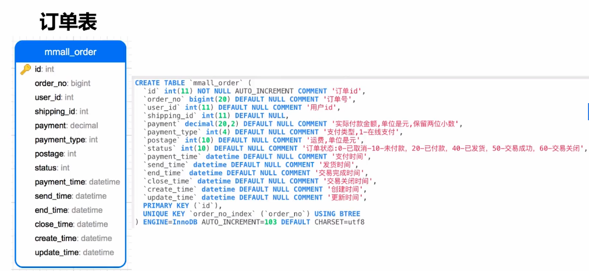
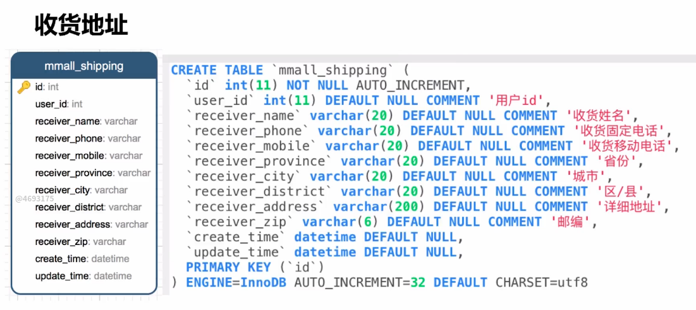

## 一、项目概述

### (1)项目介绍

慕课网SSM电商网站HappyMmall,是慕课网[Geely](https://www.imooc.com/t/2705746)老师的一个实战教程.

这个项目用到了下面几个知识:<!--待更-->

- 基础框架-ssm(SpringMVC+Spring+MyBatis)
- 数据库-MySQL
- 项目的依赖管理-Maven
- 分页-pagehelper
- 逆向工程-MyBatis Generator

课程视频的网址:https://coding.imooc.com/learn/list/96.html

项目github: https://github.com/DavidHSiang/mmall

### (2)功能介绍

项目演示网址:

* 前台网址:http://happymmall.com/index.html
* 后台网址:http://admin.happymmall.com/#/home/index

<!--more-->

## 二、数据表结构设计

数据表结构设计主要有以下几个部分:

* 表结构
* 表关系
* 唯一索引
* 单索引及组合索引
* 后悔药-时间戳

### (1)数据表结构

#### 1.用户表


* 主键为id, 本项目的主键均为id, 在之后的表中不再赘述
* 用户名(username)不可重复, 设置唯一索引

#### 2.分类表


* 分类表采用树状结构,为了方便以后扩展, 分类表可以递归

#### 3.产品表


* ``main_image``和``sub_images``的图片地址均为相对地址。在程序中, 将图片服务器的前缀与``main_image``进行拼接, 即使图片服务器迁移或域名更改, 只需要改配置文件即可
* 主图``main_image``取子图``sub_images``的第一个图, 在某些场景只需要主图, 每次都从子图中取会消耗很多资源, 可以保留一定的冗余性来提高数据库查询的效率
* ``decimal(20,2)``: 20表示要存的数据的整体位数为20位, 2表示小数点后保留2位(小数点前有18位)。``decimal``类型一般用于非常高精确度的计算,对应的Java类型会使用大数类``BigDecimal``, 用于解决商业计算中浮点数丢失精度的问题

#### 4.购物车表


* ``user_id``设置索引。这个表经常会使用非主键``user_id``进行查询, 为``user_id``添加索引, 可以提高这个表的查询效率。

#### 5.支付信息表


#### 6.订单表



* 订单号``order_no``设置唯一索引
* ``shipping_id``订单地址<!--待更-->
* 实际付款金额不要和产品的金额联动。例如我们购买了一个6888的手机,当该手机的价格修改了,订单中的价格要还是6888, **订单信息中商品信息应该是订单生成时的商品信息**

#### 7.订单明细表


* ``user_id``是我们留的一个冗余。我们本可以通过``order_no``找到``mmall_order``表, 然后再连接它的``user_id``。加了这个冗余可以显著提高SQL的查询效率
* ``bigint`` 对应Java类型为long类型
* 我们不能通过``prodect_id``连接``mmall_prodect``表,来查询``prodect_name``和``prodect_image``。例如: 当下单时,商品名称为A,等下单之后,商品名称变为B了, 但在订单信息中商品名称应该仍是A。**订单信息中商品信息应该是订单生成时的商品信息**
* 我们在存储的时候,会把``current_unit_price``和``quantity``进行乘积并存入``total_price``中, 这样就不用每次查询``total_price``的时候都进行乘积运算了
* ``order_no``设置单索引, 提高通过``order_no``查询表内容的效率
* ``order_no``和``user_id``设置组合索引, 提高通过``order_no``和``user_id``组合查询的效率

#### 8.收货地址表



### (2)表关系


* 天蓝色的表,为有索引的表

* 这里**不使用外键**。在扩展分布分表时,有外键会非常麻烦,不建议使用外键,和数据库内置的触发器 

### (3)唯一索引

唯一索引用于保证数据的唯一性

包含唯一索引的表:

* ``mmall_user``表(``username``字段)
* ``mmall_order``表(``order_no``字段)

### (4)单索引及组合索引

单索引

* ``mmall_cart``表(``user_id``字段)

* ``mmall_order_item``表(``order_no``字段)

组合索引

* ``mmall_order_item``表(``order_no``字段和``user_id``字段)

### (5)后悔药-时间戳

* create_time : 数据创建时间
* update_time : 数据更新时间

建议每个表都定义时间戳, 这样在出现错误时方便定位错误的位置, 也方便对数据的分析

## 三、数据库初始化

本项目的sql文件在课程中已有提供, 只需导入即可

### (1)下载sql文件, 打开数据库

```bash
# 选择下载的目录
cd ~/sql
# 下载sql文件
wget http://learning.happymmall.com/mmall.sql
# 登录mysql
mysql -u root -p
```

### (2)导入sql文件

创建数据库``mmall_learning``, 导入sql文件

```mysql
# 创建 mmall_learning 数据库, 使用 utf-8 编码
REATE DATABASE IF NOT EXISTS mmall_learning DEFAULT CHARSET utf8 COLLATE utf8_general_ci;
# 显示所有数据库
show databases;
# 打开 mmall_learning 数据库
use mmall_learning;
# 导入mmall.sql 文件
source /home/david/sql/mmall.sql;
# 显示所有表
show tables;
```

### (3) mmall.sql文件

```sql
/*
 Navicat Premium Data Transfer

 Source Server         : 182.92.82.103
 Source Server Type    : MySQL
 Source Server Version : 50173
 Source Host           : 182.92.82.103
 Source Database       : mmall

 Target Server Type    : MySQL
 Target Server Version : 50173
 File Encoding         : utf-8

 Date: 04/13/2017 22:04:18 PM
*/

SET NAMES utf8;
SET FOREIGN_KEY_CHECKS = 0;

-- ----------------------------
--  Table structure for `mmall_cart`
-- ----------------------------
DROP TABLE IF EXISTS `mmall_cart`;
CREATE TABLE `mmall_cart` (
  `id` int(11) NOT NULL AUTO_INCREMENT,
  `user_id` int(11) NOT NULL,
  `product_id` int(11) DEFAULT NULL COMMENT '商品id',
  `quantity` int(11) DEFAULT NULL COMMENT '数量',
  `checked` int(11) DEFAULT NULL COMMENT '是否选择,1=已勾选,0=未勾选',
  `create_time` datetime DEFAULT NULL COMMENT '创建时间',
  `update_time` datetime DEFAULT NULL COMMENT '更新时间',
  PRIMARY KEY (`id`),
  KEY `user_id_index` (`user_id`) USING BTREE
) ENGINE=InnoDB AUTO_INCREMENT=146 DEFAULT CHARSET=utf8;

-- ----------------------------
--  Records of `mmall_cart`
-- ----------------------------
BEGIN;
INSERT INTO `mmall_cart` VALUES ('126', '21', '26', '1', '1', '2017-04-13 21:27:06', '2017-04-13 21:27:06');
COMMIT;

-- ----------------------------
--  Table structure for `mmall_category`
-- ----------------------------
DROP TABLE IF EXISTS `mmall_category`;
CREATE TABLE `mmall_category` (
  `id` int(11) NOT NULL AUTO_INCREMENT COMMENT '类别Id',
  `parent_id` int(11) DEFAULT NULL COMMENT '父类别id当id=0时说明是根节点,一级类别',
  `name` varchar(50) DEFAULT NULL COMMENT '类别名称',
  `status` tinyint(1) DEFAULT '1' COMMENT '类别状态1-正常,2-已废弃',
  `sort_order` int(4) DEFAULT NULL COMMENT '排序编号,同类展示顺序,数值相等则自然排序',
  `create_time` datetime DEFAULT NULL COMMENT '创建时间',
  `update_time` datetime DEFAULT NULL COMMENT '更新时间',
  PRIMARY KEY (`id`)
) ENGINE=InnoDB AUTO_INCREMENT=100032 DEFAULT CHARSET=utf8;

-- ----------------------------
--  Records of `mmall_category`
-- ----------------------------
BEGIN;
INSERT INTO `mmall_category` VALUES ('100001', '0', '家用电器', '1', null, '2017-03-25 16:46:00', '2017-03-25 16:46:00'), ('100002', '0', '数码3C', '1', null, '2017-03-25 16:46:21', '2017-03-25 16:46:21'), ('100003', '0', '服装箱包', '1', null, '2017-03-25 16:49:53', '2017-03-25 16:49:53'), ('100004', '0', '食品生鲜', '1', null, '2017-03-25 16:50:19', '2017-03-25 16:50:19'), ('100005', '0', '酒水饮料', '1', null, '2017-03-25 16:50:29', '2017-03-25 16:50:29'), ('100006', '100001', '冰箱', '1', null, '2017-03-25 16:52:15', '2017-03-25 16:52:15'), ('100007', '100001', '电视', '1', null, '2017-03-25 16:52:26', '2017-03-25 16:52:26'), ('100008', '100001', '洗衣机', '1', null, '2017-03-25 16:52:39', '2017-03-25 16:52:39'), ('100009', '100001', '空调', '1', null, '2017-03-25 16:52:45', '2017-03-25 16:52:45'), ('100010', '100001', '电热水器', '1', null, '2017-03-25 16:52:54', '2017-03-25 16:52:54'), ('100011', '100002', '电脑', '1', null, '2017-03-25 16:53:18', '2017-03-25 16:53:18'), ('100012', '100002', '手机', '1', null, '2017-03-25 16:53:27', '2017-03-25 16:53:27'), ('100013', '100002', '平板电脑', '1', null, '2017-03-25 16:53:35', '2017-03-25 16:53:35'), ('100014', '100002', '数码相机', '1', null, '2017-03-25 16:53:56', '2017-03-25 16:53:56'), ('100015', '100002', '3C配件', '1', null, '2017-03-25 16:54:07', '2017-03-25 16:54:07'), ('100016', '100003', '女装', '1', null, '2017-03-25 16:54:44', '2017-03-25 16:54:44'), ('100017', '100003', '帽子', '1', null, '2017-03-25 16:54:51', '2017-03-25 16:54:51'), ('100018', '100003', '旅行箱', '1', null, '2017-03-25 16:55:02', '2017-03-25 16:55:02'), ('100019', '100003', '手提包', '1', null, '2017-03-25 16:55:09', '2017-03-25 16:55:09'), ('100020', '100003', '保暖内衣', '1', null, '2017-03-25 16:55:18', '2017-03-25 16:55:18'), ('100021', '100004', '零食', '1', null, '2017-03-25 16:55:30', '2017-03-25 16:55:30'), ('100022', '100004', '生鲜', '1', null, '2017-03-25 16:55:37', '2017-03-25 16:55:37'), ('100023', '100004', '半成品菜', '1', null, '2017-03-25 16:55:47', '2017-03-25 16:55:47'), ('100024', '100004', '速冻食品', '1', null, '2017-03-25 16:55:56', '2017-03-25 16:55:56'), ('100025', '100004', '进口食品', '1', null, '2017-03-25 16:56:06', '2017-03-25 16:56:06'), ('100026', '100005', '白酒', '1', null, '2017-03-25 16:56:22', '2017-03-25 16:56:22'), ('100027', '100005', '红酒', '1', null, '2017-03-25 16:56:30', '2017-03-25 16:56:30'), ('100028', '100005', '饮料', '1', null, '2017-03-25 16:56:37', '2017-03-25 16:56:37'), ('100029', '100005', '调制鸡尾酒', '1', null, '2017-03-25 16:56:45', '2017-03-25 16:56:45'), ('100030', '100005', '进口洋酒', '1', null, '2017-03-25 16:57:05', '2017-03-25 16:57:05');
COMMIT;

-- ----------------------------
--  Table structure for `mmall_order`
-- ----------------------------
DROP TABLE IF EXISTS `mmall_order`;
CREATE TABLE `mmall_order` (
  `id` int(11) NOT NULL AUTO_INCREMENT COMMENT '订单id',
  `order_no` bigint(20) DEFAULT NULL COMMENT '订单号',
  `user_id` int(11) DEFAULT NULL COMMENT '用户id',
  `shipping_id` int(11) DEFAULT NULL,
  `payment` decimal(20,2) DEFAULT NULL COMMENT '实际付款金额,单位是元,保留两位小数',
  `payment_type` int(4) DEFAULT NULL COMMENT '支付类型,1-在线支付',
  `postage` int(10) DEFAULT NULL COMMENT '运费,单位是元',
  `status` int(10) DEFAULT NULL COMMENT '订单状态:0-已取消-10-未付款，20-已付款，40-已发货，50-交易成功，60-交易关闭',
  `payment_time` datetime DEFAULT NULL COMMENT '支付时间',
  `send_time` datetime DEFAULT NULL COMMENT '发货时间',
  `end_time` datetime DEFAULT NULL COMMENT '交易完成时间',
  `close_time` datetime DEFAULT NULL COMMENT '交易关闭时间',
  `create_time` datetime DEFAULT NULL COMMENT '创建时间',
  `update_time` datetime DEFAULT NULL COMMENT '更新时间',
  PRIMARY KEY (`id`),
  UNIQUE KEY `order_no_index` (`order_no`) USING BTREE
) ENGINE=InnoDB AUTO_INCREMENT=118 DEFAULT CHARSET=utf8;

-- ----------------------------
--  Records of `mmall_order`
-- ----------------------------
BEGIN;
INSERT INTO `mmall_order` VALUES ('103', '1491753014256', '1', '25', '13998.00', '1', '0', '10', null, null, null, null, '2017-04-09 23:50:14', '2017-04-09 23:50:14'), ('104', '1491830695216', '1', '26', '13998.00', '1', '0', '10', null, null, null, null, '2017-04-10 21:24:55', '2017-04-10 21:24:55'), ('105', '1492089528889', '1', '29', '3299.00', '1', '0', '10', null, null, null, null, '2017-04-13 21:18:48', '2017-04-13 21:18:48'), ('106', '1492090946105', '1', '29', '27894.00', '1', '0', '20', '2017-04-13 21:42:40', null, null, null, '2017-04-13 21:42:26', '2017-04-13 21:42:41'), ('107', '1492091003128', '1', '29', '8597.00', '1', '0', '20', '2017-04-13 21:43:38', null, null, null, '2017-04-13 21:43:23', '2017-04-13 21:43:38'), ('108', '1492091051313', '1', '29', '1999.00', '1', '0', '10', null, null, null, null, '2017-04-13 21:44:11', '2017-04-13 21:44:11'), ('109', '1492091061513', '1', '29', '6598.00', '1', '0', '10', null, null, null, null, '2017-04-13 21:44:21', '2017-04-13 21:44:21'), ('110', '1492091069563', '1', '29', '3299.00', '1', '0', '10', null, null, null, null, '2017-04-13 21:44:29', '2017-04-13 21:44:29'), ('111', '1492091076073', '1', '29', '4299.00', '1', '0', '10', null, null, null, null, '2017-04-13 21:44:36', '2017-04-13 21:44:36'), ('112', '1492091083720', '1', '29', '3299.00', '1', '0', '10', null, null, null, null, '2017-04-13 21:44:43', '2017-04-13 21:44:43'), ('113', '1492091089794', '1', '29', '6999.00', '1', '0', '10', null, null, null, null, '2017-04-13 21:44:49', '2017-04-13 21:44:49'), ('114', '1492091096400', '1', '29', '6598.00', '1', '0', '10', null, null, null, null, '2017-04-13 21:44:56', '2017-04-13 21:44:56'), ('115', '1492091102371', '1', '29', '3299.00', '1', '0', '10', null, null, null, null, '2017-04-13 21:45:02', '2017-04-13 21:45:02'), ('116', '1492091110004', '1', '29', '8598.00', '1', '0', '40', '2017-04-13 21:55:16', '2017-04-13 21:55:31', null, null, '2017-04-13 21:45:09', '2017-04-13 21:55:31'), ('117', '1492091141269', '1', '29', '22894.00', '1', '0', '20', '2017-04-13 21:46:06', null, null, null, '2017-04-13 21:45:41', '2017-04-13 21:46:07');
COMMIT;

-- ----------------------------
--  Table structure for `mmall_order_item`
-- ----------------------------
DROP TABLE IF EXISTS `mmall_order_item`;
CREATE TABLE `mmall_order_item` (
  `id` int(11) NOT NULL AUTO_INCREMENT COMMENT '订单子表id',
  `user_id` int(11) DEFAULT NULL,
  `order_no` bigint(20) DEFAULT NULL,
  `product_id` int(11) DEFAULT NULL COMMENT '商品id',
  `product_name` varchar(100) DEFAULT NULL COMMENT '商品名称',
  `product_image` varchar(500) DEFAULT NULL COMMENT '商品图片地址',
  `current_unit_price` decimal(20,2) DEFAULT NULL COMMENT '生成订单时的商品单价，单位是元,保留两位小数',
  `quantity` int(10) DEFAULT NULL COMMENT '商品数量',
  `total_price` decimal(20,2) DEFAULT NULL COMMENT '商品总价,单位是元,保留两位小数',
  `create_time` datetime DEFAULT NULL,
  `update_time` datetime DEFAULT NULL,
  PRIMARY KEY (`id`),
  KEY `order_no_index` (`order_no`) USING BTREE,
  KEY `order_no_user_id_index` (`user_id`,`order_no`) USING BTREE
) ENGINE=InnoDB AUTO_INCREMENT=135 DEFAULT CHARSET=utf8;

-- ----------------------------
--  Records of `mmall_order_item`
-- ----------------------------
BEGIN;
INSERT INTO `mmall_order_item` VALUES ('113', '1', '1491753014256', '26', 'Apple iPhone 7 Plus (A1661) 128G 玫瑰金色 移动联通电信4G手机', '241997c4-9e62-4824-b7f0-7425c3c28917.jpeg', '6999.00', '2', '13998.00', '2017-04-09 23:50:14', '2017-04-09 23:50:14'), ('114', '1', '1491830695216', '26', 'Apple iPhone 7 Plus (A1661) 128G 玫瑰金色 移动联通电信4G手机', '241997c4-9e62-4824-b7f0-7425c3c28917.jpeg', '6999.00', '2', '13998.00', '2017-04-10 21:24:55', '2017-04-10 21:24:55'), ('115', '1', '1492089528889', '27', 'Midea/美的 BCD-535WKZM(E)冰箱双开门对开门风冷无霜智能电家用', 'ac3e571d-13ce-4fad-89e8-c92c2eccf536.jpeg', '3299.00', '1', '3299.00', '2017-04-13 21:18:48', '2017-04-13 21:18:48'), ('116', '1', '1492090946105', '29', 'Haier/海尔HJ100-1HU1 10公斤滚筒洗衣机全自动带烘干家用大容量 洗烘一体', '173335a4-5dce-4afd-9f18-a10623724c4e.jpeg', '4299.00', '2', '8598.00', '2017-04-13 21:42:26', '2017-04-13 21:42:26'), ('117', '1', '1492090946105', '28', '4+64G送手环/Huawei/华为 nova 手机P9/P10plus青春', '0093f5d3-bdb4-4fb0-bec5-5465dfd26363.jpeg', '1999.00', '1', '1999.00', '2017-04-13 21:42:26', '2017-04-13 21:42:26'), ('118', '1', '1492090946105', '27', 'Midea/美的 BCD-535WKZM(E)冰箱双开门对开门风冷无霜智能电家用', 'ac3e571d-13ce-4fad-89e8-c92c2eccf536.jpeg', '3299.00', '1', '3299.00', '2017-04-13 21:42:26', '2017-04-13 21:42:26'), ('119', '1', '1492090946105', '26', 'Apple iPhone 7 Plus (A1661) 128G 玫瑰金色 移动联通电信4G手机', '241997c4-9e62-4824-b7f0-7425c3c28917.jpeg', '6999.00', '2', '13998.00', '2017-04-13 21:42:26', '2017-04-13 21:42:26'), ('120', '1', '1492091003128', '27', 'Midea/美的 BCD-535WKZM(E)冰箱双开门对开门风冷无霜智能电家用', 'ac3e571d-13ce-4fad-89e8-c92c2eccf536.jpeg', '3299.00', '2', '6598.00', '2017-04-13 21:43:23', '2017-04-13 21:43:23'), ('121', '1', '1492091003128', '28', '4+64G送手环/Huawei/华为 nova 手机P9/P10plus青春', '0093f5d3-bdb4-4fb0-bec5-5465dfd26363.jpeg', '1999.00', '1', '1999.00', '2017-04-13 21:43:23', '2017-04-13 21:43:23'), ('122', '1', '1492091051313', '28', '4+64G送手环/Huawei/华为 nova 手机P9/P10plus青春', '0093f5d3-bdb4-4fb0-bec5-5465dfd26363.jpeg', '1999.00', '1', '1999.00', '2017-04-13 21:44:11', '2017-04-13 21:44:11'), ('123', '1', '1492091061513', '27', 'Midea/美的 BCD-535WKZM(E)冰箱双开门对开门风冷无霜智能电家用', 'ac3e571d-13ce-4fad-89e8-c92c2eccf536.jpeg', '3299.00', '2', '6598.00', '2017-04-13 21:44:21', '2017-04-13 21:44:21'), ('124', '1', '1492091069563', '27', 'Midea/美的 BCD-535WKZM(E)冰箱双开门对开门风冷无霜智能电家用', 'ac3e571d-13ce-4fad-89e8-c92c2eccf536.jpeg', '3299.00', '1', '3299.00', '2017-04-13 21:44:29', '2017-04-13 21:44:29'), ('125', '1', '1492091076073', '29', 'Haier/海尔HJ100-1HU1 10公斤滚筒洗衣机全自动带烘干家用大容量 洗烘一体', '173335a4-5dce-4afd-9f18-a10623724c4e.jpeg', '4299.00', '1', '4299.00', '2017-04-13 21:44:36', '2017-04-13 21:44:36'), ('126', '1', '1492091083720', '27', 'Midea/美的 BCD-535WKZM(E)冰箱双开门对开门风冷无霜智能电家用', 'ac3e571d-13ce-4fad-89e8-c92c2eccf536.jpeg', '3299.00', '1', '3299.00', '2017-04-13 21:44:43', '2017-04-13 21:44:43'), ('127', '1', '1492091089794', '26', 'Apple iPhone 7 Plus (A1661) 128G 玫瑰金色 移动联通电信4G手机', '241997c4-9e62-4824-b7f0-7425c3c28917.jpeg', '6999.00', '1', '6999.00', '2017-04-13 21:44:49', '2017-04-13 21:44:49'), ('128', '1', '1492091096400', '27', 'Midea/美的 BCD-535WKZM(E)冰箱双开门对开门风冷无霜智能电家用', 'ac3e571d-13ce-4fad-89e8-c92c2eccf536.jpeg', '3299.00', '2', '6598.00', '2017-04-13 21:44:56', '2017-04-13 21:44:56'), ('129', '1', '1492091102371', '27', 'Midea/美的 BCD-535WKZM(E)冰箱双开门对开门风冷无霜智能电家用', 'ac3e571d-13ce-4fad-89e8-c92c2eccf536.jpeg', '3299.00', '1', '3299.00', '2017-04-13 21:45:02', '2017-04-13 21:45:02'), ('130', '1', '1492091110004', '29', 'Haier/海尔HJ100-1HU1 10公斤滚筒洗衣机全自动带烘干家用大容量 洗烘一体', '173335a4-5dce-4afd-9f18-a10623724c4e.jpeg', '4299.00', '2', '8598.00', '2017-04-13 21:45:09', '2017-04-13 21:45:09'), ('131', '1', '1492091141269', '26', 'Apple iPhone 7 Plus (A1661) 128G 玫瑰金色 移动联通电信4G手机', '241997c4-9e62-4824-b7f0-7425c3c28917.jpeg', '6999.00', '1', '6999.00', '2017-04-13 21:45:41', '2017-04-13 21:45:41'), ('132', '1', '1492091141269', '27', 'Midea/美的 BCD-535WKZM(E)冰箱双开门对开门风冷无霜智能电家用', 'ac3e571d-13ce-4fad-89e8-c92c2eccf536.jpeg', '3299.00', '1', '3299.00', '2017-04-13 21:45:41', '2017-04-13 21:45:41'), ('133', '1', '1492091141269', '29', 'Haier/海尔HJ100-1HU1 10公斤滚筒洗衣机全自动带烘干家用大容量 洗烘一体', '173335a4-5dce-4afd-9f18-a10623724c4e.jpeg', '4299.00', '2', '8598.00', '2017-04-13 21:45:41', '2017-04-13 21:45:41'), ('134', '1', '1492091141269', '28', '4+64G送手环/Huawei/华为 nova 手机P9/P10plus青春', '0093f5d3-bdb4-4fb0-bec5-5465dfd26363.jpeg', '1999.00', '2', '3998.00', '2017-04-13 21:45:41', '2017-04-13 21:45:41');
COMMIT;

-- ----------------------------
--  Table structure for `mmall_pay_info`
-- ----------------------------
DROP TABLE IF EXISTS `mmall_pay_info`;
CREATE TABLE `mmall_pay_info` (
  `id` int(11) NOT NULL AUTO_INCREMENT,
  `user_id` int(11) DEFAULT NULL COMMENT '用户id',
  `order_no` bigint(20) DEFAULT NULL COMMENT '订单号',
  `pay_platform` int(10) DEFAULT NULL COMMENT '支付平台:1-支付宝,2-微信',
  `platform_number` varchar(200) DEFAULT NULL COMMENT '支付宝支付流水号',
  `platform_status` varchar(20) DEFAULT NULL COMMENT '支付宝支付状态',
  `create_time` datetime DEFAULT NULL COMMENT '创建时间',
  `update_time` datetime DEFAULT NULL COMMENT '更新时间',
  PRIMARY KEY (`id`)
) ENGINE=InnoDB AUTO_INCREMENT=61 DEFAULT CHARSET=utf8;

-- ----------------------------
--  Records of `mmall_pay_info`
-- ----------------------------
BEGIN;
INSERT INTO `mmall_pay_info` VALUES ('53', '1', '1492090946105', '1', '2017041321001004300200116250', 'WAIT_BUYER_PAY', '2017-04-13 21:42:33', '2017-04-13 21:42:33'), ('54', '1', '1492090946105', '1', '2017041321001004300200116250', 'TRADE_SUCCESS', '2017-04-13 21:42:41', '2017-04-13 21:42:41'), ('55', '1', '1492091003128', '1', '2017041321001004300200116251', 'WAIT_BUYER_PAY', '2017-04-13 21:43:31', '2017-04-13 21:43:31'), ('56', '1', '1492091003128', '1', '2017041321001004300200116251', 'TRADE_SUCCESS', '2017-04-13 21:43:38', '2017-04-13 21:43:38'), ('57', '1', '1492091141269', '1', '2017041321001004300200116252', 'WAIT_BUYER_PAY', '2017-04-13 21:45:59', '2017-04-13 21:45:59'), ('58', '1', '1492091141269', '1', '2017041321001004300200116252', 'TRADE_SUCCESS', '2017-04-13 21:46:07', '2017-04-13 21:46:07'), ('59', '1', '1492091110004', '1', '2017041321001004300200116396', 'WAIT_BUYER_PAY', '2017-04-13 21:55:08', '2017-04-13 21:55:08'), ('60', '1', '1492091110004', '1', '2017041321001004300200116396', 'TRADE_SUCCESS', '2017-04-13 21:55:17', '2017-04-13 21:55:17');
COMMIT;

-- ----------------------------
--  Table structure for `mmall_product`
-- ----------------------------
DROP TABLE IF EXISTS `mmall_product`;
CREATE TABLE `mmall_product` (
  `id` int(11) NOT NULL AUTO_INCREMENT COMMENT '商品id',
  `category_id` int(11) NOT NULL COMMENT '分类id,对应mmall_category表的主键',
  `name` varchar(100) NOT NULL COMMENT '商品名称',
  `subtitle` varchar(200) DEFAULT NULL COMMENT '商品副标题',
  `main_image` varchar(500) DEFAULT NULL COMMENT '产品主图,url相对地址',
  `sub_images` text COMMENT '图片地址,json格式,扩展用',
  `detail` text COMMENT '商品详情',
  `price` decimal(20,2) NOT NULL COMMENT '价格,单位-元保留两位小数',
  `stock` int(11) NOT NULL COMMENT '库存数量',
  `status` int(6) DEFAULT '1' COMMENT '商品状态.1-在售 2-下架 3-删除',
  `create_time` datetime DEFAULT NULL COMMENT '创建时间',
  `update_time` datetime DEFAULT NULL COMMENT '更新时间',
  PRIMARY KEY (`id`)
) ENGINE=InnoDB AUTO_INCREMENT=30 DEFAULT CHARSET=utf8;

-- ----------------------------
--  Records of `mmall_product`
-- ----------------------------
BEGIN;
INSERT INTO `mmall_product` VALUES ('26', '100002', 'Apple iPhone 7 Plus (A1661) 128G 玫瑰金色 移动联通电信4G手机', 'iPhone 7，现更以红色呈现。', '241997c4-9e62-4824-b7f0-7425c3c28917.jpeg', '241997c4-9e62-4824-b7f0-7425c3c28917.jpeg,b6c56eb0-1748-49a9-98dc-bcc4b9788a54.jpeg,92f17532-1527-4563-aa1d-ed01baa0f7b2.jpeg,3adbe4f7-e374-4533-aa79-cc4a98c529bf.jpeg', '<p><br></p><p><br></p><p><br></p><p><br></p><p><br></p><p><br></p><p><br></p><p><br></p><p><br></p><p><br></p><p><br></p>', '6999.00', '9991', '1', null, '2017-04-13 21:45:41'), ('27', '100006', 'Midea/美的 BCD-535WKZM(E)冰箱双开门对开门风冷无霜智能电家用', '送品牌烤箱，五一大促', 'ac3e571d-13ce-4fad-89e8-c92c2eccf536.jpeg', 'ac3e571d-13ce-4fad-89e8-c92c2eccf536.jpeg,4bb02f1c-62d5-48cc-b358-97b05af5740d.jpeg,36bdb49c-72ae-4185-9297-78829b54b566.jpeg', '<p><br></p><p><br></p>', '3299.00', '8876', '1', '2017-04-13 18:51:54', '2017-04-13 21:45:41'), ('28', '100012', '4+64G送手环/Huawei/华为 nova 手机P9/P10plus青春', 'NOVA青春版1999元', '0093f5d3-bdb4-4fb0-bec5-5465dfd26363.jpeg', '0093f5d3-bdb4-4fb0-bec5-5465dfd26363.jpeg,13da2172-4445-4eb5-a13f-c5d4ede8458c.jpeg,58d5d4b7-58d4-4948-81b6-2bae4f79bf02.jpeg', '<p><br></p>', '1999.00', '9994', '1', '2017-04-13 18:57:18', '2017-04-13 21:45:41'), ('29', '100008', 'Haier/海尔HJ100-1HU1 10公斤滚筒洗衣机全自动带烘干家用大容量 洗烘一体', '门店机型 德邦送货', '173335a4-5dce-4afd-9f18-a10623724c4e.jpeg', '173335a4-5dce-4afd-9f18-a10623724c4e.jpeg,42b1b8bc-27c7-4ee1-80ab-753d216a1d49.jpeg,2f1b3de1-1eb1-4c18-8ca2-518934931bec.jpeg', '<p><br></p>', '4299.00', '9993', '1', '2017-04-13 19:07:47', '2017-04-13 21:45:41');
COMMIT;

-- ----------------------------
--  Table structure for `mmall_shipping`
-- ----------------------------
DROP TABLE IF EXISTS `mmall_shipping`;
CREATE TABLE `mmall_shipping` (
  `id` int(11) NOT NULL AUTO_INCREMENT,
  `user_id` int(11) DEFAULT NULL COMMENT '用户id',
  `receiver_name` varchar(20) DEFAULT NULL COMMENT '收货姓名',
  `receiver_phone` varchar(20) DEFAULT NULL COMMENT '收货固定电话',
  `receiver_mobile` varchar(20) DEFAULT NULL COMMENT '收货移动电话',
  `receiver_province` varchar(20) DEFAULT NULL COMMENT '省份',
  `receiver_city` varchar(20) DEFAULT NULL COMMENT '城市',
  `receiver_district` varchar(20) DEFAULT NULL COMMENT '区/县',
  `receiver_address` varchar(200) DEFAULT NULL COMMENT '详细地址',
  `receiver_zip` varchar(6) DEFAULT NULL COMMENT '邮编',
  `create_time` datetime DEFAULT NULL,
  `update_time` datetime DEFAULT NULL,
  PRIMARY KEY (`id`)
) ENGINE=InnoDB AUTO_INCREMENT=33 DEFAULT CHARSET=utf8;

-- ----------------------------
--  Records of `mmall_shipping`
-- ----------------------------
BEGIN;
INSERT INTO `mmall_shipping` VALUES ('4', '13', 'geely', '010', '18688888888', '北京', '北京市', '海淀区', '中关村', '100000', '2017-01-22 14:26:25', '2017-01-22 14:26:25'), ('7', '17', 'Rosen', '13800138000', '13800138000', '北京', '北京', null, '中关村', '100000', '2017-03-29 12:11:01', '2017-03-29 12:11:01'), ('29', '1', '吉利', '13800138000', '13800138000', '北京', '北京', '海淀区', '海淀区中关村', '100000', '2017-04-09 18:33:32', '2017-04-09 18:33:32');
COMMIT;

-- ----------------------------
--  Table structure for `mmall_user`
-- ----------------------------
DROP TABLE IF EXISTS `mmall_user`;
CREATE TABLE `mmall_user` (
  `id` int(11) NOT NULL AUTO_INCREMENT COMMENT '用户表id',
  `username` varchar(50) NOT NULL COMMENT '用户名',
  `password` varchar(50) NOT NULL COMMENT '用户密码，MD5加密',
  `email` varchar(50) DEFAULT NULL,
  `phone` varchar(20) DEFAULT NULL,
  `question` varchar(100) DEFAULT NULL COMMENT '找回密码问题',
  `answer` varchar(100) DEFAULT NULL COMMENT '找回密码答案',
  `role` int(4) NOT NULL COMMENT '角色0-管理员,1-普通用户',
  `create_time` datetime NOT NULL COMMENT '创建时间',
  `update_time` datetime NOT NULL COMMENT '最后一次更新时间',
  PRIMARY KEY (`id`),
  UNIQUE KEY `user_name_unique` (`username`) USING BTREE
) ENGINE=InnoDB AUTO_INCREMENT=22 DEFAULT CHARSET=utf8;

-- ----------------------------
--  Records of `mmall_user`
-- ----------------------------
BEGIN;
INSERT INTO `mmall_user` VALUES ('1', 'admin', '427338237BD929443EC5D48E24FD2B1A', 'admin@happymmall.com', '13800138000', '问题', '答案', '1', '2016-11-06 16:56:45', '2017-04-04 19:27:36'), ('13', 'geely', '08E9A6EA287E70E7E3F7C982BF7923AC', 'geely@happymmall.com', '13800138000', '问题', '答案', '0', '2016-11-19 22:19:25', '2016-11-19 22:19:25'), ('17', 'rosen', '095AC193FE2212EEC7A93E8FEFF11902', 'rosen1@happymmall.com', '13800138000', '问题', '答案', '0', '2017-03-17 10:51:33', '2017-04-09 23:13:26'), ('21', 'soonerbetter', 'DE6D76FE7C40D5A1A8F04213F2BEFBEE', 'test06@happymmall.com', '13800138000', '105204', '105204', '0', '2017-04-13 21:26:22', '2017-04-13 21:26:22');
COMMIT;

SET FOREIGN_KEY_CHECKS = 1;
```

## 四、创建web工程

本项目使用IDEA来搭建Web工程

### (1)使用maven创建web工程

使用maven的archetype模板创建web工程


### (2)设置工程信息

* Name: 项目名
* Location: 项目路径
* GroupId: 组名 , 为公司域名的反写
* ArtifactId: 不带版本号的jar的名字 , 与项目名相同
* Version : 当前项目的版本号 , SNAPSHOT表示是快照版(不稳定版) , RELEASE 为稳定版


### (3)设置Maven

- Maven home directory : Maven工具的路径
- User setting file : Maven配置文件的路径
- Local repository: Maven本地仓库的路径


### (4)Web工程创建完成


### (5)补全目录结构

- 在main下添加java目录
- 在main下添加resources目录
- 在src下添加test/java目录


若添加目录后图标与上不符, 需要 右键 > Mark Directory as 来设置

## 五、Git初始化

### (1)创建两个基本文件

```bash
# 创建 README.md 文件
touch README.md
# 创建 .gitignore 文件, 用于设置不用提交到Git的文件
touch .gitignore
```

### (2)配置.gitignore文件

配置``.gitignore``文件, 设置不用提交到Git的文件

> ``.gitignore``文件

```bash
#填写不提交到Git的文件
*.class

#packagefile(包文件)
*.war
*.ear

#kdiff3 ignore
*.orig

#maven ignore
target/

#eclipse ignore
.settings/
.project
.classpath

#idea ignore
.idea/
/idea/
*.ipr
*.iml
*.iws

#temp file 临时文件
*.log
*.cache
*.diff
*.patch
*.tmp

#system ignore 系统临时文件
.DS_Store
Thumbs.db
```

### (3)在Github上添加远程仓库

Github主页点击new,创建一个新仓库


* Repository name : 远程仓库名
* Description : 远程仓库的描述


### (4)将本地推送到远程

创建本地仓库, 并将其推送到远程仓库

```bash
# 初始化Git仓库
git init
# 查看Git仓库的状态
git status 
# 添加所有到Git仓库
git add .
# 查看Git仓库的状态
git status 
# 提交, 并指定提交信息为'first commit init project'
git commit -am 'first commit init project'
# 设置远程仓库
git remote add origin https://github.com/DavidHSiang/mmall.git
# 将本地仓库推送到远程仓库
git push -u origin master
```

### (5)创建分支, 在分支进行开发

本项目采用在分支开发新版本, 完成后合并到主分支的方法。为项目添加一个新分支,在新分支上进行第一版本的开发

```bash
# 查看本地的当前分支
git branch
# 查看远程分支
git branch -r
# 在origin/master分支的基础之上, 创建分支v1.0
git checkout -b v1.0 origin/master
# 查看本地的当前分支
git branch
# 将当前分支(v1.0)推送到远程仓库
git push origin HEAD -u
# 查看远程分支
git branch -r
```

