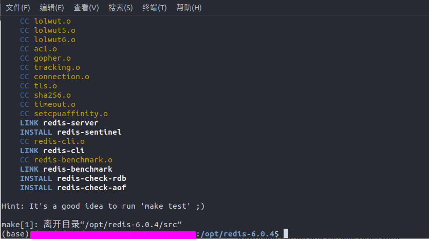
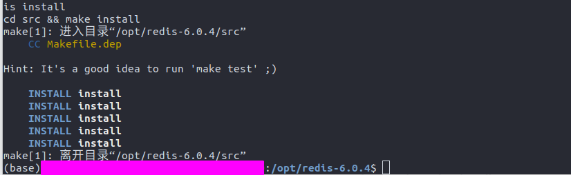
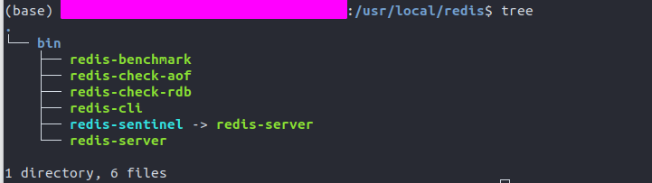
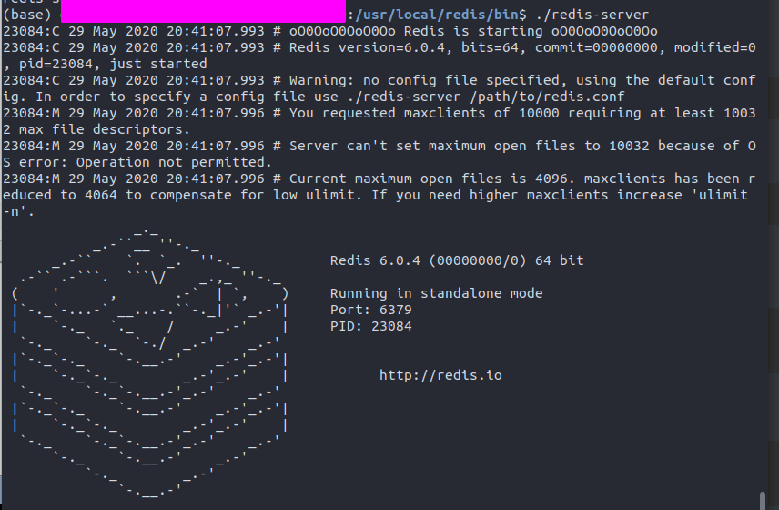
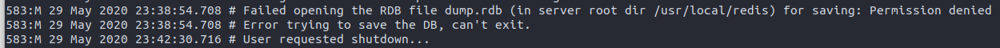

节选自[<u>Redis安装与配置</u>](https://note.youdao.com/ynoteshare1/index.html?id=bfcc478547c920926146675e678e4a1f&type=note)

## 一、Redis简介

### (1)什么是Redis

​		Redis 是完全开源免费的，**遵守BSD协议**，是一个高性能(**NOSQL**)的**key-value**数据库,Redis是一个开源的使用ANSI C语言编写、支持网络、可基于内存亦可持久化的日志型、Key-Value数据库，并提供多种语言的API。

> 什么是 BSD 协议？
>
> BSD 是"Berkeley Software Distribution"的缩写，意思是"伯克利软件发行版"。
>
> BSD开源协议是一个给于使用者很大自由的协议。可以自由的使用，修改源代码，也可以将修改后的代码作为开源或者专有软件再发布。BSD代码鼓励代码共享，但需要尊重代码作者的著作权。BSD由于允许使用者修改和重新发布代码，也允许使用或在BSD代码上开发商业软件发布和销售，因此是对商业集成很友好的协议。

<!--more-->

### (2)什么是NoSQL数据库

​		NoSQL，泛指**非关系型的数据库**。随着互联网**web2.0**网站的兴起，传统的关系数据库在应付web2.0网站，特别是超大规模和高并发的SNS类型的web2.0纯动态网站已经显得力不从心，暴露了很多难以克服的问题，而非关系型的数据库则由于其本身的特点得到了非常迅速的发展。**NoSQL数据库的产生就是为了解决大规模数据集合多重数据种类带来的挑战，尤其是大数据应用难**

**NoSQL数据库的四大分类:**

* 键值([*Key-Value*](https://baike.baidu.com/item/Key-Value))存储数据库
* 列存储数据库
* 文档型数据库
* 图形(Graph)数据库

### (3)相关网址

Redis官网 : https://redis.io

Redis作者Github : https://github.com/antirez

Redis教程 : https://www.bilibili.com/video/BV1Cb411j7RA?p=1


## 二、Redis安装

这里采用redis-6.0.4版为例 , 需要安装最新版redis可去官方下载页查看：http://redis.io/download

### (1)下载Redis并编译

```bash
$ wget http://download.redis.io/releases/redis-6.0.4.tar.gz
$ sudo tar zxvf redis-6.0.4.tar.gz -C /opt
$ cd /opt/redis-6.0.4
$ sudo make
```

当出现如下信息, 表示编译完成



### (2)安装redis

```bash
sudo make PREFIX=/usr/local/redis install
```

**注意：**PREFIX必须大写、同时会自动为我们创建redis目录，并将结果安装此目录

当出现如下信息, 表示安装完成



### (3)查看redis安装目录

```bash
cd /usr/local/redis
tree
```

可以看到redis已经安装完成



## 三、安装过程中的常见问题

### (1)找不到make指令

若找不到make指令, 则需要安装gcc

> CentOS

```bash
yum -y install gcc automake autoconf libtool make 
```

**注意：**运行yum时出现/var/run/yum.pid已被锁定,PID为xxxx的另一个程序正在运行的问题解决

```bash
rm -f /var/run/yum.pid
```

> ubuntu

```bash
sudo apt update
sudo apt install build-essential
```

## 四、启动Redis

### (1)启动Redis服务

```bash
cd /usr/local/redis/bin
# 启动Redis服务端
./redis-server
```

**启动Redis 服务端命令: **

```bash
redis-server redis.conf
```

若看到以下内容, 表示**Redis服务端**启动成功



### (2)启动Redis客户端

```bash
cd /usr/local/redis/bin
# 启动Redis客户端
./redis-cli
```

**启动Redis 客户端命令: **

```bash
redis-cli -h IP地址 -p 端口 -a  密码
```

**退出客户端命令: Ctrl+C**  

**检测是否服务端启动: **

```bash
$ redis-cli
redis 127.0.0.1:6379> PING
PONG
```

## 五、关闭Redis服务端

### (1)杀死进程

非正常关闭, 容易数据丢失

```bash
# 查询PID 
ps -ef | grep -i redis
# 根据PID杀死进程
kill -9 PID
```

### (2)在客户端使用shutdown

正常关闭, 数据保存

```bash
$ redis-cli
redis 127.0.0.1:6379> shutdown
```

在刚刚安装没有配置的Redis中, 使用``shutdown``指令关闭服务端可能会出现如下问题:



这是因为Redis安装的文件夹没有写入权限, 而默认情况下, Redis持久化生成的**本地数据库文件 dump.rdb**, 在Redis的bin目录中, 我们需要给Redis目录赋予权限

```bash
cd /usr/local
sudo chmod -R 777 redis/
```

## 六、开放防火墙端口

### (1)CentOS7

```bash
# 查看已经开放的端口
firewall-cmd --list-ports
# 开启端口
firewall-cmd --zone=public --add-port=6379/tcp --permanent
# 重启防火墙
firewall-cmd --reload # 重启
firewall systemctl stop firewalld.service # 停止
firewall systemctl disable firewalld.service # 禁止防火墙开机启动
```

### (2)Ubuntu18.4

```bash
# sudo iptables -I INPUT -p tcp --dport [端口号] -j ACCEPT
sudo iptables -I INPUT -p tcp --dport 80 -j ACCEPT
# 临时保存配置，重启后失效
sudo iptables-save
# 安装 iptables-persistent工具，持久化开放端口配置
sudo apt-get install iptables-persistent
sudo netfilter-persistent save
sudo netfilter-persistent reload
```

