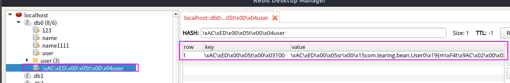
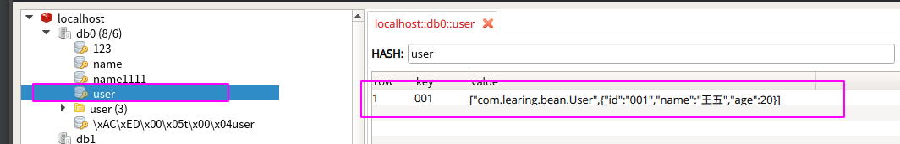

## 一、简介

​        在使用SpringBoot搭建微服务的时候, 很多时候需要用Redis来缓存一些数据 , 存储一些高频率访问的数据。SpringBoot整合Redis所常用的Redis常用客户端有三个: 

- Jedis api
- redisson
- lettuce

本文采用lettuce来访问Redis, **在Spring boot2之后, 对redis连接的支持, 默认就采用了lettuce**

<!--more-->

## 二、导入依赖

```xml
        <!-- SpringData 用于简化数据库访问-->
        <!--默认是lettuce客户端-->
        <dependency>
            <groupId>org.springframework.boot</groupId>
            <artifactId>spring-boot-starter-data-redis</artifactId>
        </dependency>

        <!-- redis依赖commons-pool 这个依赖一定要添加 -->
        <dependency>
            <groupId>org.apache.commons</groupId>
            <artifactId>commons-pool2</artifactId>
        </dependency>
```

## 三、配置连接信息

在`application.yml`文件中, 配置 Redis 连接信息

```yml
spring:
  redis:
    host: 127.0.0.1
    port: 6379
    password: 123456
    lettuce:
      pool:
        max-active: 8 # 连接池最大连接数(使用负值表示没有限制)
        max-idle: 8 # 连接池中的最大空闲连接
        min-idle: 0 # 连接池中的最小空闲连接
        max-wait: 1000 # 连接池最大阻塞等待时间(使用负值表示没有限制)
      shutdown-timeout: 100 # 关闭超时时间
```

## 四、RedisConfig类介绍

缓存配置类RedisConfig用于调优缓存默认配置, 使``RedisTemplate<String,Object>``的类型兼容性更高

在``redisTemplate()``这个方法中, 用``Jackson2JsonRedisSerializer``更换掉了Redis默认的序列化方式 ``JdkSerializationRedisSerializer``

spring-data-redis中序列化类有一下几个:

* ``GenericToStringSerializer`` : 可以将任何对象泛化为字符串并序列化
* ``Jackson2JsonRedisSerializer`` : 序列化 Object 对象为 Json 字符串 (与``JacksonJsonRedisSerializer``相同)
* ``JdkSerializationRedisSerializer`` : 序列化 Java 对象
* ``StringRedisSerializer`` : 简单的字符串序列化

``JdkSerializationRedisSerializer``序列化 : 被序列化对象必须实现``Serializable``接口 , 被序列化除属性内容还有其他内容 , 长度长且不易阅读 , 默认就是采用这种序列化方式

存储内容如下:



``JdkSerializationRedisSerializer``序列化 : 被序列化对象不需要实现``Serializable``接口 , 被序列化的结果清晰 , 内容易阅读 , 且存储字节少 , 速度快

存储内容如下:



​	``StringRedisSerializer``序列化 : 一般如果key、value都是字符串的话 , 用这个就可以了

## 五、编写RedisConfig类

```java
@Configuration
public class RedisConfig extends CachingConfigurerSupport {
    /**
     * 自定义缓存key的生成策略,默认的生成策略是看不懂的(乱码内容)
     * 通过Spring的依赖注入特性进行自定义的配置注入并且此类是一个配置类, 可以更多程度的自定义配置
     * @return
     */
    @Bean
    @Override
    public KeyGenerator keyGenerator() {
        return new KeyGenerator() {
            @Override
            public Object generate(Object target, Method method, Object... params) {
                StringBuilder stringBuilder = new StringBuilder();
                stringBuilder.append(target.getClass().getName());
                stringBuilder.append(method.getName());
                for (Object obj :
                        params) {
                    stringBuilder.append(obj.toString());
                }
                return stringBuilder.toString();
            }
        };
    }

    /**
     * 缓存配置管理器
     * @param factory
     * @return
     */
    @Bean
    public CacheManager cacheManager(LettuceConnectionFactory factory){
        //以锁写入的方式创建RedisCacheWriter对象
        RedisCacheWriter writer = RedisCacheWriter.lockingRedisCacheWriter(factory);
        //创建默认缓存配置对象
        RedisCacheConfiguration config = RedisCacheConfiguration.defaultCacheConfig();
        RedisCacheManager cacheManager = new RedisCacheManager(writer,config);
        return cacheManager;
    }

    //@ConditionalOnMissingBean(name="redisTemplate") 如果没有RedisTemplate的Bean则使用该注解定义的Bean
    @Bean
    public RedisTemplate<String,Object> redisTemplate(LettuceConnectionFactory factory){
        RedisTemplate<String,Object> template = new RedisTemplate<>();
        template.setConnectionFactory(factory);

        Jackson2JsonRedisSerializer jackson2JsonRedisSerializer = new Jackson2JsonRedisSerializer(Object.class);
        ObjectMapper objectMapper = new ObjectMapper();
        objectMapper.setVisibility(PropertyAccessor.ALL, JsonAutoDetect.Visibility.ANY);
        objectMapper.enableDefaultTyping(ObjectMapper.DefaultTyping.NON_FINAL);
        jackson2JsonRedisSerializer.setObjectMapper(objectMapper);

        StringRedisSerializer stringRedisSerializer = new StringRedisSerializer();

        //在使用注解@Bean返回RedisTemplate的时候,同时配置hashKey与hashValue的序列化方式
        //key采用String的序列化方式
        template.setKeySerializer(stringRedisSerializer);
        //value序列化方式采用jackson
        template.setValueSerializer(jackson2JsonRedisSerializer);

        //hash的key采用String的序列化方式
        template.setHashKeySerializer(stringRedisSerializer);
        //hash的value序列化方式采用jackson
        template.setHashValueSerializer(jackson2JsonRedisSerializer);

        template.afterPropertiesSet();

        return template;
    }
}
```

## 五、使用RedisTemplate

### (1)注入 RedisTemplate 对象

在要使用 Redis模板 的类中注入 RedisTemplate 对象

```java
@Autowired
private RedisTemplate<String,Object> redisTemplate;
```

### (2)使用 RedisTemplate 对象

redisTemplate 类是对lettuce的进一步封装 , 因此他的方法并不与Redis语法一一对应。

对于Redis中所有类型共有的命令, 可以使用``redisTemplate.方法()`` 对Redis进行操作

对于Redis中特定类型的命令, 需要使用``redisTemplate.opsFor类型().方法()``对Redis进行操作

* String 类型 : ``redisTemplate.opsForValue().方法()``
* Hash 类型 : ``redisTemplate.opsForHash().方法()``
* List 类型 : ``redisTemplate.opsForList().方法()``
* Set 类型 : ``redisTemplate.opsForSet().方法()``
* ZSet 类型 : ``redisTemplate.opsForZSet().方法()``

### (3) 使用 RedisTemplate 注入 ValueOperations 

如果每次调用方法, 都用``redisTemplate.opsFor类型().方法()`` , 在代码中会有很多重复的``redisTemplate.opsFor类型()``

为了解决这个问题 , 我们可以使用 RedisTemplate 注入 ``类型 + Operations``

以String类型为例: 

```java
@Autowired
private RedisTemplate<String,Object> redisTemplate;

@Resource(name = "redisTemplate")
private ValueOperations<String, Object> vOps; // 相当于 vOps = redisTemplate.opsForValue()
```

RedisTemplate 类型和 ValueOperations 类型并没有任何的关系, 他之所以可以注入是因为Spring在注入时对其进行了类型转换。若想要深入了解redisTemplate如何注入到ValueOperations, 可以查看此博客: [<u>redisTemplate如何注入到ValueOperations</u>](https://www.cnblogs.com/tangyuanyuan/p/8067923.html) 

### (4) 实例 - RedisTemplate 操作 String 类型

```java
@Resource(name = "redisTemplate")
private ValueOperations<String, Object> vOps;

public String gerString(String key){
    String val = null;
    if(redisTemplate.hasKey(key)){
        val = (String) vOps.get(key);
        log.info("从Redis查询");
    }else {
        val ="模拟MySql查询";
        log.info("从MySql查询");
        vOps.set(key,val);
    }
    return val;
}
```

### (5) 实例 - RedisTemplate 操作 Hash 类型

> User实体类

```java
@Data
public class User implements Serializable {
    private String id;
    private String name;
    private Integer age;
}
```

> 查询 User 方法

```java
@Resource(name = "redisTemplate")
private HashOperations<String,String,User> hOps;

public User selectUserById(String id){
    if(hOps.hasKey("user", id)){
        log.info("查询Redis");
        return (User) hOps.get("user",id);
    }else{
        User user = new User();
        user.setId(id);
        user.setName("王五");
        user.setAge(20);
        log.info("查询Mysql数据库");
        hOps.put("user",id,user);
        return user;
    }
}
```

