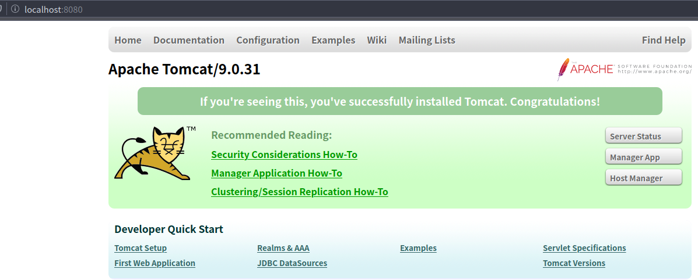

> 本文讲解如何在Ubuntu上安装Tomcat

## 一、下载

官网地址：https://tomcat.apache.org/

```bash
# 下载 Tomcat
wget https://mirrors.tuna.tsinghua.edu.cn/apache/tomcat/tomcat-9/v9.0.31/bin/apache-tomcat-9.0.31.tar.gz
```

## 二、解压

```bash
# 解压Tomcat
sudo tar -zxvf apache-tomcat-9.0.31.tar.gz
```

<!--more-->

## 三、配置环境变量

```bash
# 查看安装目录
pwd
# 编辑环境变量
sudo vim /etc/profile
```

在/etc/profile末尾添加环境变量

```bash
#SET PATH FOR TOMCAT
export CATALINA_HOME=/usr/local/apache-tomcat-9.0.31
export CATALINA_BASE=/usr/local/apache-tomcat-9.0.31

export PATH=$CATALINA_HOME/lib:$CATALINA_HOME/bin
```

使环境变量生效

```bash
source /etc/profile
```

## 四、配置UTF-8字符集

```bash
# 打开配置文件
sudo vim ./conf/server.xml
```

添加配置``URIEncoding="UTF-8"``

```xml
    <Connector port="8080" protocol="HTTP/1.1"
               connectionTimeout="20000"
               redirectPort="8443" URIEncoding="UTF-8"/>
```

## 五、赋予权限

```bash
sudo chmod -R 777 apache-tomcat-9.0.31
```

## 六、验证

```bash
# 运行Tomcat
./bin/startup.sh
```



---

## 参考文档

[tomcat 配置环境变量](https://blog.csdn.net/wsjzzcbq/article/details/87953594)