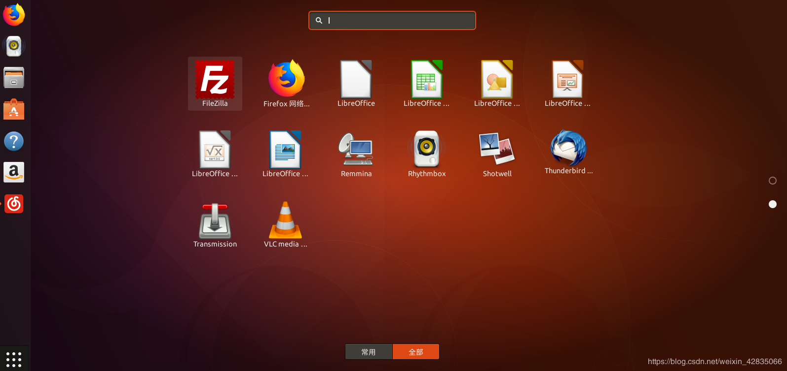
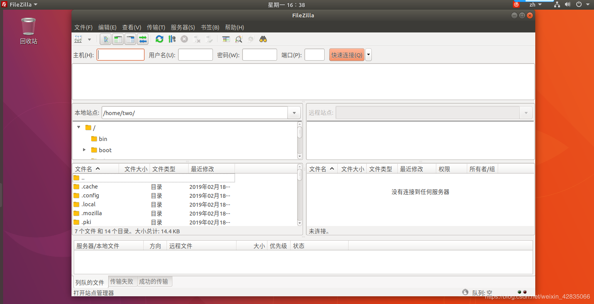

转载自：https://blog.csdn.net/weixin_42835066/article/details/87628691

---

FileZilla是一个免费而且开源的FTP客户端软件，FileZilla共有两种版本：客户端版本(FileZilla Client)、服务器版本(FileZilla Server)。
**安装filezilla ：直接在终端执行sudo apt-get install filezilla**
此时安装就完成了
<!--more-->

打开Filezilla

