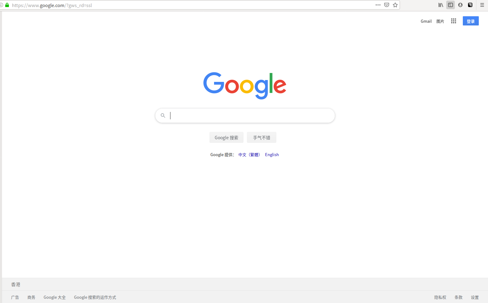

> 本文讲解如何在Ubuntu上安装并使用SSR客户端工具

### 0.SSR的原理

<!--more-->


1. 通过Proxy chains，把本地的流量转发到1080端口
2. localhost 的1080 端口和VPS 的8080 端口通过shadowsocksr建立ssr连接
3. 通过VPS访问目标站点
4. 本地流量 -> localhost 1080 -> VPS 8080 -> 目标站点

-----
### 1.配置Proxy chains

0.在配置Proxy chains之前，首先要查看本机是否安装Proxy chains
* 输入指令``dpkg -s proxychains``
* 若如下图显示，则代表已经安装

  
* 若没有安装proxychains，可查看：[Ubuntu下安装proxychains教程](/2020/04/08/Ubuntu下安装proxychains教程/)
1.配置Proxy chains

```
vim /etc/proxychains.conf
```

将dynamic_chain前面的注释去掉，再将[ProxyList]下的socks4 改为socks5，并且127.0.0.1后面的端口改为1080

  

  

-----
### 2.安装SSR

1.下载SSR脚本

```bash
wget https://onlyless.github.io/ssr
sudo mv ssr /usr/local/bin
sudo chmod 766 /usr/local/bin/ssr
```

2.安装SSR

```bash
ssr install
```

3.配置SSR

```bash
ssr config
```

```json
{
    "server": "0.0.0.0",   //服务器IP地址
    "server_ipv6": "::",
    "server_port": 2333,  //端口
    "local_address": "127.0.0.1",
    "local_port": 1080,

    "password": "password",  //密码
    "method": "aes-256-cfb", //加密方式
    "protocol": "auth_aes128_md5", //协议
    "protocol_param": "",
    "obfs": "plain",  //混淆方式
    "obfs_param": "",
    "speed_limit_per_con": 0,
    "speed_limit_per_user": 0,

    "additional_ports" : {},
    "additional_ports_only" : false,
    "timeout": 120,
    "udp_timeout": 60,
    "dns_ipv6": false,
    "connect_verbose_info": 0,
    "redirect": "",
    "fast_open": false
}
```

配置完之后保存，ssr就会自动启动，查看本地1080端口：

```
sudo lsof -i:1080
```


-----
### 3.启动代理

1.ssr的启动和关闭方式为：

```bash
ssr start
ssr stop
```

2.通过proxyresolv测试代理是否成功

```bash
proxyresolv www.google.com
```

若执行``proxyresolv www.google.com``报错找不到命令，则执行：

```bash
cp /usr/lib/proxychains3/proxyresolv /usr/bin/
```

若显示：

```
|S-chain|-<>-127.0.0.1:1080-<><>-4.2.2.2:53-<><>-OK
```

说明没问题，使用proxychain firefox命令启动火狐浏览器：

```
proxychains firefox
```



-----

### 参考文档

[Kali代理之SSR和proxychains](http://blog.qqzzz.net/?post=54 )

[在ubuntu检查一个软件包是否安装](https://blog.csdn.net/tration/article/details/81199590)

[kali安装后配置](https://www.cnblogs.com/pythonal/p/9301350.html)
