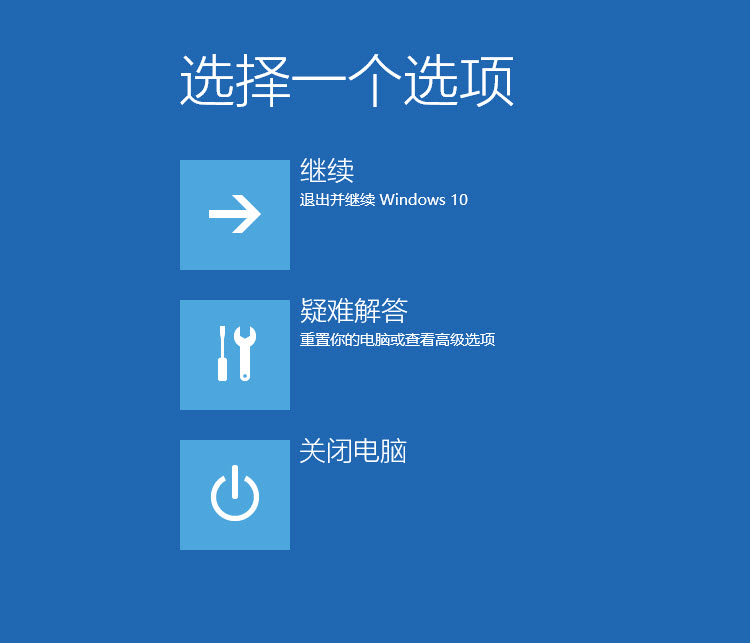
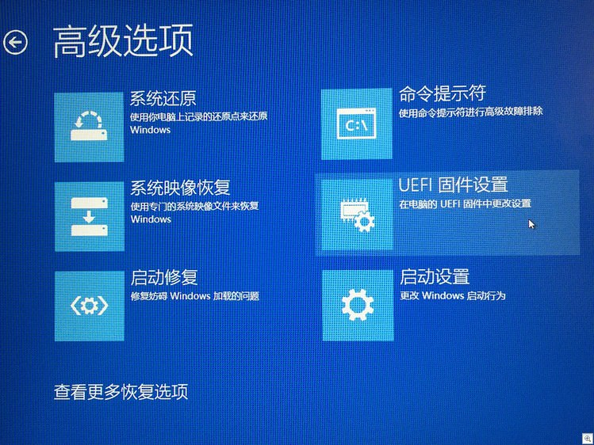

本文转载自:

[Windows/Linux 重启进入 UEFI BIOS设置 ](https://www.qiansw.com/linux-on-uefi-how-to-reboot-to-the-uefi-setup-screen-like-windows.html):https://www.qiansw.com/linux-on-uefi-how-to-reboot-to-the-uefi-setup-screen-like-windows.html

---

很多支持 Fast Boot 的主板，在启动 Fast Boot 之后开机过程中按 F2/F12 这些键是进不了BIOS的。

解决办法是进入操作系统后指定下一次重启进入 BIOS。

<!--more-->

## Windows

在 Windows 8/10 中，重启时按住 shift 键，可以调出高级重启菜单，选择进入 疑难解答——高级启动—高级选项—UEFI固件设置，重启后可以直接引导到 UEFI。





## Linux

Linux 也可以在重启时告诉系统下一次启动进入 UEFI 设置。使用 systemd 的 Linux 系统有 `systemctl` 工具可以设置。

可以查看帮助：`systemctl --help|grep firmware-setup`

```
--firmware-setup Tell the firmware to show the setup menu on next boot
```

直接在命令行执行下面命令即可在下一次启动后进入 UEFI 设置。

```
systemctl reboot --firmware-setup
```