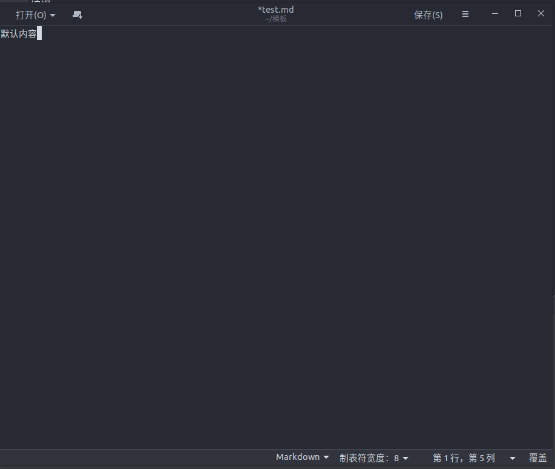
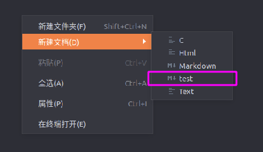
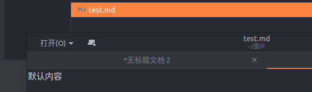

## (1)在家目录的模板目录下创建模板文件

```bash
#打开家目录下的模板目录
cd ~/模板
#用文本编辑器创建一个文件
sudo gedit 新建文件名
```

<!--more-->

## (2)编辑新建文件的默认内容并保存



## (3)此时,右键新建文档中,就有刚才创建的模板文件了



## (4)打开新建的文件,可以看到默认的内容就在文件中



## 参考文档

[ubuntu18.04右键怎么添加新建空白文本文件](https://jingyan.baidu.com/article/6079ad0ecbc85428ff86dbdc.html)