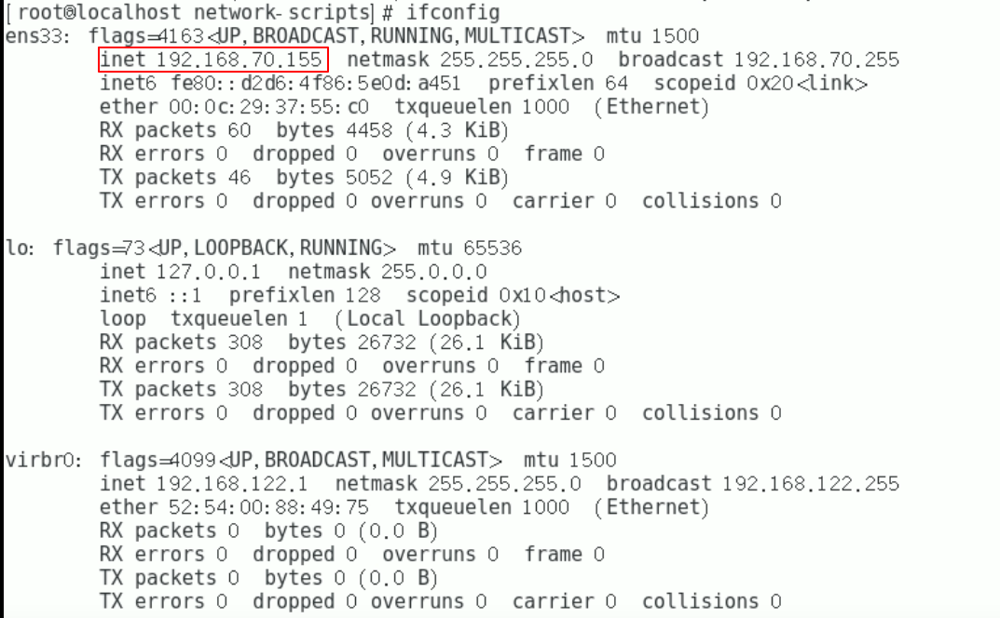
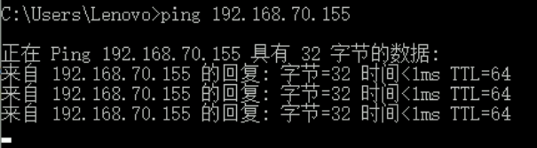
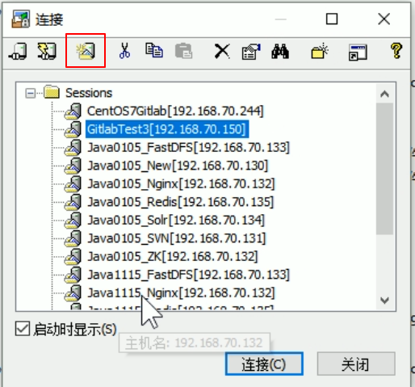
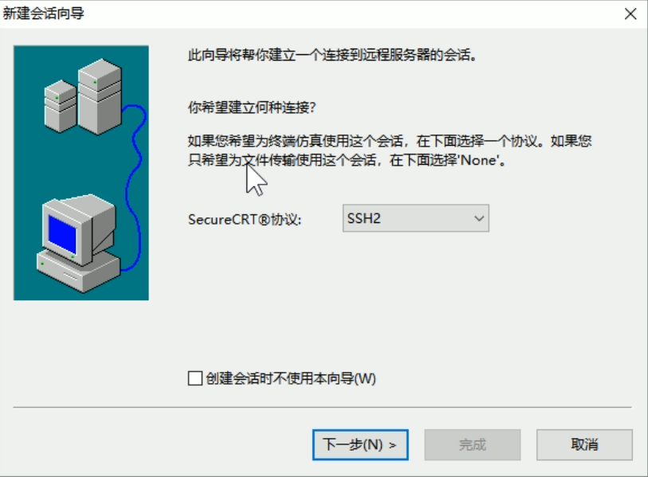
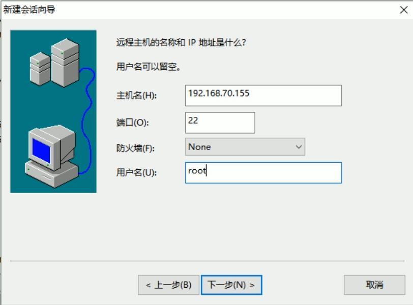
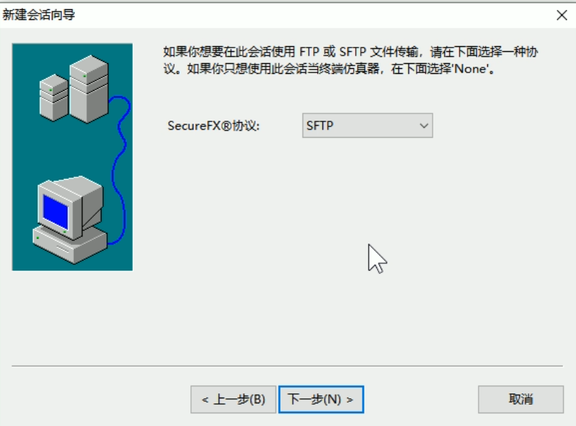
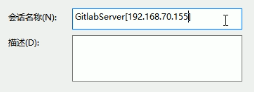
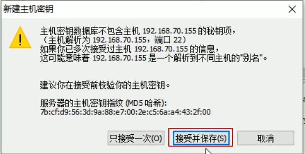
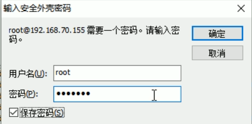
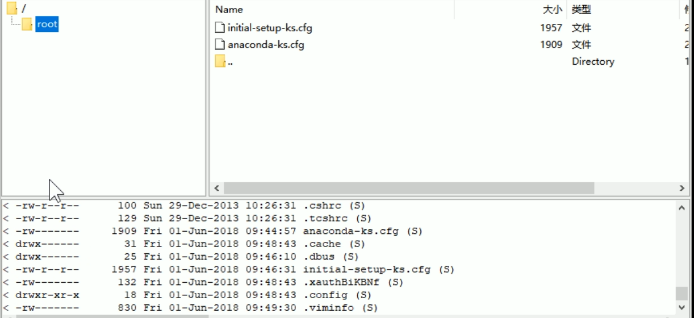

### 1.安装CentOS-7

安装CentOS-7同安装CentOS-8，详见[CentOS-8虚拟机安装教程](CentOS-8虚拟机安装.md)

### 2.配置虚拟机IP

1.进入目录``cd /etc/sysconfig/network-scripts``

  ip地址配置的文件：ifcfg-ens33 (在CentOS-8中是ifcfg-ens160)

2.切换至root权限``su root``
3.修改ifcfg-ens33文件：
``vim ifcfg-ens33``

<!--more-->

> 原文件：
```
TYPE=Ethernet
PROXY_METHOD=none
BROWSER_ONLY=no
BOOTPROTO=dhcp
DEFROUTE=yes
IPV4_FAILURE_FATAL=no
IPV6INIT=yes
IPV6_AUTOCONF=yes
IPV6_DEFROUTE=yes
IPV6_FAILURE_FATAL=no
IPV6_ADDR_GEN_MODE=stable-privacy
NAME=ens33     #在CentOS-8中是NAME=ens160
UUID=51fbe0fc-fae8-43e7-9d51-3c0d1cbc73bd
DEVICE=ens33   #在CentOS-8中是DEVICE=ens160
ONBOOT=no
```
> 修改后的文件
```
TYPE=Ethernet
PROXY_METHOD=none
BROWSER_ONLY=no
BOOTPROTO=static
DEFROUTE=yes
IPV4_FAILURE_FATAL=no
IPV6INIT=yes
IPV6_AUTOCONF=yes
IPV6_DEFROUTE=yes
IPV6_FAILURE_FATAL=no
IPV6_ADDR_GEN_MODE=stable-privacy
NAME=ens33     #在CentOS-8中是NAME=ens160
UUID=51fbe0fc-fae8-43e7-9d51-3c0d1cbc73bd
DEVICE=ens33   #在CentOS-8中是DEVICE=ens160
ONBOOT=yes
IPADDR=192.168.70.155
GATEWAY=192.168.70.2
DNSI=192.168.70.2
```

### 3.重启网络服务

``service network restart``

若CentOS-8中是：``nmcli c reload``

### 4.检查配置是否生效

1.查看本机IP``ifconfig``

> 结果：



可以看到，IP地址为刚才设置的192.168.70.155：``inet 192.168.70.155``

2.ping 外网:``ping www.baidu.com``

> 结果：


3.在windows下ping Linux:``ping 192.168.70.155``

> 结果：



### 5.通过SecureFX创建远程连接

1.创建一个新的连接



2.选择SSH2，继续



3.填入主机名和用户名



4.选择SFTP



5.输入会话名称



6.接受并保存密钥



7.输入用户名密码



8.连接成功


