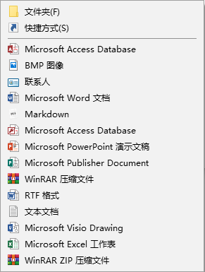
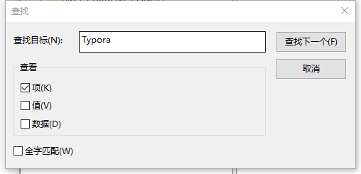
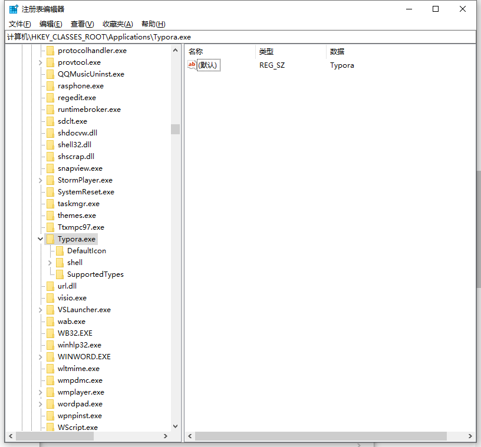
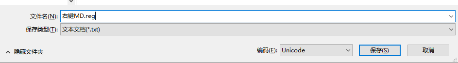
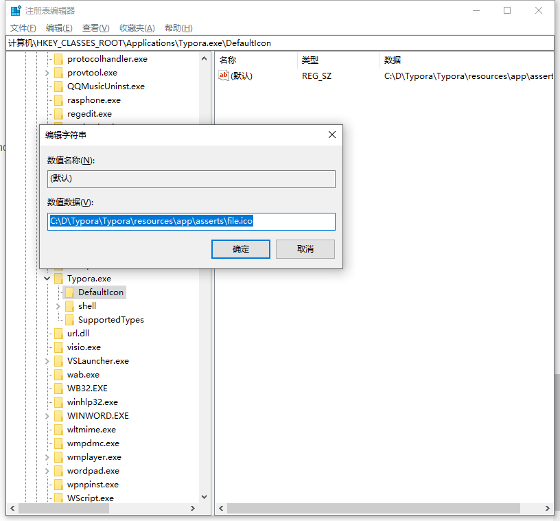

本文转载自: [Windows下右键新建.md文件教程](https://stepneverstop.github.io/win-rightclick-create-md.html):https://stepneverstop.github.io/win-rightclick-create-md.html

原本创建.md文件需要首先打开markdown文本编辑器，如Typora，或者新建.txt文件然后修改后缀名，本文介绍了如何在Windows操作系统中添加右键创建.md文件的方法。

## 环境

windows10操作系统
Typora编辑器

<!--more-->

## 效果图



## 步骤

### 1. 打开注册表

1.`CMD+R`，打开运行对话框
2.输入`regedit`，打开注册表编辑器

### 2. 修改注册表

1.在`计算机>HKEY_CLASSES_ROOT`右键查找，输入`Typora`，勾选项，取消勾选值和数据



2.确认运行的程序名字，我的电脑如图所示，运行文件是`Typora.exe`


如果使用的是markdownpad或者其他编辑器，同理

1)在磁盘任意位置新建一个文件，后缀为`.reg`

2)打开编辑刚刚创建好的注册表文件，写入以下内容：

```
Windows Registry Editor Version 5.00
[HKEY_CLASSES_ROOT\.md]
@="Typora.exe"
[HKEY_CLASSES_ROOT\.md\ShellNew]
"NullFile"=""
[HKEY_CLASSES_ROOT\Typora.exe]
@="Markdown"
```

``@="Typora.exe"`` 代表的是指定.md文件的运行程序
``@="Markdown"`` 代表的是右键时默认的文件名字，这样写新建为``
新建Markdown.md``文件，而且右键菜单中显示``MarkDown``

3.编辑好之后,另存为,设置如图所示:



文件名可以随便设置，但是后缀必须是`.reg`文件,保存类型一定要是`文本文档(*.txt)`,编码选择`Unicode`,非常重要!!!!!

4.保存文件后,双击运行,修改注册表即可,现在右键即可达到预期效果,如果不行,请重启一下.

## 3.编辑新建图标(非必须)

1.以`Typora`为例,在注册表`Typora.exe`下点击项`DefaultIcon`,右键修改
2.将属性修改为想要设置的Markdown文件图标

